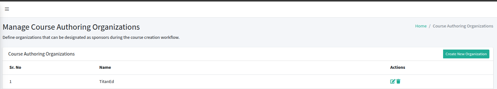

## Accessing Configuration

After logging into the Control Hub, click on the **Configuration** option in the left navigation menu. This section allows administrators to configure the core settings of the LMS platform, including branding, general platform details, email, SSO, and footer settings.

Each configuration area is accessible from the sidebar menu and can be updated individually.

---

## 1. General Settings

Navigate to:  
**Configuration > General**

This section allows you to define essential platform settings.

### Editable Fields

- **Site Name**: Enter the name of your learning platform (e.g., TitanEd LMS).
- **LMS Domain**: The public URL where learners access the LMS (e.g., `https://demo.example.com`).
- **CMS/Studio Domain**: The authoring interface URL (e.g., `https://studio.example.com`).
- **Industry**: Select the industry your platform serves (e.g., School, Corporate).
- **Contact Email**: Enter the official support or admin email.
- **Default Platform Language**: Choose the default display language.
- **Additional Platform Languages** (optional): Enable multilingual support by adding more languages.

---

## 2. Branding Settings

Navigate to:  
**Configuration > Brand**

This section allows you to visually customize the platform.

### Logo Configuration

- **Logo Upload**: Upload a company logo.
  - File type: JPG, PNG, JPEG  

- **Favicon Upload**: Upload a favicon for browser tab branding.
  - File type: ICO, PNG, JPG, JPEG  

---

## 3. Manage Course Authoring Organizations

Navigate to:  
**Configuration > Course Authoring Organizations**

Define organizations that can act as sponsors or course authors during course creation.

### Features

- View a list of existing organizations.
- Add new organizations using the "Create New Organization" option.
- Each organization entry includes:
  - Organization Name
  - Available Actions (e.g., edit, delete)

---

## 4. Footer Settings

Navigate to:  
**Configuration > Footer**

Customize the footer section of your platform for branding and legal information.

### Footer Elements

- **Footer Logo**: Upload a logo to appear in the site footer.
  - File type: JPG, PNG, JPEG  
  - Max file size: 500KB  
  - Recommended ratio: 1:3 (wide rectangle)

- **Social Media Links**: Add URLs for your organization's social media profiles:
  - Facebook
  - LinkedIn
  - YouTube
  - Twitter
  - Instagram

- **Contact Number**: Provide a phone number for platform support or inquiries.

- **Address**: Display your physical or mailing address.

- **Copyright Text**: Customize the copyright notice.

- **Footer Links**: Add important links with:
  - **Title**
  - **URL**
  - **Status** (e.g., Active/Inactive)

---

## 5. Email Configuration

Navigate to:  
**Configuration > Email**

Set up email-related settings used for account notifications, password resets, and communication with users.

> This section typically includes SMTP configuration, default sender address, and other email behavior preferences.

---

## 6. SSO (Single Sign-On)

Navigate to:  
**Configuration > SSO**

Enable and configure third-party authentication providers to allow users to log in using external systems.

### Common Integrations

- Facebook
- OAuth2
- Google
- Institutional Identity Providers

> Configuration includes:
- Client ID / Secret
- Redirect URIs
- Identity Provider Metadata
- Attribute Mapping

---

## Accessing E-commerce

Navigate to:  
**Configuration > Ecommerce**

This section allows administrators to configure payment-related settings for enabling and managing paid courses on the platform.

## E-commerce Configuration Options

### Enable Paid Courses

Toggle this option to enable or disable paid enrollment across the platform. When enabled, learners will be required to complete a payment before gaining access to specific courses.

### Currency

Select the default currency used for transactions on the platform.  
Example: `USD`, `INR`, `EUR`, etc.

### Billing Information

- **Billing Email**: Enter the email address where billing-related notifications and receipts will be sent.  
  Example: `billing@yourdomain.com`

- **Billing Phone Number**: Provide a contact number for billing support or inquiries.

- **TAX ID**: Enter the official tax identification number for your organization.

- **TAX ID Label**: Specify the label associated with your tax ID (e.g., GST, VAT, TIN).

- **Billing Address**: Enter the full address that should appear on invoices or receipts.

---

### Supported Gateways

 - Razorpay 
 - Paytm
 - PayU (PayUMoney)
 - PayPal
 - Stripe.

### Configuration

Field                  | Description                      | Required |
|------------------------|----------------------------------|----------|
| **Merchant ID**        | Unique identifier for your Razorpay account. You can find this in your Razorpay dashboard. | Yes|
| **Key ID**             | Public API Key used for client-side authentication. |  Yes|
| **Key Secret**         | Private API Key used for server-side authentication. Keep this confidential. | Yes |

---

