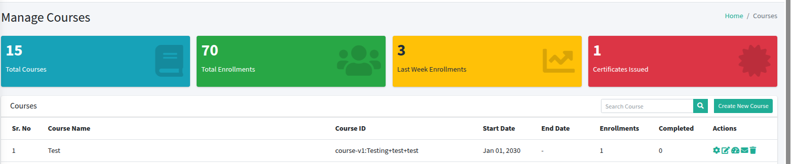

# Course Management Guide

## Navigating to Course Management

- Go to **Control Hub**.
- Click on **Course Management**.
---

## Managing Categories

- To create a new category, click on **Create New Category**.
- You can add a new category using this button.

### Categories List

| Sr. No | Name  | Actions        |
|--------|-------|----------------|
| 1      | Maths | Edit |

- You can edit existing categories as needed.

---

## Managing Courses

- Here you can see the list of all courses.
- You will also find important stats displayed:

  - **Total Courses:**
  - **Total Enrollments:**
  - **Last Week Enrollments:**
  - **Certificates Issued:**

### Courses Table

### Additional Actions

- Users can perform different actions such as editing or deleting courses.
- You can also open the course in **Studio** for more detailed editing.
- You can also **send emails** related to the course to learners or instructors.
- View **course-related analytics**, such as enrollments, completion rates, and certificates issued.

---

## Create New Coupon

to create a new discount coupon.

## Coupon Details

- **Coupon Code**  
  Enter the coupon code

- **Description**  
  Enter coupon description

- **Course**  
  Select course (e.g., Test (course-v1:Testing+test+test))

- **Discount (%)**  
  Enter discount percentage (e.g., 0)

- **Is Active**  
  Specify if the coupon is active (Yes / No)
