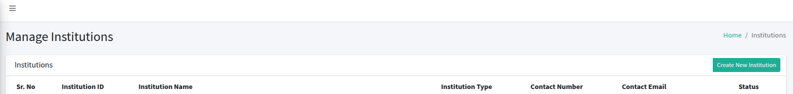
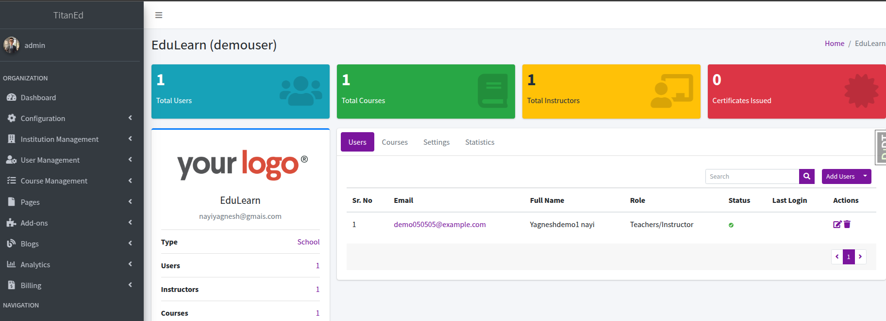

Manage institutions registered on the platform.  
Access via: **Institution Management > Institutions**

---

## Institution List

| Sr. No | Institution ID | Institution Name           | Institution Type | Contact Number | Contact Email            | Status |
|--------|----------------|----------------------------|------------------|----------------|--------------------------|--------|
| 1      | INST001        | Unity Academy              | School           | 123-456-7890   | info@unityacademy.org    | Active |
| 2      | INST002        | Tech Institute             | University       | (123) 789-0123 | contact@techinst.org     | Active |
| 3      | INST003        | New Placeholder Institute  | University       | +9876543210    | admin@placeholder.org    | Active |

---

## Create New Institution

To add a new institution, click **Create New Institution** and complete the form:

- **Institution ID**: Unique identifier (required).  
  *Example*: `INST003`
- **Institution Name**: Full name (required).  
  *Example*: `New Placeholder Institute`
- **Institution Type**: Select type (e.g., School, University) (required).  
  *Example*: `University`
- **Address**: Physical address (required).  
  *Example*: `789 New Street, City, 67890`
- **Logo**: Optional upload.  
  *File Type*: JPG, PNG, JPEG  
- **Contact Number**: Phone number (required).  
  *Example*: `+9876543210`
- **Contact Email**: Email address (required).  
  *Example*: `admin@placeholder.org`
- **Website**: Optional URL.  
  *Example*: `https://placeholder.org`

Click **Create Institution** to save.

## Institution Details

Click an **Institution ID** to view or manage its details, users, courses, and statistics.

### Example Institution: Unity Academy (INST001)

- **Institution ID**: INST001
- **Institution Name**: Unity Academy
- **Institution Type**: School
- **Address**: 456 Harmony Road, Metro City, 12345
- **Logo**: Optional upload (JPG/PNG/JPEG)
- **Contact Number**: 123-456-7890
- **Contact Email**: info@unityacademy.org
- **Website**: Optional (e.g., https://unityacademy.org)
- **Total Users**: 32
- **Total Courses**: 5
- **Total Instructors**: 1
- **Certificates Issued**: 1

#### User Management

Manage users associated with the institution.

| Sr. No | Email                   | Full Name         | Role     | Status | Last Login | Actions |
|--------|-------------------------|-------------------|----------|--------|------------|---------|
| 1      | learner1@example.org    | Learner One       | Learner  | Active | -          | -       |
| 2      | learner2@example.org    | Learner Two       | Learner  | Active | -          | -       |

**Actions**:
- **Add Individual User**: Add a single user to the institution.
- **Import User**: Bulk import users via CSV.
- **Download CSV Templates**: Download templates for user import.
- **Send Activation Emails**: Send activation emails to users.

#### User Statistics

| Sr. No | User Role           | No. of Users |
|--------|---------------------|--------------|
| 1      | Learner             | 31           |
| 2      | Teacher/Instructor  | 1            |
| 3      | Total               | 32           |

#### Course Management

Manage courses offered by the institution.

| Sr. No | Course Name                         | Course ID              | Start Date   | End Date     | Actions |
|--------|-------------------------------------|------------------------|--------------|--------------|---------|
| 1      | Intro to Technology                 | course-v1:Platform+101+2024_T1 | Jun 01, 2024 | -            | -       |
| 2      | Leadership Essentials               | course-v1:Platform+102+2024_T2 | Jan 01, 2025 | Sep 02, 2027 | -       |

---

## Delete Institution

> Click an **Institution ID** > *Settings* and click on delete button.  

---
