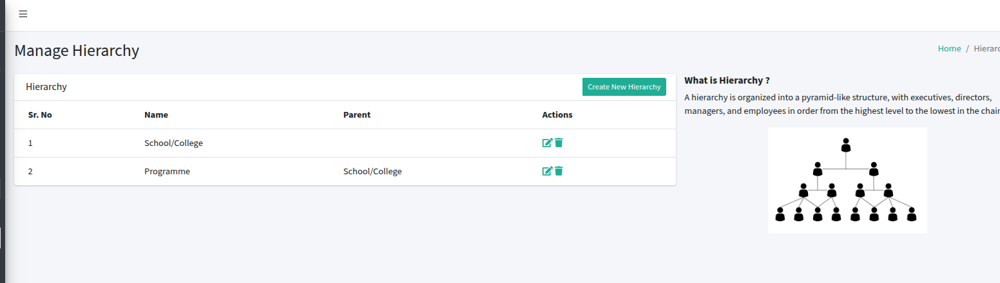
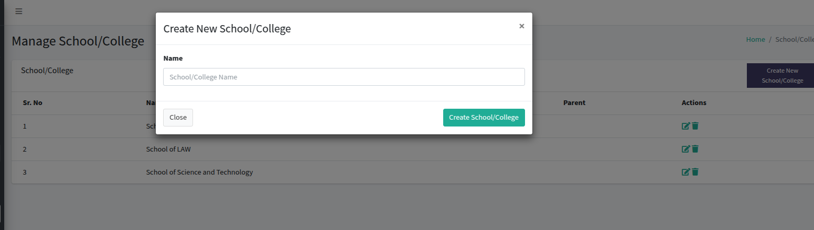
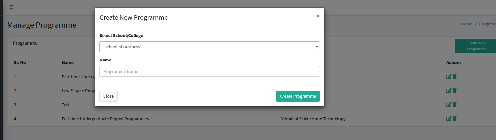
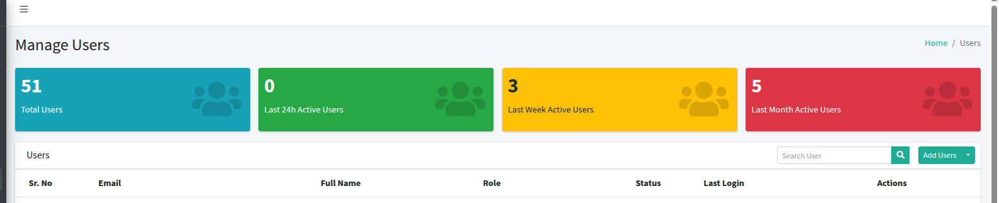
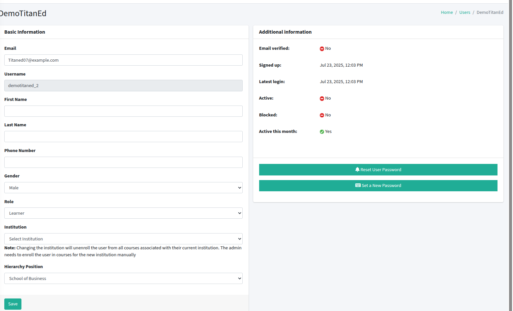
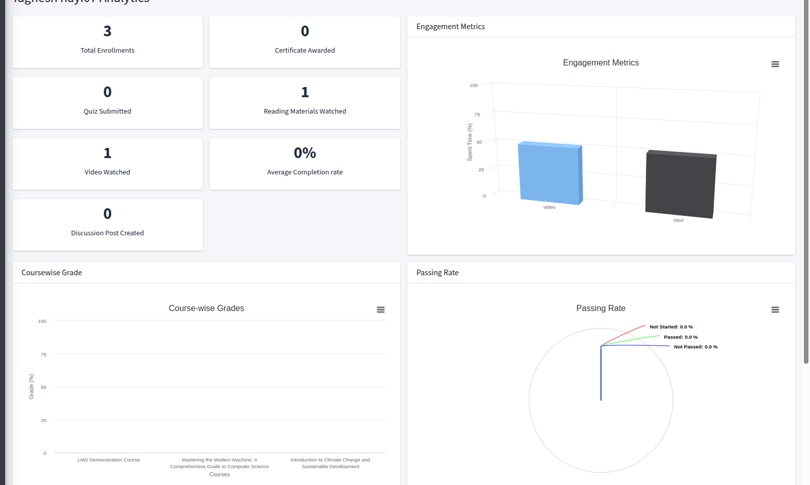
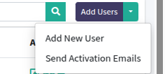

Manage user roles and their permissions on the platform.  
Access via: **User Management > Roles**

---

## User Roles

- **Tutor**: Provides academic support, such as moderating discussion boards or assisting with assignments.
- **Learner**: Accesses courses, completes assignments, and views personal progress and grades.
- **Group-Admin**: Manages specific groups of users and their associated courses and content.
- **Teacher/Instructor**: Creates, manages, and grades courses and assignments.
- **Coordinator**: Manages certain aspects of course and user administration.
- **Principal**: Oversees platform activity with read-only access to reports and analytics.
- **Co-Admin**: Manages and configures platform-specific features, users, and content.
- **Admin**: Has full permissions to manage all platform features, users, and content.

---

> The Manage User Roles section allows administrators to view and configure user roles and their permissions for efficient platform management.

---

## Manage Hierarchy

Manage the organizational hierarchy of the platform.  
Access via: **User Management > Hierarchy**

---

## What is Hierarchy?

A hierarchy is organized into a pyramid-like structure, with executives, directors, managers, and employees in order from the highest level to the lowest in the chain.

---

## Hierarchy List

View, edit, or delete the following hierarchy levels:

- **Institute**: Top-level hierarchy with no parent. Actions: Edit, Delete.
- **Programme**: Child of Institute. Actions: Edit, Delete.

View, edit, or delete hierarchy levels in the table below.

| Sr. No | Name             | Parent          | Actions |
|--------|------------------|-----------------|---------|
| 1      | Institute        | -               | Edit, Delete |
| 2      | Programme        | Institute       | Edit, Delete |

---

## Edit Hierarchy

To modify a hierarchy level, select Edit and update:
- **Name**: Change the hierarchy level name (required). Example: Department.
- **Parent Hierarchy**: Update the parent level if needed (required). Example: Institute.

Save changes to update.

---

## Delete Hierarchy

To remove a hierarchy level, select Delete and confirm.  
*Note*: Ensure no active users or content are linked before deleting.

---

> The Manage Hierarchy section enables administrators to view, edit, and delete hierarchy levels to organize the platform’s structure efficiently.

---

## Manage School/College

Manage schools/colleges and their programmes on the platform.  
Access via: **User Managemente > School/College**

---

## School/College List

View, edit, or delete the following schools/colleges:

- **Institute of Business**: Top-level school/college with no parent. Actions: Edit, Delete.
- **Institute of Law**: Top-level school/college with no parent. Actions: Edit, Delete.
- **Institute of Science and Technology**: Top-level school/college with no parent. Actions: Edit, Delete.

---

## Create New School/College

To add a new school/college, click **Create New School/College** and complete the form:
-
- **Name**: Enter the school/college name (required).  
  *Example*: Institute of Arts

Click **Create School/College** to save.

## Edit School/College

To modify a school/college, select Edit and update:
- **Name**: Change the school/college name (required).  
  *Example*: Institute of Arts

Save changes to update.

## Delete School/College

To remove a school/college, select Delete and confirm.  
*Note*: Ensure no active programmes, users, or content are linked before deleting.

---

## Create New Programme

To add a programme under a school/college, click **Create New Programme** and complete the form:
-
- **Select School/College**: Choose the parent school/college (required).  
  *Example*: Institute of Business
- **Name**: Enter the programme name (required).  
  *Example*: Business Management

Click **Create Programme** to save.

---

> The Manage School/College section enables administrators to view, create, edit, and delete schools/colleges and their programmes to organize the platform’s structure efficiently.

---

Manage users and their details on the platform.  
Access via: **User Management > User**

---

## User Statistics

- **Total Users**:
- **Last 24h Active Users**:
- **Last Week Active Users**:
- **Last Month Active Users**:

---

## User List

View, edit, or manage the users:

---

## User Actions

### 1. View/Edit User Information

Select **View/Edit** to see or modify a user’s details. Example user:

- **Username**: Learner_TitanEd
- **Email**: learner22@example.org
- **First Name**: Not provided
- **Last Name**: Not provided
- **Phone Number**: Not provided
- **Gender**: Male
- **Role**: Learner
- **Institution**: Select Institute of Business (Note: Changing the institution unenrolls the user from all courses associated with their current institution. The admin must manually enroll the user in courses for the new institution.)
- **Hierarchy Position**: Institute of Business
- **Additional Information**:
  - Email Verified: Yes
  - Signed Up: Jul 23, 2025, 12:04 PM
  - Latest Login: Jul 24, 2025, 03:36 PM
  - Active: Yes
  - Blocked: No
  - Active This Month: Yes
  - You can reset your password or change your existing password

Save changes to update.

---

### 2. View User Analytics

Select **Analytics** to view a user’s engagement and performance metrics. Example user analytics:

- **Total Enrollments**: 3
- **Certificates Awarded**: 0
- **Quizzes Submitted**: 0
- **Reading Materials Watched**: 1
- **Videos Watched**: 1
- **Average Completion Rate**: 0%
- **Discussion Posts Created**: 0
- **Engagement Metrics**: Bar chart showing time spent (%) across categories (e.g., 50% in two categories).
- **Course-wise Grades**: Bar chart showing grades (%) across three courses (ranging from 0 to 100%).
- **Passing Rate**: Pie chart showing passing rate across three slices.

---

### 3. Resend Account Activation Email

Select **Resend Account Activation Email** to send a new activation link to the user’s registered email, allowing them to activate their account. Confirm the action before sending.

---

## Create New User

Use this form to create a new user in the system.

## User Information

- **First Name**  
  Enter first name

- **Last Name**  
  Enter last name

- **Email Address**  
  Enter email

- **Mobile Number**  
  Enter mobile number

- **Gender**  
  - Male  
  - Female  
  - Other

- **Institution**  
  Select institution from list

- **Role**  
  Select role (e.g., Learner)

- **Hierarchy Position**  
  e.g., School of Business

## Password Setup

By default, the user will receive an email with a link to set their password and complete registration.

Alternatively, you can manually set a password for the user. If you do this, the user will **not** receive the password setup email.

- **Set Password Manually**  
  Enter password (if setting manually)

---

## Bulk Account Activation Email

> This action will send activation links and login credentials to their registered email addresses, allowing them to activate their accounts.

---

## Delete User

To remove a user, select Delete from their actions and confirm.  

---

## Course Creator / Tutor Management

**Purpose of this:**  
Course Creators/Tutors are responsible for designing and delivering educational content for a platform or institution. They create course materials, video lessons, assignments, and sometimes engage directly with learners through Q&A sessions or live lectures.

They may specialize in specific subjects and are expected to bring expertise, clear communication, and engaging teaching styles to the table.

---

## Applicant Details

### Review/Update Course Creator Application

- **Name:** Alex Johnson  
- **Email:** alex.johnson@example.com  
- **Phone Number:** 123-456-7890  
- **Interest Area:** AI  
- **Requested At:** July 24, 2024  
- **Address:** 123 Learning Avenue, Cityville  
- **Message:** test  
- **Application Status:** Pending

---

## Next Steps

1. **Review the candidate's qualifications and experience.**
2. **Conduct an interview if needed.**
3. **Change the status from "Pending" to "Approved" or "Rejected" after review.**
4. **Notify the applicant of the decision.**

