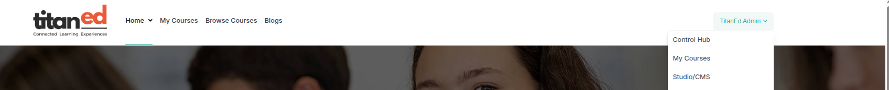
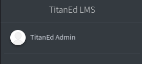
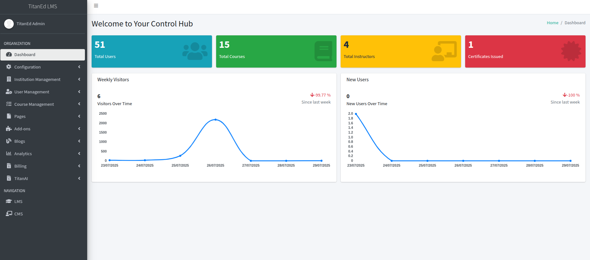

# Accessing the Control Hub Dashboard

Once you log in to the platform with administrator credentials, you will see an option in your navigation menu labeled **Control Hub**.

Clicking on **Control Hub** will open the centralized admin interface for your organization.

## Control Hub Dashboard Layout

After clicking into the Control Hub, you will land on the main dashboard screen. On the left side of the interface, you will see a vertical navigation panel. At the top of this panel, your **organization name** will be displayed.

#### Key Metrics

The dashboard presents quick-access tiles with real-time data:

- **Total Users:**
- **Total Courses:**
- **Total Instructors:**
- **Certificates Issued:**

#### Weekly Visitors

- **Visitors Over Time:**
- **Change Since Last Week:**

> Note: The percentage reflects traffic change trends and helps monitor engagement.

#### New Users Chart

A graphical chart displays **new user registrations** over time. This helps administrators quickly analyze growth patterns and user onboarding performance.

---

