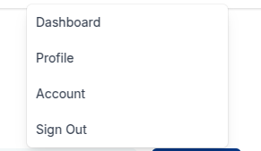
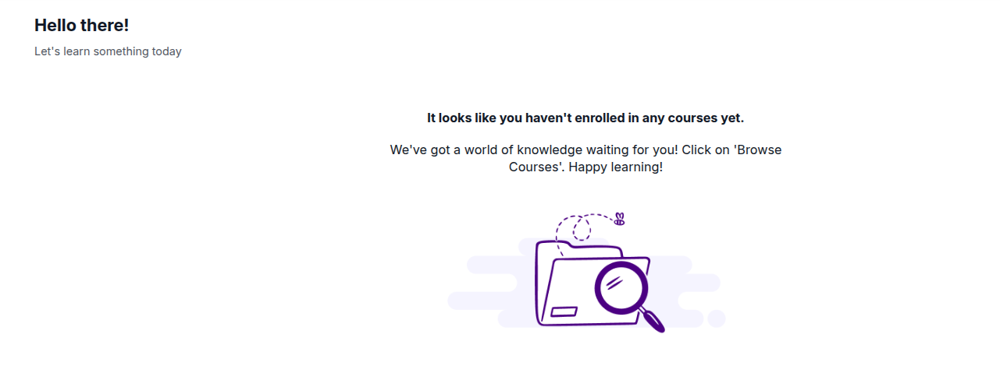
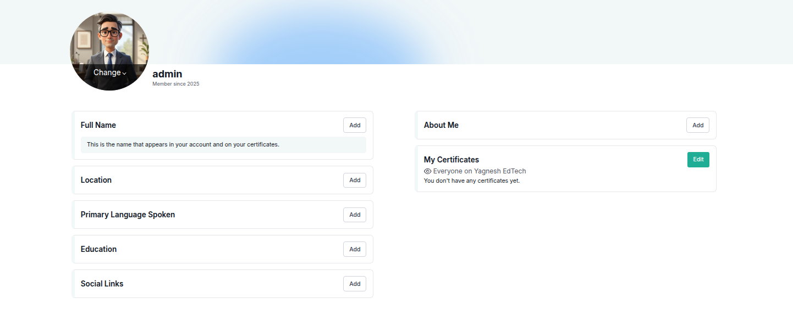

# Exploring Your Dashboard and Account Menu

After creating an account, you can view your enrolled courses on your dashboard, update your profile, and manage account or course settings.

You can access your dashboard or other account-related pages from any part of the platform. Simply click on the dropdown menu located next to your username in the top right corner of the page.

This menu provides quick access to the following options:

- Dashboard
- Profile
- Account
- Sign Out

Each option in this menu serves a specific purpose, described in detail below.

## **Dashboard**

The **Dashboard** is your main hub for learning activity. It lists all the courses and programs you are enrolled in. From this page, you can:

When you first create an account and have not yet enrolled in any courses, your dashboard will appear empty.

### How to Browse Available Courses

To begin your learning journey, click the **Courses** tab located at the top of the platform navigation bar. This will take you to the course catalog.

In the course catalog, you can:

- Browse all available courses created by instructors or administrators
- Filter or search by category, title, or instructor
- View course descriptions, durations, and start dates

Once you enroll in a course, it will automatically appear on your dashboard.

### 1. Your Course List

If you have any courses, your dashboard displays them as a list or cards. Each course entry typically includes:

- **Course Name**  
- **Organization or Instructor Name** (if available)  
- **Start Date** of the course (if set)  
- **Settings Icon** — a gear or similar symbol you can click to manage course-specific options  

### 2. Using the Settings Icon

Clicking the settings icon and opens a menu where you can:

- **Unenroll from the course** if you no longer wish to participate  
- **Adjust email preferences** for that course, such as turning on or off notifications about announcements, deadlines, or updates  

This helps you customize your learning experience for each course individually.

> You are automatically taken to the dashboard after signing up or enrolling in a course. You can also return to it anytime by selecting "Dashboard" from the dropdown menu.

## **Profile Overview**

Your profile allows you to personalize your account and share relevant information with other learners. It includes your name, location, language, education background, social media links, and certificates you have earned.

You can access your profile from any page by clicking the dropdown menu next to your username in the top right corner, then selecting **Profile**.

## What You Can Do in Your Profile

When you open your profile page, you will see several editable sections:

### 1. Upload Profile Image

You can upload a profile photo that other learners will see next to your posts and comments in courses.

- Click the upload button to select and add a profile picture from your device.

### 2. Full Name

This is the name that appears in your account and on any certificates you earn.

- You can update your full name as needed.
- Make sure the name is accurate if you want it displayed correctly on your certificates.

### 3. Location

Add your current location to let other learners know where you are joining from.

- This is optional and can be updated anytime.

### 4. Primary Language Spoken

Specify the main language you speak. This helps improve communication and visibility within course discussions.

### 5. Education

You can add brief information about your educational background.

- For example: “Bachelor’s degree in Safety Engineering” or “Currently pursuing a diploma in Occupational Health.”

### 6. Social Links

You can link to your professional or academic profiles on platforms such as:

- LinkedIn
- GitHub
- Personal Website or Portfolio

### 7. About Me

Use this section to write a short biography. Share details about your professional background, interests, or goals.

- This information is visible to others in your courses.

---

### My Certificates

Your profile also includes a section that lists the certificates you have earned through TitanEd LMS.

Each certificate includes:

- **Course Title**
- **Issuing Organization**
- **Completion Date**

Certificates will appear in your profile automatically once you successfully complete a course and meet all the requirements.

---

## Account

The **Account** page contains your personal settings and preferences. On this page, you can:

- Change your password
- Update your email address
- Set your time zone
- Manage additional account-related settings

Keeping your account settings up to date ensures better communication and access to course materials.

## Sign Out

Select **Sign Out** to securely log out of your account. This is especially important when using a shared or public computer.

---

# Accessing Courses from the Dashboard

When you visit your dashboard, you will see a list of all the courses you are enrolled in. Each course is displayed as a card that shows the course title, status, and access options.

Clicking on the title of a course will take you to the course homepage. From there, you can begin or continue your learning.

You can also manage course email settings directly from the dashboard. These settings help you stay informed about deadlines, announcements, and updates.

---

# Sharing Your Courses on Social Media

If enabled by the course provider, you can share your course enrollment on social media directly from your dashboard.

To share a course:

1. Sign in to the social media platform where you want to post (such as Facebook or Twitter).
2. On your dashboard, locate the course you want to share.
3. Click the menu button (usually represented by three dots) on the course card.
4. Select the option labeled "Share to [social media site]".
5. A pop-up window will appear where you can preview and edit the message.
6. Click the post or share button to publish it to your account.

This feature is optional and only available when supported by the course platform.

---

# Need Help?

If you are having difficulty using the dashboard or accessing course information, contact TitanEd LMS Support for further assistance.

# Account Settings

The Account Settings page allows you to view and update your personal information, security settings, preferences, and connected accounts. You can also manage social links and request permanent deletion of your account.

You can access this page by selecting the dropdown menu next to your username and clicking on **Account**.

## Sections in Account Settings

Your account is divided into the following sections:

- Account Information  
- Profile Information  
- Social Media Links  
- Site Preferences  
- Linked Accounts  
- Delete My Account

---

## Account Information

This section contains the core details about your account.

- **Username:**  
  This is the name used to identify you on Yagnesh EdTech. Usernames cannot be changed after account creation.  
  Example: `TitanEd`

- **Full Name:**  
  The name that appears on your certificates and is used for identity verification.

- **Email Address:**  
  This is your primary sign-in email address. All platform notifications and messages from course teams will be sent here.  
  Example: `TitanEd@example.com`

- **Password:**  
  You can change your password to help secure your account.

- **Year of Birth:**  
  Used for demographic reporting and course personalization.  
  Example: `1990`

- **Country:**  
  Example: `India`

---

## Profile Information

Additional personal information used for learner engagement and reporting.

- **Education:**  
  Include your educational background if you'd like.

- **Gender:**  
  Optional field used for analytics and community inclusion.

- **Spoken Language:**  
  Select your preferred language for viewing the platform and participating in discussions.

---

## Social Media Links

You can optionally link your personal accounts so that visitors to your Yagnesh EdTech profile can view them.

Supported platforms include:

- LinkedIn  
- Facebook  
- Twitter

These links appear as icons on your public profile page.

---

## Site Preferences

This section may allow customization of the platform interface, such as selecting a preferred time zone or language.

Note: Available options may vary depending on platform configuration.

---

## Linked Accounts

You may have the option to link third-party identity providers (such as Google or Microsoft) to simplify sign-in.

---

## Delete My Account

If you choose to delete your account, all of your personal data will be permanently removed.

> **Important Notes:**
Deletion is permanent and cannot be undone.
Your account, course history, certificates, and progress will no longer be accessible.
You will not be able to reuse the same email address to register again.
You may want to download your certificates or take screenshots of course completions before proceeding.

> If you only wish to change your email address, name, or password, do **not** delete your account. You can update those items directly from the Account Information section.

---

