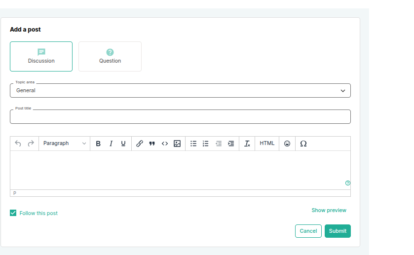
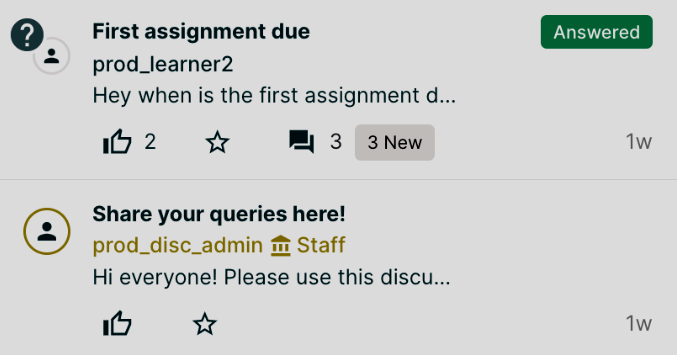
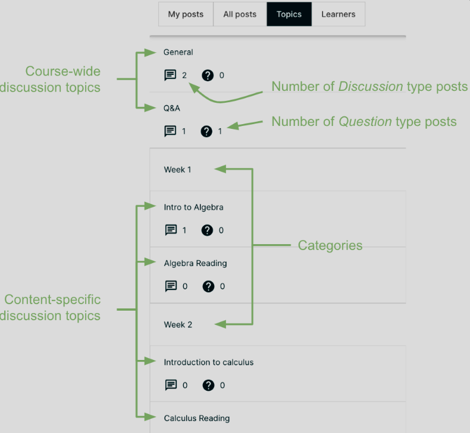
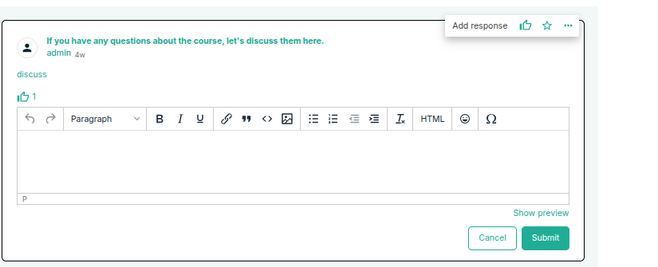
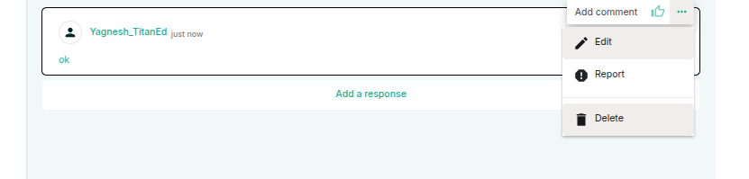
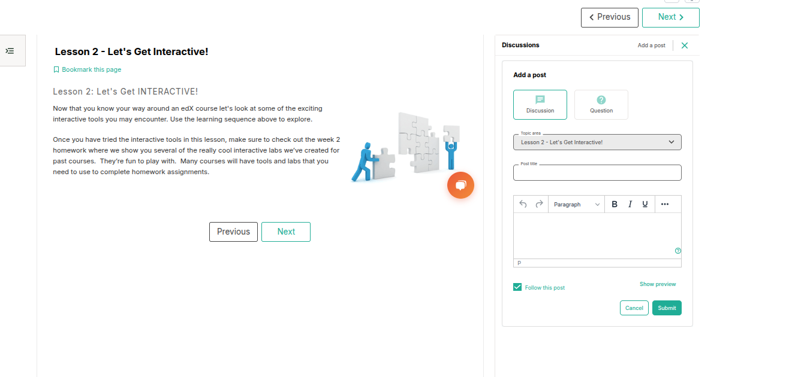
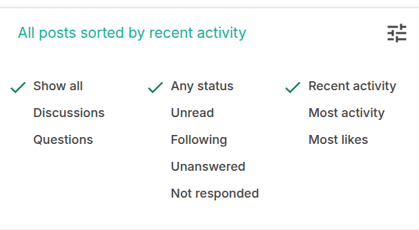

The **Discussions** section is a space where you can ask questions, share ideas, and interact with other learners and course staff.

### What You Can Do in Discussions

- Ask questions about course content
- Reply to other learners' posts
- Participate in topic-specific threads
- View responses from course staff or moderators
- Follow posts to receive updates

> **Tip:** Use clear titles and specific questions to get better responses.

### Categories and Organization

Discussions are usually organized by topic, such as:

- General course questions
- Week-specific topics
- Assignments or assessments
- Technical issues
- Course feedback

> **Pinned Posts**
Pinned posts appear at the top of the list of posts in All posts, My posts and Topics tab. Pinned posts can contain important information about the course or any part of the course, such as a particular video or problem. The pinned post can originate from anyone in the course, including other learners or members of the discussion moderation team, but only members of the moderation team can pin a post. Look for the pin icon on top-right of the summary of a post to identify a pinned post.

### Best Practices

- Be respectful and supportive in your responses
- Search for similar questions before posting
- Use upvotes to support helpful answers
- Report inappropriate content if needed

The Discussions area is a great way to connect with peers and deepen your understanding of the course material.

## Taking Part in Course Discussions

## Adding a Post

When you add a post to a discussion in your course, you decide both the type of post and the topic.

## Determining the Post Type: Discussion or Question

To ensure that other learners and the course team can find and respond to your post, decide what type of post you want to make: **Question** or **Discussion**.

- **Choose Post Type:**  
  - **Question:** Ask for a specific answer or help.  
  - **Discussion:** Share ideas or start a conversation.  
  - You can change the type anytime after posting.

## How to Create a Discussion Post

You can start a conversation or ask questions on the course’s Discussion page, either for the whole course or specific topics.

1. Navigate to the **Discussion** section and click on **Add a Post**.

2. Choose whether your post is a **Question** or a **Discussion**.

3. Select the relevant category or topic where your post fits best from the available list.

4. Write a clear and concise title that summarizes your post. This title will help others quickly understand what your post is about when browsing.

5. Compose the body of your post. Use the text editor tools to format your message, add links, or include images if needed.

6. Once satisfied, hit **Submit** to publish your post, or choose **Cancel** if you decide not to post.

## Posting Anonymously

- If allowed, you can choose to post anonymously.  
- Course staff will still see your name, but other learners won’t.

## Adding Responses or Comments

- Find a post to respond to on the Discussion page or inside a Course Unit.  
- Click **Add a Response** to reply to the post.  
- Use **Add a Comment** to comment on a response.  
- Submit your reply or comment when done.
- You can also follow a post by clicking the star icon.

## Editing or Deleting Your Posts

- You can only edit or delete your own posts, responses, or comments.  
- Click the **three dots (…)** on your post or comment to see options.  
- Select **Edit** to change text, topic, or post type.  
- Select **Delete** to remove your post or comment.

---

## Posting from a Course Unit (Content-Specific Discussion)

If you come across a discussion while working through a particular unit in your course, you can post directly within that unit. This is useful when your comment or question is directly related to the course material.

Follow these steps:

1. Select **Course** from the main navigation menu.

2. Navigate to the specific unit that relates to the discussion you want to join.

3. Click **Show Discussion** to open the conversation thread tied to that content.

4. Review existing posts—only the title and the first line of each post are shown initially, so you can quickly scan what's already been shared.

5. Add your post to contribute your ideas or questions directly in the context of that content.

## Discussion Filters and Sorting Options

On the Discussion page, you can organize and refine the view of posts using the following filters and sorting options:

## Filter by Post Type
- **Show all** – Displays both questions and discussions.
- **Discussions** – Shows only discussion-type posts.
- **Questions** – Shows only question-type posts.

## Filter by Post Status
- **Any status** – Includes all posts regardless of interaction.
- **Unread** – Displays posts you haven’t read yet.
- **Following** – Shows posts you are following (starred).
- **Unanswered** – Filters posts that have not received any answers.
- **Not responded** – Shows posts without instructor or staff responses.

## Sort Posts
- **Recent activity** – Shows posts with the latest replies or updates.
- **Most activity** – Prioritizes posts with the most replies.
- **Most likes** – Displays posts with the highest number of likes.
