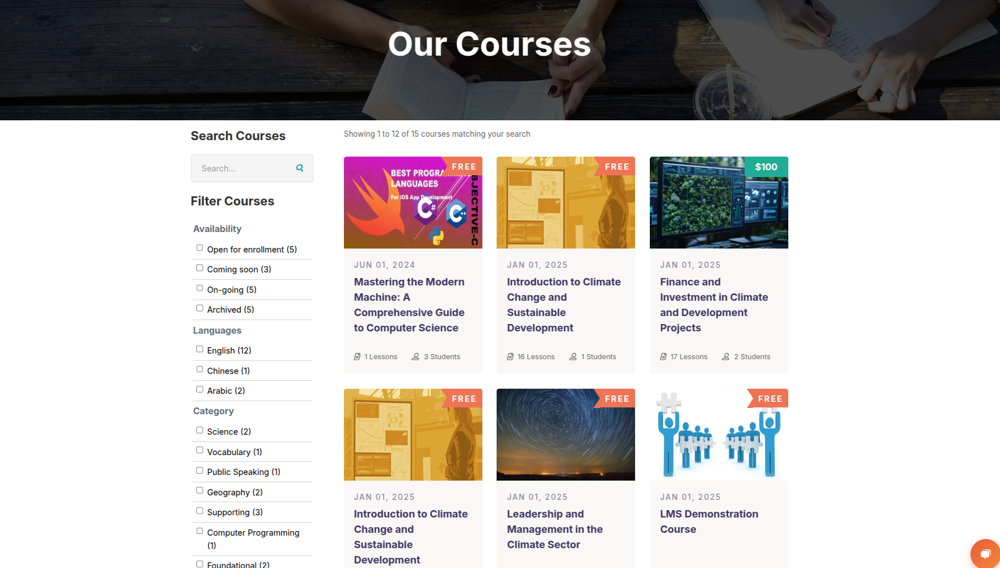
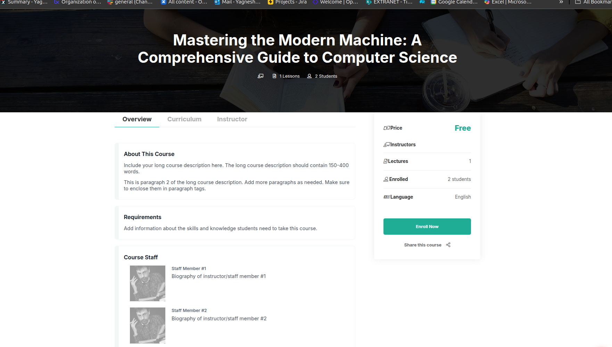
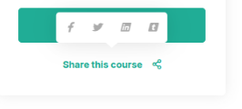

# Exploring a Course and Enrolling

Before taking a course, it’s important to understand what the course offers and how to begin. This guide walks you through how to find course details, understand what you’ll learn, and enroll with confidence.

---

## Step 1: Accessing the Course Catalog

From the top menu of the platform, click the **Courses** or **Explore Courses** tab. This will take you to the full course catalog, where you can:

- Browse a wide range of available courses  
- Use search or filters to narrow down topics of interest  
- Identify which courses are **Free**, **Paid**, or **Open Access**

> **Open Access Courses**  
> Some courses are completely open, meaning you don’t need to enroll to view the content. You can simply click and begin learning.

 

---

## Step 2: Selecting a Course

When you click on a course title in the catalog, you will be taken to the **Course Detail Page**.

This page provides a full overview of what the course includes and helps you decide whether to enroll.

### What You’ll See on the Course Detail Page:

- **Course Title and Subtitle**  
  The name of the course and a short description.

- **About This Course**  
  A detailed section explaining:
  - What the course covers  
  - Skills you will gain  
  - Who the course is for (beginners, professionals, etc.)  
  - Any required background knowledge or prerequisites  
  - Duration and expected weekly effort

- **Instructor Information** (if provided)  
  Learn about the educators or organization offering the course.

- **Related Courses**  
  A list of other courses that may be of interest based on the current selection.

---

## Step 3: Enrolling in the Course

Once you decide to take the course, look for the **Enroll Now** button on the right side or bottom of the Course Detail Page.

Clicking **Enroll Now** will:

- Add the course to your personal dashboard  
- Allow you to begin learning once the course is open  
- Show you additional options if applicable (e.g., free audit mode, paid certificate)

> **Note**: Some courses allow you to enroll instantly. Others may offer different enrollment tracks (such as free access with no certificate, or a verified certificate for a fee).

---

## Step 4: Course Sharing Option

On the Course Detail Page, you may also see a **Share This Course**.

This feature allows you to:

- Share the course with friends, classmates, or colleagues  
- Post it to social media platforms like Facebook or Twitter  
- Copy the link to share manually via email or messaging apps

---

## Summary

To start learning:

1. Visit the **Courses** tab and find a course that interests you  
2. Review the **Course Detail Page** to understand the objectives and structure  
3. Click **Enroll Now** to add the course to your dashboard  
4. Begin learning as soon as the course is available  
5. Share the course if you think others may benefit from it

Whether it’s a free course or a more advanced track with certification, the platform makes it simple to explore, understand, and join with just a few clicks.

---

# Course Prerequisites and Entrance Exams

Some courses have certain requirements that learners must meet before they can access course content. These requirements are in place to make sure learners are prepared and have the foundational knowledge needed for success in the course.

This document explains two common types of course requirements:

- Prerequisite Courses  
- Entrance Exams

---

## Prerequisite Courses

Some courses require that you complete another course first. This is called a **prerequisite course**. The purpose is to ensure you have the necessary background knowledge before moving forward.

### Where to Find Prerequisite Info

You can usually find information about prerequisites on the **About** page of the course. The page will tell you if:

- You need specific skills or knowledge  
- You need to complete a different course first  

### What Happens If You Enroll Without Completing the Prerequisite

You can still enroll in the course even if you haven’t completed the required course. However:

- The course will appear on your dashboard  
- You **will not** be able to access the content yet  
- A message will be shown under the course name that says you must complete the prerequisite first  
- A link will be provided to the required course

> **Example**  
> If you want to take a “Math Basics” course but it requires a “Science Foundations” course as a prerequisite, you'll need to complete the Science course first. You can enroll in Math, but you won’t be able to enter the course until the Science course is completed.

### How to Complete the Prerequisite

1. Click the link to the prerequisite course from your dashboard  
2. Enroll in the prerequisite course  
3. Complete the required materials  
4. Once completed, the original course becomes available on your dashboard  
5. You can now enter and start learning

---

## Entrance Exams

Some courses require learners to pass an entrance exam before gaining full access to course content.

### How Entrance Exams Work

- After enrolling, the course appears on your dashboard  
- You will **not** see all course content until the exam is passed  
- The first time you enter the course, you will be taken to the **Entrance Exam page**

On this page, you will see:

- Your current score  
- The minimum score needed to pass  
- Instructions to start the exam

### Taking the Exam

1. Answer all the questions  
2. Click **Submit** to send your answers  
3. Refresh the page to see your score  
4. The top of the page will tell you whether you passed  
   - If you refresh before finishing, it will show your current score

Once you pass:

- All available course materials will become visible  
- You can start working through the course

> **Note**  
> In some cases, the course team may allow you to skip the entrance exam. If this is allowed, you will gain access to all course content immediately after enrollment.

---

> Some courses may have both types of requirements. Always read the **About** page of the course carefully to understand what is needed before you begin.

