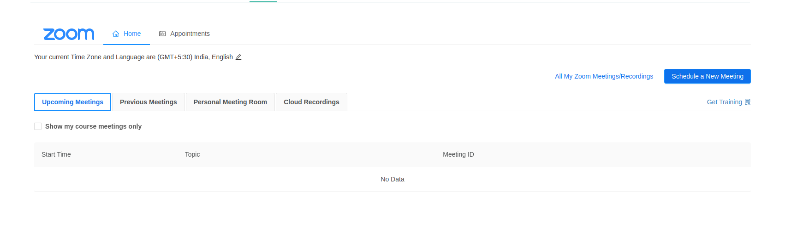

# Live Tab Overview

The **Live** tab provides access to real-time course interactions powered by Zoom. This includes both scheduled meetings and one-on-one appointment slots with instructors or staff.

### What You’ll Find in the Live Tab:

- **Upcoming Meetings** — A list of scheduled Zoom sessions such as lectures, live discussions, or workshops.
- **Previous Meetings** — A history of past Zoom meetings, with details for reference.
- **Personal Meeting Room** — A dedicated Zoom space that instructors can use for spontaneous or recurring sessions.
- **Cloud Recordings** — Access to recordings of past Zoom sessions, if they’ve been shared.
- **Appointments** — If your course supports it, you can book individual or group appointments with instructors or teaching staff. These are often used for office hours, feedback sessions, or help with course content.

> The Live tab helps you stay connected with your instructors and classmates in real time.

