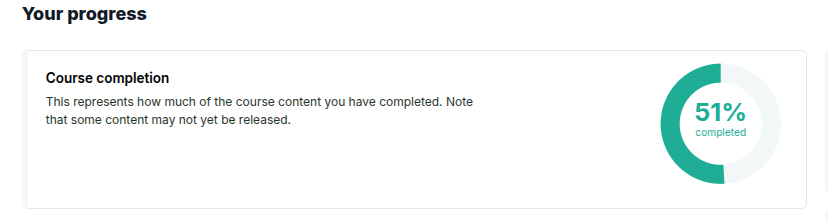
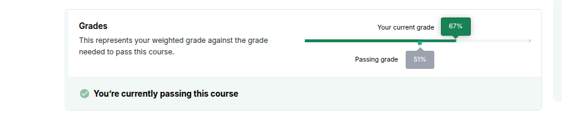
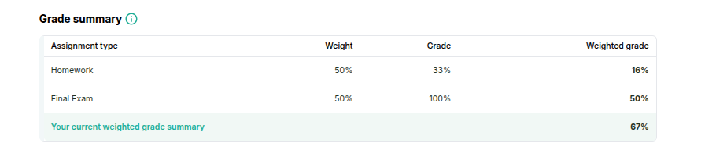
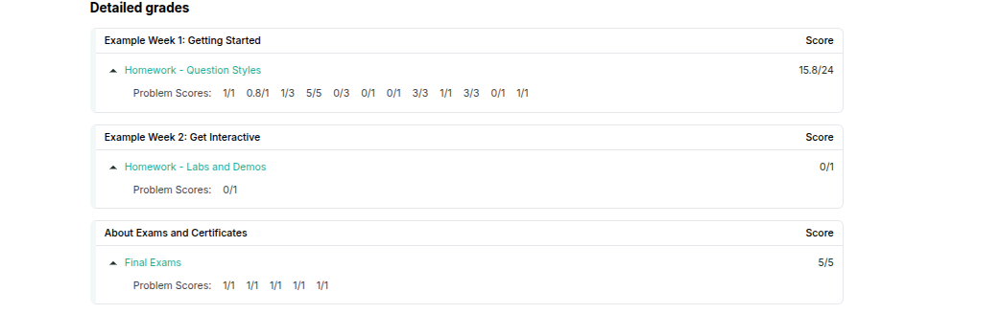
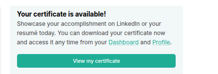

# Progress Page – Learner View

## Course Completion

The Course Completion chart helps you track how much of the course content you have completed. It includes any unit that is considered completable, such as:

- Readings
- Videos
- Practice assignments
- Graded assessments

As you complete different parts of the course, this chart will automatically update to reflect your progress.

> **Note:** The chart only includes items that are visible and accessible to you. If some parts of the course are hidden or restricted, they will not appear in your completion status.

- Course content with a Subsection Visibility Setting of “Entirely Hide Subsection” will not appear in the chart.

- Course content in self-paced courses with a Subsection Visibility Setting of “Hide content after course end date” will not appear in the chart once the course has ended.

- Course content in instructor-paced courses with a Subsection Visibility Setting of “Hide content after due date” will not appear in the chart once the assignment’s due date has passed.

## Understanding Your Grade

The Grades feature shows your current grade in the course alongside the minimum passing grade.

Your displayed grade depends on how the course assignments are set to be visible:

- Assignments set to **Always Show Results** are included in your grade calculation.
- Assignments set to **Never Show Results** are excluded from your displayed grade.  
  > **Note:** This does not affect your official grade or eligibility for a certificate.
- Assignments set to **Show When Subsection is Past Due** are included in your grade only after the due date has passed.

> **Important:** These settings only impact what you see on the Progress page. Your official grade and certificate eligibility are based on the full gradebook.

## Grade Range and Certificates

Your grade is categorized based on the course’s grading scheme. Most courses use a Pass/Fail scale by default.

If your course uses letter grades or other ranges, they will be shown here.

> **Note:** You will qualify for a certificate if your final grade is above the Fail threshold, regardless of how many grading levels the course uses.

## Grade Summary Table

The Grade Summary table breaks down your performance by assignment type in the course. It shows how you are doing in each category, such as homework, exams, or labs.

The grades displayed here use the same rules as the main Grades feature:

- Assignments set to **Always Show Results** or **Show When Subsection is Past Due** are included in the grade calculations.

## Assignment Types and Their Weights

Courses organize assignments into different types, each contributing a percentage to your overall grade.

For example, a course might have:

- Homework assignments worth 50% of the grade
- A midterm exam worth 20%
- A final exam worth 30%

Each assignment type groups related assignments and has a weight that shows how much it counts toward your final grade.

### Default Assignment Types

Most courses start with these common assignment types:

- Homework
- Lab
- Midterm Exam
- Final Exam

Your course may use these, modify them, or add new types.

### What You Should Know

- The **Assignment Type Name** shows the category name you will see.
- The total weight of all assignment types always adds up to 100%.
- Each assignment within a type contributes equally to that category’s weight.
  
> **Note:** An assignment with more problems is weighted the same as one with fewer problems within the same assignment type.

- Some assignments may be dropped (not counted toward your grade) if the course allows for dropping the lowest scores.

---

## Detailed Grades

The Detailed Grades section lists all graded assignments in the course. It shows both:

- The overall grade for each subsection
- The scores for individual problems within assignments

### When Assignments Do Not Appear

Assignments will **not** appear in this list if:

- The assignment’s subsection visibility is set to **"Entirely Hide Subsection"**.
- The assignment has a future scheduled release date.
- The assignment is not graded.

---

## Certificate Status

Certificate Status is shown only if your course offers a certificate option. It indicates which of the following applies to you:

- **Passing:** You have earned the minimum grade required for a certificate.
- **Not passing:** You have not yet earned the minimum grade required.
- **Audit learner:** You are auditing the course and do not qualify for a certificate.
- **Certificate not yet available:** For instructor-paced courses, the certificate becomes available only after the course end date.
- **ID not verified:** You have not completed required ID verification.
- **Can request the certificate:** You have earned a certificate but it has not been generated yet. You can request it.

---