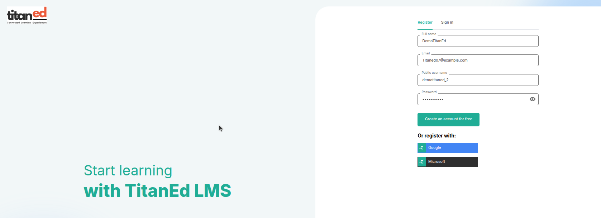
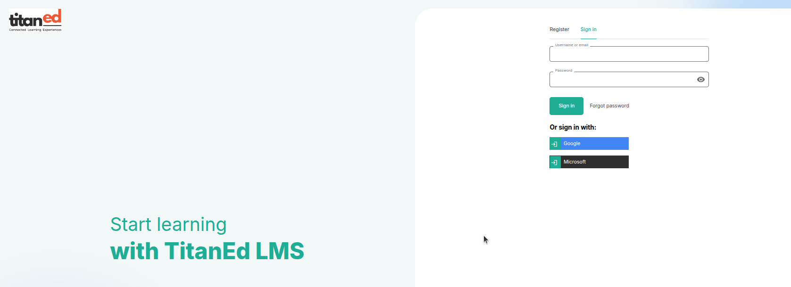

## Signup Overview

To create a new account, users can simply click on the **Sign Up** button located at the top right corner of the homepage.

### Registration Form Fields

The registration form includes the following input fields:

- **Full Name** – User's complete name  
- **Email** – A valid email address (e.g., titaned07@example.com)  
- **Public Username** – Unique username visible to others (e.g., demotitaned_2)  
- **Password** – A secure password (masked for privacy)

### Alternate Sign-Up Options

Users can also choose to register using third-party authentication providers:

- **Register with Google**  
- **Register with Microsoft**

These options offer a quick and secure way to create an account without manually entering all details.

> **Important Note**: After completing the sign-up form, a verification email will be sent to the provided email address.

>  Please check your inbox and follow the link to activate your account before attempting to sign in.

> This user-friendly registration process ensures a smooth onboarding experience for learners while maintaining security and flexibility.

---

> **Need Help?**  
> If you need assistance at any point, please contact **TitanEd LMS Support** for guidance and troubleshooting.

## Sign-In Process

If the user is already registered, they can access their account by clicking on the **Sign In** button located at the top right corner of the homepage.

### Sign-In Fields

On the sign-in page, the user will be prompted to enter:

- **Username or Email** – The email address or username used during registration  
- **Password** – The account password

After entering the required details, the user can proceed by clicking the **Sign In** button to access their dashboard.

Users can also choose to Sign In using third-party authentication providers:

- **Register with Google**  
- **Register with Microsoft**

---

# Forgot Password

If you can't remember your password, you can easily reset it.

## How to Reset Your Password

1. Go to the **Sign In** page.
2. Click on **Forgot Password?**
3. Enter the email address associated with your account.
4. Check your inbox for a password reset email.
5. Click the link in the email and follow the instructions to create a new password.

> **Note**: If you don’t receive the email within a few minutes, check your spam or junk folder.

---

## Still Having Trouble?

- Make sure you entered the correct email address.
- Try searching your inbox for emails from your course platform.
- If the problem continues, contact us for assistance.

