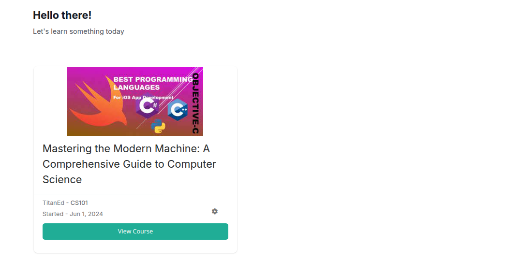
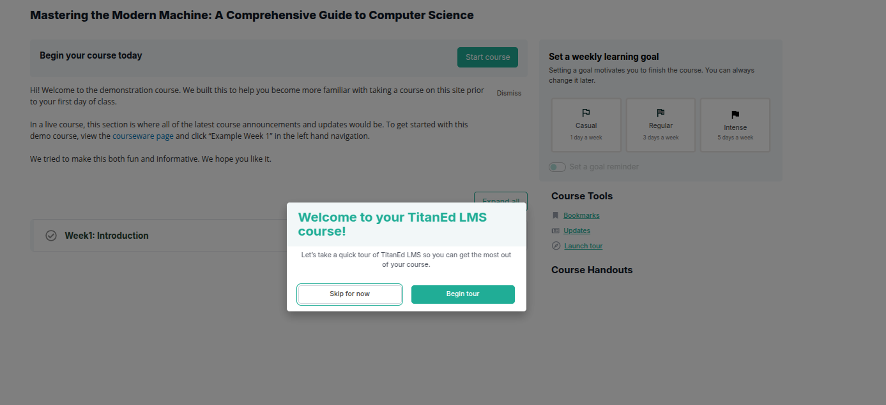
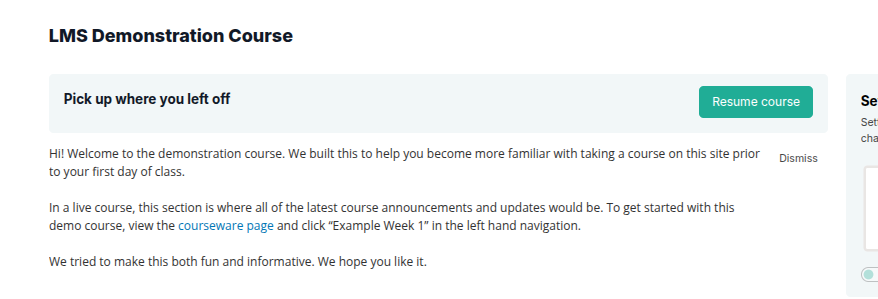
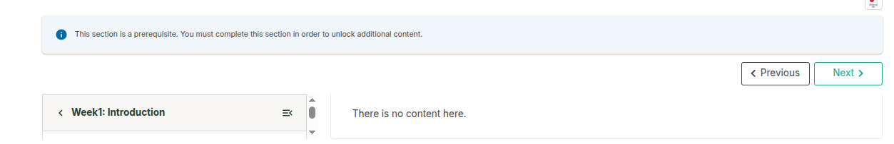
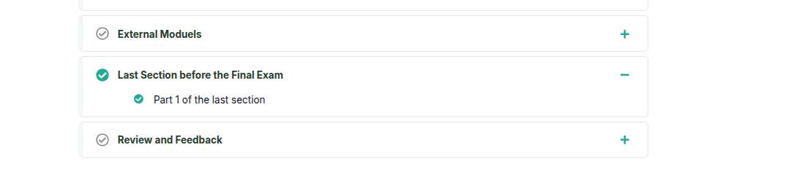
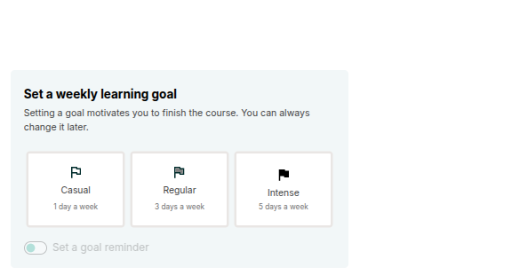

# Starting and Resuming a Course

After enrolling in a course, the next step is to begin learning. This guide explains how to start a course once it becomes available and how to return to where you left off.

---

## Course Visibility After Enrollment

Once you enroll in a course:

- The course appears on your **dashboard**
- You will see the **course title**, **instructor/organization name**, and the **start date**

> **Note**: You can enroll in a course before it begins. However, you will not be able to access any course materials until the official start date has passed.

---

## Accessing the Course After It Starts

Once the course start date has passed, you can begin.

### To Start a Course:

1. Go to your dashboard  
2. Locate the course you want to begin  
3. Click **View Course**  
4. You will be taken to the **Course Page**

On the Course Page:

- You may see a **welcome message** from the course team
- At the top of the outline, you'll find a **Start Course** button

> **Tip:**Taking the tour is optional, but it's a great way to quickly understand the layout and get comfortable before you start learning.

Click **Start Course** to begin at the very first section.  
Alternatively, you can open any section by expanding the outline and selecting a topic of your choice.

---

> **Resuming a Course:**
When you return to a course later, you don’t need to remember where you left off. There are convenient ways to resume learning.

---

### Resume Your Most Recent Course

You can go back to the most recently completed unit across all your courses.

- Click the arrow next to your username at the top of any page  
- Select **Resume your last course**  
- The platform will take you directly to the last unit you completed

---

### Resume a Specific Course

You have two ways to resume a specific course:

#### From the Dashboard:
- Find the course you want to continue
- Click **Resume Course**

#### From Within the Course:
- Open the course normally
- Click **Resume Course** on the Course Page

You will be taken to the **last unit** you completed in that course.

---

### Understanding Prerequisite Messages

If you see this message:

> This section is a prerequisite. You must complete this section in order to unlock additional content.

It means that you need to complete the required sections in order, step-by-step.

You cannot access or complete later sections until you finish all previous ones.

This helps you build knowledge progressively and ensures you don’t miss important information.

---

## How Completion is Tracked

A unit is marked as **complete** when all the following actions are done:

- All videos have been watched  
- All questions or problems have been attempted or submitted  
- All text and content have been viewed for at least five seconds

Once a section is complete, a **green check mark** appears in the course outline next to that unit.

This helps you easily track your learning progress and know what’s next.

---

## Summary

| Action | Steps |
|--------|-------|
| **Start a new course** | Go to your dashboard → View Course → Start Course |
| **Jump to a section** | Use the Course Outline to select a section |
| **Resume recent course** | Use the dropdown next to your name → Resume your last course |
| **Resume specific course** | Use Resume Course from dashboard or Course Page |
| **Track progress** | Look for green check marks on the course outline |

Once enrolled and started, your learning experience is tracked and easy to manage.

---

## What You’ll See on the Right Side of Your Course

As you work through your course, there’s a sidebar on the right side of the screen with helpful tools and updates. Here’s what each section means:

## Course Tools

**Bookmarks**  
You can save lessons or pages that you want to return to later.

**Updates**  
This section shows important announcements or changes shared by your instructors.

**Important Dates**  
Here you'll see key deadlines and events, like assignment due dates or the final day to complete the course.

## Course End Date

**Course ends on:  for ex: Wednesday, September 2, 2026**

After this date:
- You can still view the course content  
- But you won’t be able to submit assignments, take quizzes, or earn a certificate  
- Participation features like discussions or grading may be closed

Make sure to finish everything before the course end date.

## Course Handouts

This section includes any extra materials your instructor has shared. These might include:
- The course syllabus  
- Weekly schedules  
- Extra readings or reference materials

The sidebar is there to help you stay on track and get the most out of your course.

## Set a Weekly Learning Goal

Setting a weekly learning goal can help you stay motivated and on track as you move through the course. You can always update your goal later if your schedule changes.

Choose the option that works best for you:

**Casual**  
1 day a week  
Take your time and check in once a week.

**Regular**  
3 days a week  
Stay consistent and build steady progress.

**Intense**  
5 days a week  
Move quickly and stay focused throughout the week.

> **Get Reminders**
You can choose to receive reminders based on your learning goal. These can help you stay on track and avoid falling behind.
you’ll be able to turn reminders on or off at any time in your settings.
