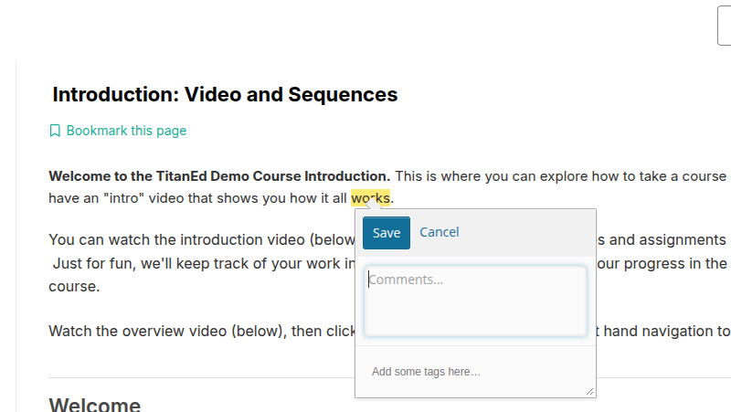

# Taking Notes in a Course

This guide explains how to create, manage, and view notes within your course platform.

---

## Overview of Notes

In supported courses, you can **highlight passages** and **add notes** directly within course content. This helps you keep track of key ideas and organize your learning.

> **Note:**  
> Notes are available for most regular text content. However, they are **not supported** in exercises, videos, or PDF textbooks.

### Key Features:
- A **Notes page** is accessible from the top of every course unit (if notes are enabled).
- A **pencil icon** appears in the lower-right corner of the page to manage note visibility.
- Notes can include **text** and **tags** for easier organization.
- You can view notes **inline** or through the **Notes page**.

---

## How to Highlight a Passage or Add a Note

1. **Select the text** you want to highlight.
2. A pencil (✏️) icon appears above the selection — click it to open the note editor.
3. In the editor, you can:
   - Just **highlight** the passage and save it.
   - **Add a comment** under the "Comments" section.
   - **Add tags** to organize your notes.
     > Tags cannot include spaces. Use hyphens `-` or underscores `_` to separate words.
4. Click **Save** or press **Enter** to confirm your note.

---

## Viewing Notes

You can view notes in two ways:

### 1. In the Course Content  
Hover over or select highlighted text to view the note.

### 2. On the Notes Page  
- Access a list of all your notes.
- Search through notes by **text** or **tags**.
- Notes are shown with:
  - The highlighted text.
  - Your note content.

  

---

## Editing or Deleting Notes

### To Edit:
1. Hover over the highlighted text.
2. Click the pencil icon.
3. Update your note and click **Save**.

### To Delete:
1. Hover over the highlight.
2. Click the **trash icon** to delete the note and/or highlight.

---
