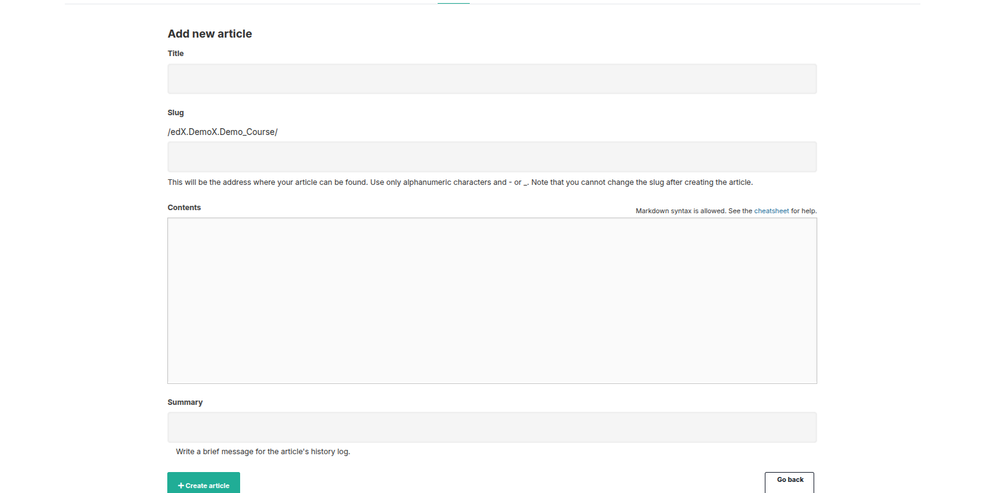
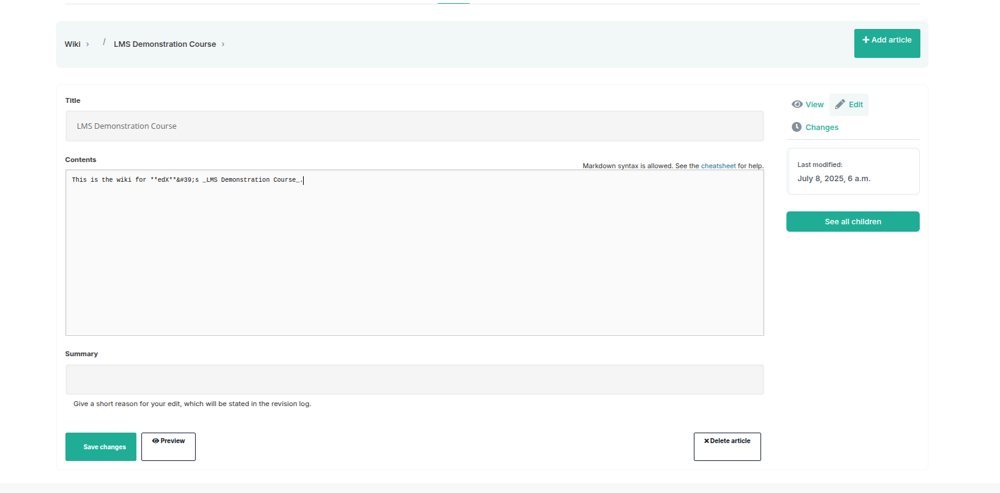

# Course Wiki Overview

Our courses offer a wiki — a collaborative space where both students and instructors can view, share, and update course-related information. If your course features a wiki, you can find it by clicking the **Wiki** tab located at the top of any course page. If you don’t see this tab, it means the wiki is not enabled for your course.

## Purpose of the Wiki

The course team may utilize the wiki for several reasons, including but not limited to:

- Providing answers to frequently asked questions (FAQs) and gathering new questions from students.
- Sharing detailed instructions, such as how to download or install required software.
- Encouraging students to contribute and exchange learning resources, often as part of group assignments.
- Reporting and correcting errors found in course content.
- Collecting feedback and suggestions for improving future iterations of the course.

## What Students Can Do

Depending on the permissions granted by the course team, students may be able to:

- Create new wiki articles.

- Edit existing articles. When editing is allowed, an **Edit** button appears on the right side of the page for each article.  
- Search through the collection of wiki articles.

> To move down a level in the wiki, select See all children; to move up, select the appropriate level in the wiki breadcrumb trail links at the top of the page.

Note: Only instructors and course staff have the ability to delete wiki articles entirely.

---

Feel free to contribute actively to keep the wiki a helpful and up-to-date resource for everyone!
