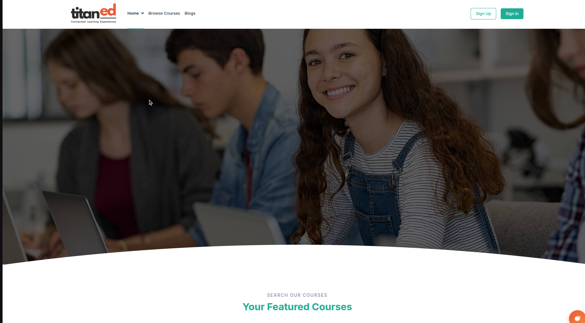
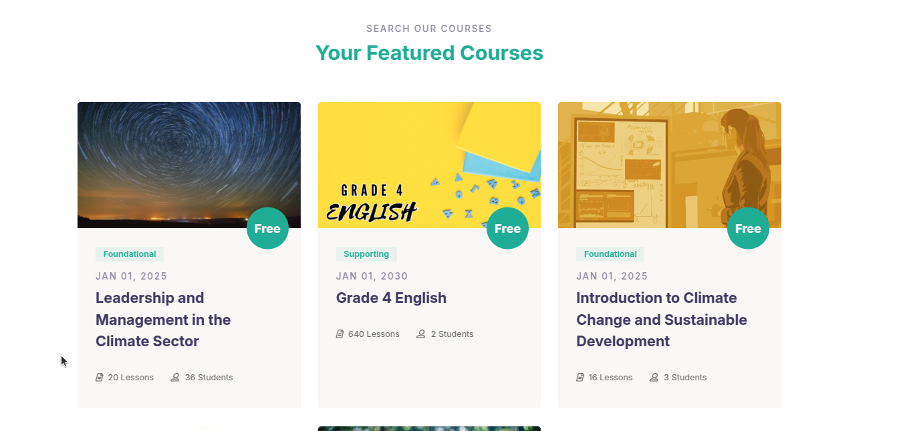

# LMS Home Page Overview – TitanEd

The TitanEd LMS homepage is designed to provide users with a streamlined and intuitive learning experience. Key features are strategically placed to ensure easy navigation and quick access to relevant course information.

 

 
> Register and Sign In buttons located at the top right corner for easy access.

> The platform also highlights recommended courses, student success stories, and the educational approach to engage and motivate learners.

> Additional resources like blogs, policies, and contact information are accessible, providing a complete and transparent learning environment.

> Powered by TitanEd Open edX, the homepage ensures an efficient and welcoming experience for all users.

## Featured Courses Section
- Displays a curated list of highlighted courses.
- Shows course title, code, price, level, start date, number of lessons, and enrolled students.
- Courses are grouped by categories such as Foundational, Supporting, and Geography.

---

## Learn New Skills
- Showcases top or recommended courses to help learners develop new skills.
- Courses in this section often overlap with Featured Courses but emphasize popular or trending offerings.

