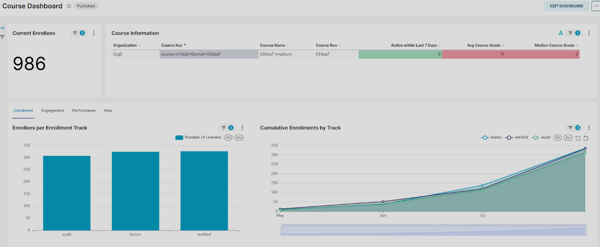
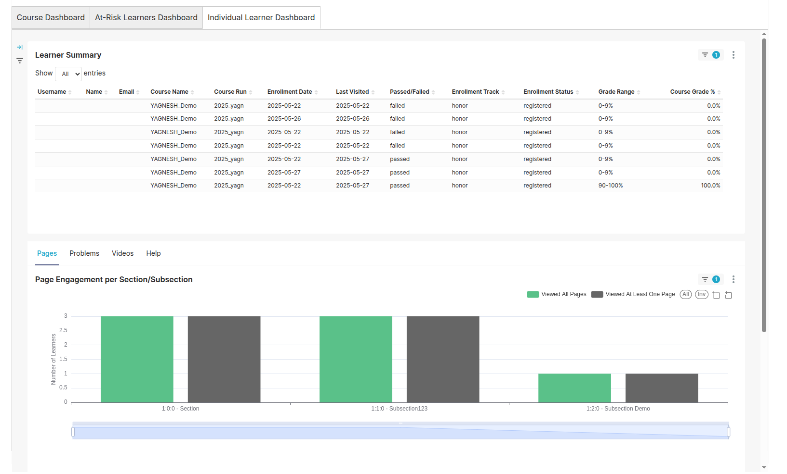

## Accessing Reports and Learner Analytics

In addition to grading submissions, instructors can access various analytics dashboards to monitor learner progress, engagement, and assessment activity.

## Navigating to the Reports Section

1. From your LMS course page (as an instructor), click on the **Instructor** tab.
2. Then select the **Reports** sub-tab.

This section provides access to high-level and learner-specific analytics.

---

## Key Reports Available

### 1. Course Dashboard

- Offers a broad overview of course activity.
- Tracks submissions, grades, discussion activity, and enrollment.
- Useful for identifying overall trends and engagement patterns.

### 2. At-Risk Learners Dashboard

- Identifies learners who may need support.
- Highlights low-performing or inactive students.
- Helps staff intervene early for retention and completion.

### 3. Individual Learner Dashboard

- Allows instructors to view detailed activity for a single student.
- Shows:
  - Submission and grading history
  - ORA participation
  - Video views, discussions, and quiz performance
- Useful for 1-on-1 support or manual grading follow-ups.

---
