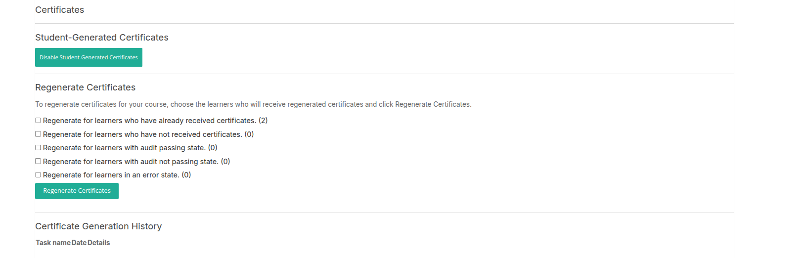
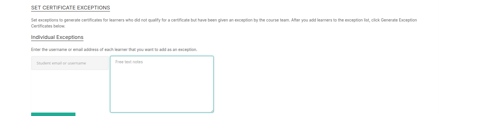

# Certificates Management

This section allows instructors to manage the generation, regeneration, exceptions, and invalidation of course completion certificates for learners.

---

## Student-Generated Certificates

Learners can generate their own certificates upon meeting course requirements.

---

## Regenerate Certificates

Instructors can regenerate certificates for learners by selecting one or more learner groups:

- **Learners who have already received certificates**  
- **Learners who have not received certificates**  
- **Learners with audit passing status**  
- **Learners with audit not passing status**  
- **Learners in an error state**

After selecting the groups, click **Regenerate Certificates** to initiate the process.

---

## Certificate Generation History

View a history of certificate generation tasks with details such as:

- Task name  
- Date  
- Additional details

---

## Set Certificate Exceptions

Use this feature to grant exceptions to learners who do not normally qualify for certificates but have been approved by the course team.

### Individual Exceptions

Add learners by entering their username or email address along with any relevant notes. Then add them to the exception list.

### Bulk Exceptions

Upload a CSV file containing usernames or email addresses, with an optional note explaining the exception reason.

---

## Generate Exception Certificates

After adding learners to the exception list, select the group and click **Generate Exception Certificates** to create certificates for those learners.

---

## Exception List Overview

| Name           | User Email           | Exception Granted | Certificate Generated | Notes | Action          |
|----------------|----------------------|-------------------|----------------------|-------|-----------------|
| Example Name   | example@email.com     | Date Granted      | Date Generated       | Notes | Remove from List|

---

## Invalidate Certificates

To revoke a certificate, enter the learner's username or email address along with any notes, and submit the request to invalidate the certificate.

---

This system helps instructors maintain accurate and fair certification records for their courses.
