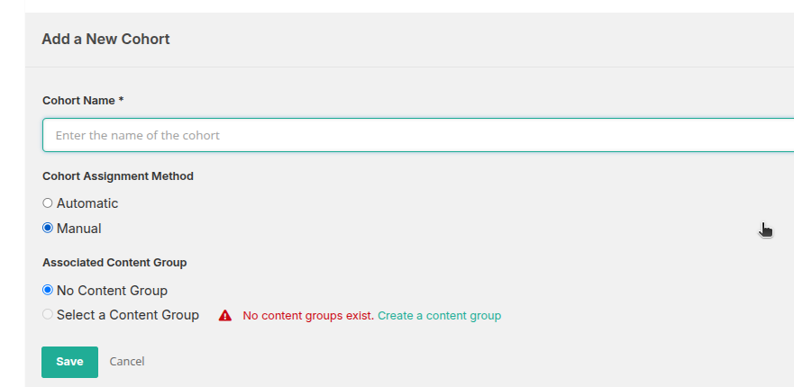
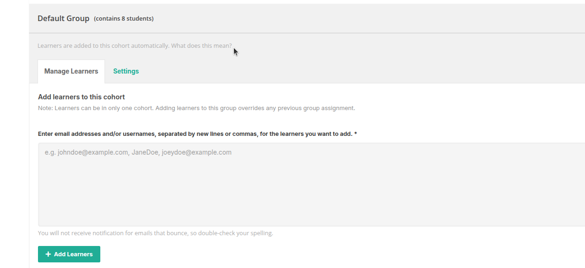

## Cohorts

Cohorts are used to divide learners into subgroups within a course. This feature helps manage learner interactions and content visibility, particularly in course discussions and group-specific content.

### What Are Cohorts?

- A cohort is a group of learners that can be assigned automatically or manually.
- Learners in different cohorts can be shown different content or kept in separate discussion groups.
- Cohorting helps customize the learning experience for different segments of learners.

### Key Features

- **Automatic Cohort Assignment**  
  Learners are automatically assigned to cohorts based on platform settings. You can configure which cohort is the default or base cohort.

- **Manual Cohort Assignment**  
  Instructors or staff can assign learners to specific cohorts via the Cohorts tab or through the LMS enrollment tools.

- **Cohort-Specific Discussions**  
  Discussion topics can be restricted to specific cohorts to create private conversations within each group.

- **Cohort Visibility**  
  Course content can be shown to all learners or restricted to one or more specific cohorts. This allows for differentiated content delivery.

## Add a New Cohort

  

Use this section to create a new cohort and configure its assignment method and associated content group.

### Cohort Name *(Required)*

- Enter a unique name for the cohort.
- This name is used to identify the group of learners throughout the course.

### Cohort Assignment Method

Choose how learners should be assigned to this cohort:

- **Automatic**:  
  Learners are automatically added to this cohort based on the platform’s assignment rules.

- **Manual**:  
  Learners are assigned manually by instructors or course staff.

### Associated Content Group

## Cohort Management

Cohorts allow you to group learners within a course. Each learner can belong to only one cohort.

### Default Cohort

- One cohort must be set as the default for automatic learner assignment.
- Learners added automatically are placed in this group unless manually reassigned.

### Add Learners

  

- Enter email addresses or usernames (comma or newline separated).
- Assigning a learner to a new cohort replaces their previous group.

Link the cohort to a content group if you want to deliver specific course materials or discussions only to this group:

- **No Content Group**:  
  Select this option if the cohort should not be tied to any specific content.

- **Select a Content Group**:  
  Choose an existing content group from the list.

> **Warning**: No content groups currently exist. You must create a content group before one can be selected.

## Assign Learners via CSV Upload

You can assign learners to cohorts in bulk by uploading a `.csv` file.

### CSV Requirements

- The file must be in `.csv` format.
- It should include valid learner identifiers (e.g., email or username) and corresponding cohort names.
- Only properly formatted files will be accepted.

### Upload Instructions

1. Choose your `.csv` file using the upload option.
2. Verify formatting before submission to avoid errors.
