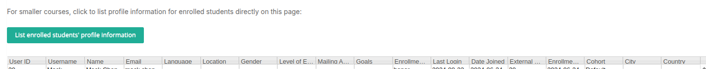
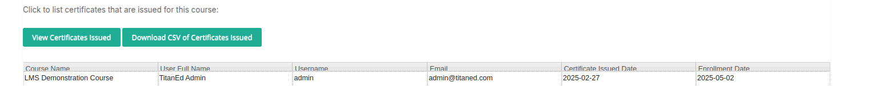
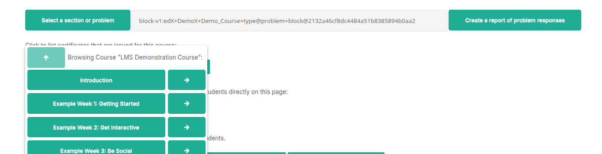
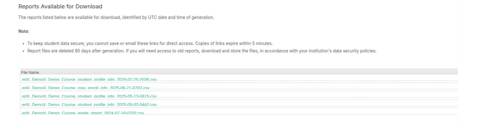

# Data Download Report

The **Data Download** section of the LMS Instructor Dashboard allows instructors with appropriate permissions to generate and download various reports. Access requires the **Course Data Researcher** role, in addition to course staff or admin privileges. This role can be assigned via the **Membership** tab in the course.

Reports are listed in the **Data Download** tab with brief descriptions. Once selected, reports are generated and available for download at the bottom of the page, typically in **.csv** format, compatible with spreadsheet software or text editors.

## Available Reports

## Learner Profile Information Report

This is a very useful report that lists all the profile information of learners enrolled in a course. The report includes the following columns:

- **id**
- **username**
- **name**
- **email**
- **language**
- **location**
- **year_of_birth**
- **gender**
- **level_of_education**
- **mailing_address**
- **goals**
- **enrollment_mode**
- **verification_status**
- **last_login**
- **date_joined**
- **team**
- **city**
- **country**

## Anonymized Students

  

This report lists the anonymized learner IDs. It includes the following columns:

- **User ID**: Numeric ID in the system  
- **Anonymized User ID**: The same anonymized ID for a learner across all their courses  
- **Course Specific Anonymized User ID**: A different anonymized ID for the learner in each individual course  

## Users Who Can Enroll

  

This report lists people who have been invited to the course but have not yet registered on the platform. Their enrollments are still pending.

The report contains the following column:

- **email**

## Certificates Issued for This Course

Click the button below to view the list of certificates issued: **View Certificates Issued**

---

## Certificates List

This will display the list of certificates issued for the course.

### Download CSV Report for Certificates

You can download a CSV report containing the certificate details with the following columns:

- **Course Name**
- **User Full Name**
- **Username**
- **email**
- **Certificate Issued**
- **Date**
- **Enrollment Date**

> **Note:**  
> The CSV report will provide a detailed export of all certificates issued, including enrollment and issuance dates for auditing and record-keeping purposes.

## CSV of Problem Responses Report

This report lists all the responses a particular problem has received.

### Columns Included:
- **username**
- **title**
- **location**
- **Answer**
- **Answer ID**
- **Correct Answer**
- **Question**
- **block_key**
- **state**

## How to Generate the Report

- Select a **problem** to generate a CSV file listing all student answers to that problem.
- Alternatively, select a **section** or **chapter** to include results for all problems within that section or chapter.

---

> **NOTE:**  
> The generated report is limited to **5,000 responses**.  
> If you expect more than 5,000 responses, try generating the report by:  
> - Chapter-by-chapter  
> - Problem-by-problem  
> Or contact your site administrator to increase the limit.

## Grade Report

This is a key report that will list the main learner profile fields, the total grade, and the computed grade for each of the graded subsections in the course.

### Columns Included:
- **Student ID**
- **Email**
- **Username**
- **Grade**: The total computed grade for the learner in the course
- **Graded Subsection #1**: The grade for this graded subsection
- **Graded Subsection #2**: The grade for this graded subsection
- **Graded Subsection (Avg)**: The computed average for all the graded subsections in this assignment type
- **Experiment Group (A/B test)**
- **Team Name**
- **Enrollment Track**
- **Verification Status**
- **Certificate Eligible**
- **Certificate Delivered**
- **Certificate Type**
- **Enrollment Status**

---

# Problem Grade Report

This is a key report that will list the main learner profile fields, the total grade, and the learner score in each problem across all graded subsections in the course.

### Columns Included:
- **Student ID**
- **Email**
- **Username**
- **Enrollment Status**
- **Grade**
- **Assignment Type 1: Problem Type - Problem Name (Earned)**
- **Assignment Type 1: Problem Type - Problem Name (Possible)**
- **Assignment Type 1: Problem Type - Problem Name2 (Earned)**
- **Assignment Type 1: Problem Type - Problem Name2 (Possible)**

> **Note**:  
> For each problem, the report will have 2 columns:  
> - One with the **earned score** for each learner  
> - One with the **maximum possible** points for that problem  

---

# ORA Data Report

This report lists the anonymized submissions to Open Response Assessment (ORA) problems and the feedback they collected. This report cannot be read in standard spreadsheet format, as some fields are represented in JSON format.

### Columns Included:
- **Submission ID**
- **Item ID**
- **Anonymized Student ID**
- **Date/Time Response Submitted**
- **Response**
- **Assessment Details**
- **Assessment Scores**
- **Date/Time Final Score Given**
- **Final Score Points Earned**
- **Final Score Points Possible**
- **Feedback Statements Selected**
- **Feedback on Peer Assessments**

## Click to generate a ZIP file that contains all submission texts and attachments.

## Reports Available for Download

The reports listed below are available for download and are identified by the UTC date and time of generation.

**Note:**

- To keep student data secure, you cannot save or email these links for direct access.  
- Copies of links expire within 5 minutes.  
- Report files are deleted 90 days after generation.  
- If you will need access to older reports, be sure to download and store the files in accordance with your institution's data security policies.

