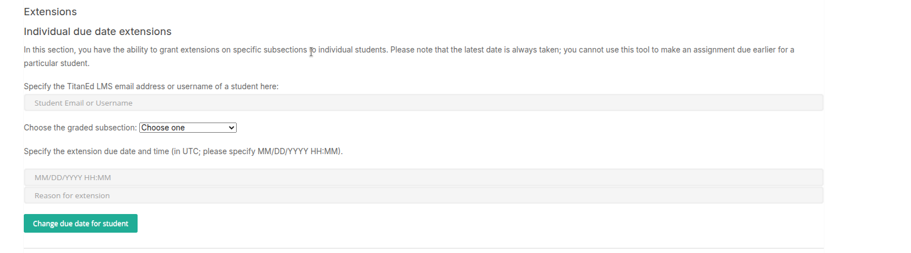
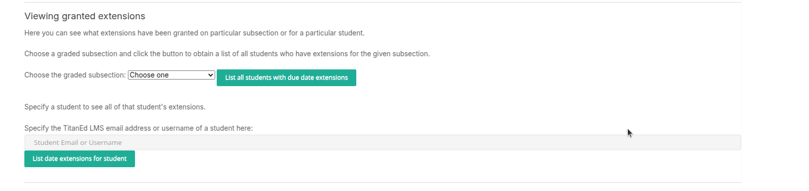
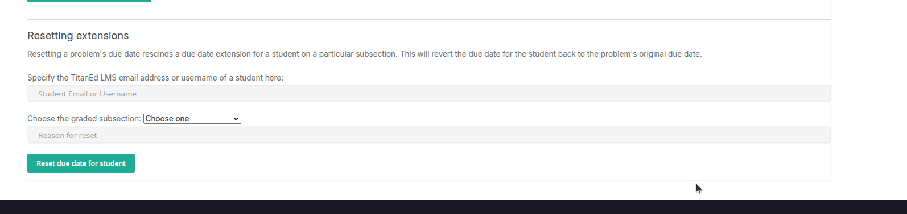

## Extensions

This section allows instructors to grant due date extensions for graded subsections to individual learners.

### Important Notes

- You can only **extend** due dates — not shorten them.
- The system always uses the **latest applicable due date** for a learner.
- Extensions apply to specific graded subsections only.

  

### How to Grant an Extension

1. **Enter the learner’s email or username.**
2. **Choose the graded subsection** from the dropdown list (e.g., Assignment 1, Quiz 2).
3. **Enter the new due date and time** in `MM/DD/YYYY HH:MM` format (UTC).
4. Optionally, provide a **reason for the extension**.
5. Click **Change Due Date for Extension** to apply the update.

> Only valid and later dates will be accepted.

## Viewing Granted Extensions

This section allows instructors to view which learners have been granted due date extensions.

  

### Option 1: View by Subsection

- **Choose a graded subsection** from the dropdown menu.
- Click **List all students with due date extensions** to display all learners who have an extension for that subsection.

### Option 2: View by Student

- **Enter the learner’s email or username** in the input field.
- Click **List date extensions for student** to view all granted extensions for that learner.

> Use this section to verify and manage extension records easily.

## Resetting Extensions

This section allows instructors to remove a previously granted due date extension for a specific student and subsection.

  

### Function

- Resets the student’s due date for the selected graded subsection.
- Reverts to the original course due date.
- Any extension previously granted will be removed.

### How to Reset

1. **Enter the student’s email or username.**
2. **Choose the graded subsection** from the dropdown list.
3. **Provide a reason for the reset** (optional but recommended).
4. Click **Reset due date for student** to apply the change.

> This action cannot be undone. Confirm all details before submitting.
