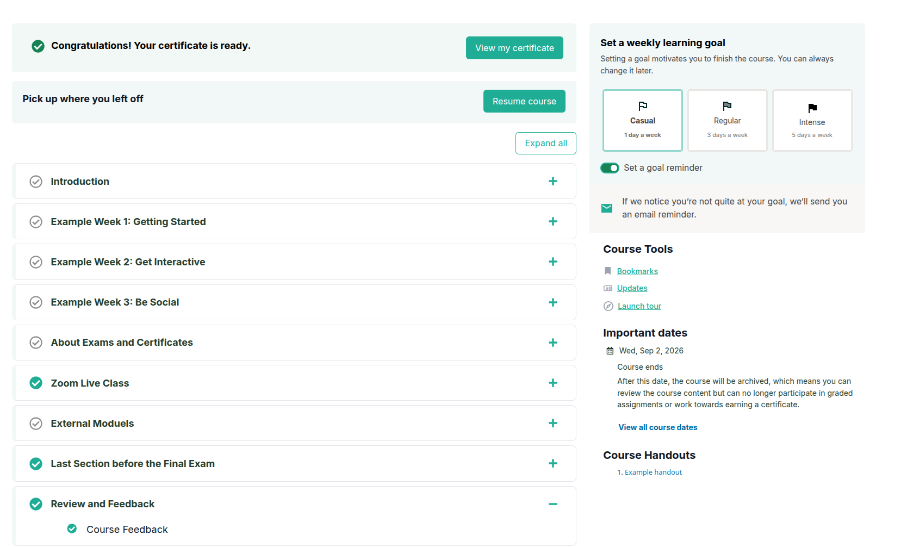
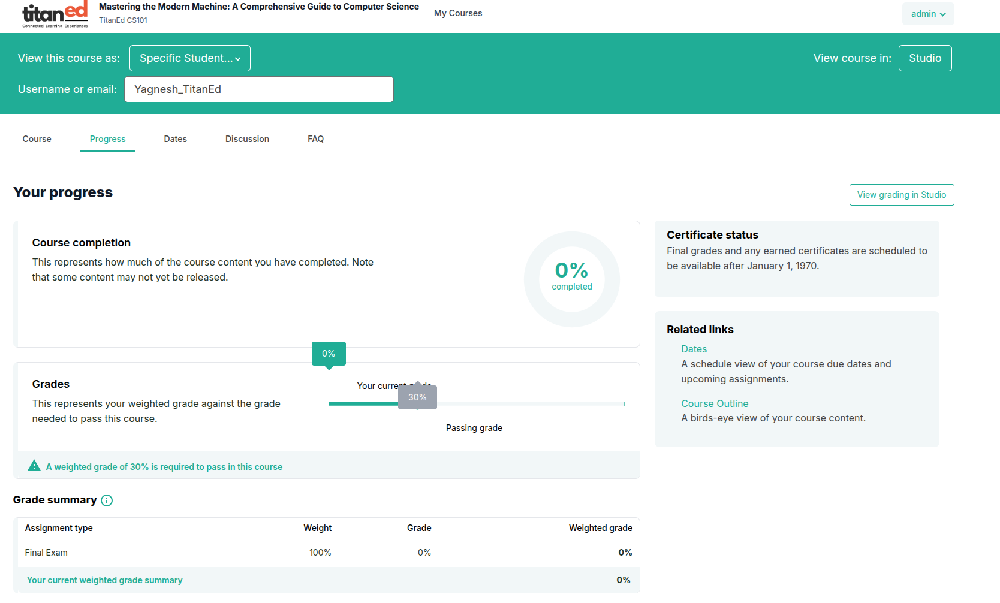
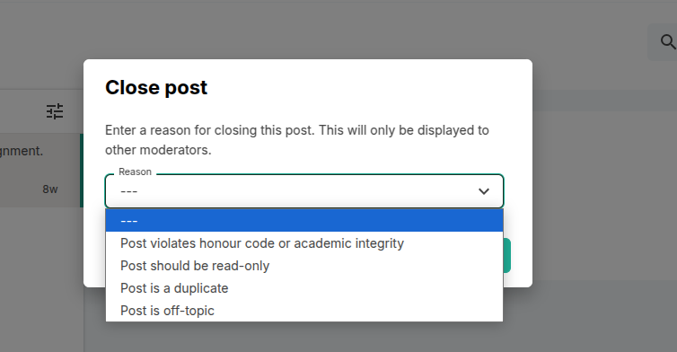
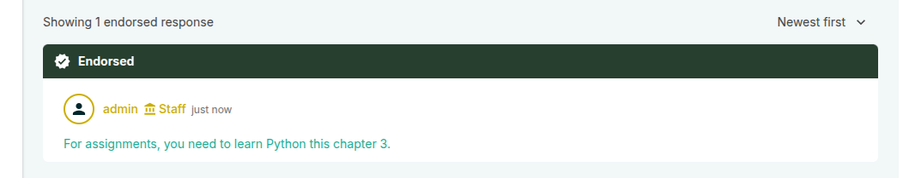
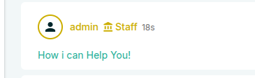
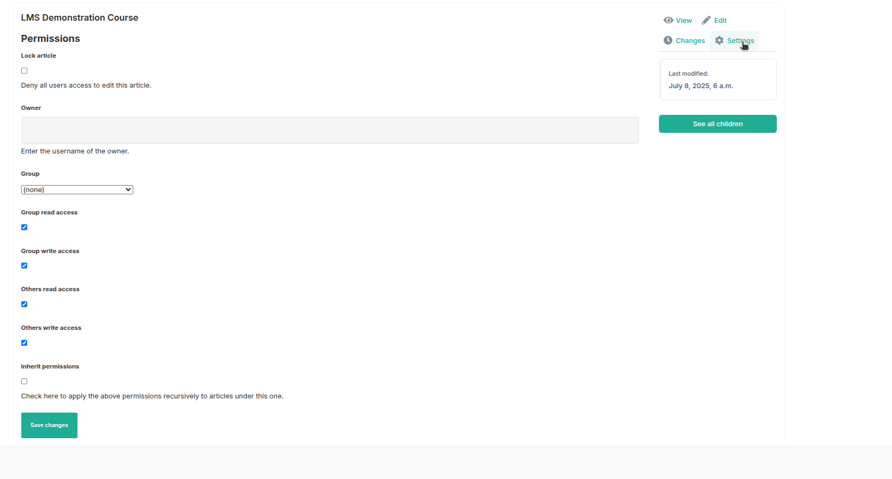

# Instructor Access Overview

## Login and Role Logic

- All users log in using the same process.
- After login, the system checks the user's roles.
- Instructors also have access to the **Studio** environment.
- Studio is the course authoring and management platform where instructors can:
  - Create new courses
  - Edit existing course content
  - Manage course structure and settings
  - Upload resources and assessments
- Studio access is granted automatically based on the instructor role.
- This allows instructors to build and maintain their courses independently.

## Instructor Actions in the Course Tab

The Course tab allows instructors to manage various aspects of their courses, including:

- **Create and Edit Course Content:** Build and organize lessons, modules, and activities.
- **Upload Resources:** Add videos, documents, quizzes, and other learning materials.
- **Set Course Structure:** Arrange chapters, sections, and units to guide the learning path.
- **Manage Enrollments:** View and control student enrollment and access.
- **Monitor Progress:** Track learner activity and performance within the course.
- **Publish or Unpublish Content:** Control when course materials are available to students.
- **Communicate with Learners:** Post announcements and updates related to the course.
- **Configure Course Settings:** Adjust options like grading policies, deadlines, and accessibility.

These tools empower instructors to effectively design and maintain their courses, ensuring an engaging learning experience.

# Viewing Course Progress as a Specific User

On the Progress page, instructors have the ability to:

- **View this course as:** Enter a learner’s username or email address.
- After entering the user details, the instructor can see the course progress and activity from that learner’s perspective.
- This includes detailed information about completed modules, quiz scores, assignment submissions, and overall progress.
- It allows instructors to closely monitor individual learner performance and provide personalized support if needed.

> This feature helps instructors understand exactly how each learner is progressing within the course at an individual level.

## Discussion Feature Overview

The discussion forum is a vital space for learner interaction and community building. Instructors have comprehensive control over the forum to ensure meaningful and respectful conversations. Key capabilities include:

- **View All Posts:**  
  Instructors can access every post made within the discussion forums. This includes initial threads and all replies, allowing instructors to monitor the flow of conversation and stay informed about learner questions and feedback.

- **Create Posts:**  
  Instructors can initiate new discussion threads or contribute to existing ones. This allows them to guide discussions, provide additional insights, share announcements, or pose questions to encourage engagement.

- **Delete Posts:**  
  To maintain a positive and respectful environment, instructors can delete posts that are inappropriate, off-topic, or violate community guidelines. This moderation helps keep discussions focused and productive.

- **Filter Posts:**  
  Instructors can apply filters to sort posts based on different criteria such as user name, date, topic, or post status. This makes it easier to locate specific conversations or monitor activity related to particular learners or subjects.

- **Manage Discussions:**  
  Beyond viewing and moderating posts, instructors can oversee the overall discussion flow to foster a collaborative learning atmosphere. They can respond to queries, highlight important threads, and ensure the forum supports course objectives.

- **Close Posts (with Reason):**  
  Instructors can close discussion threads to prevent further replies. When closing a post, instructors provide a reason to clarify the action. Common reasons include:  
  - Post violates honor code or academic integrity  
  - Post should be read-only  
  - Post is a duplicate  
  - Post is off-topic

- **Endorse Posts:**  
  Instructors can endorse posts to highlight valuable contributions or correct answers. Endorsed posts are marked prominently to guide learners toward useful information.
  

By effectively using these tools, instructors can enhance learner participation, address concerns promptly, and build a supportive online community.

### Wiki Management by Instructor

- **Instructor** have **full access** to the course wiki.
- They can:
  - **Create**, **edit**, and **delete** wiki pages.
  - Oversee all wiki activity within their courses.
  - Deleting wiki articles as well.

