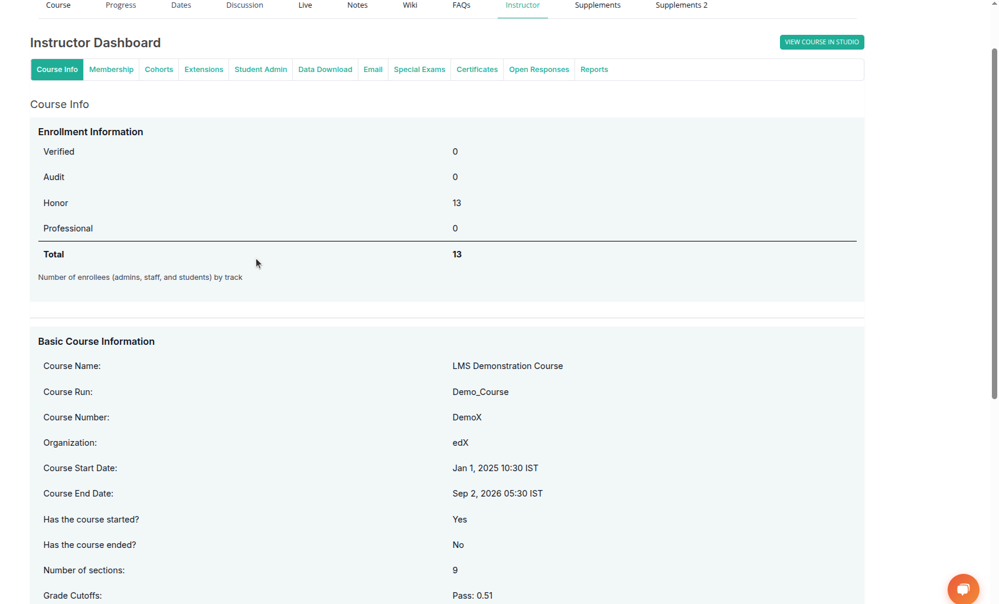

# Instructor Course Interface Guide

In the course platform, instructors have access to various tabs that provide different types of information and management options.

## Accessing Course Information

- When you enter a course as an **instructor**, you can see a list of tabs available for managing and viewing course details.
- The **first tab** you will see is **Course Info**.

  

## Course Info

The Course Info section provides an overview of key details related to the course configuration and enrollment statistics. This section is visible to instructors and staff users.

### Enrollment Information

Displays the number of users enrolled in the course by enrollment track. Typical tracks may include:

- Verified
- Audit
- Honor
- Professional

Each track count includes all active users with corresponding roles (e.g., students, staff, admins). A total enrollment count is also provided for reference.

### Basic Course Information

This section summarizes essential course metadata, which may include:

- **Course Name**: The display title of the course as seen by learners.
- **Course Run**: The unique run identifier for the course session.
- **Course Number**: A short alphanumeric code used to identify the course.
- **Organization**: The institution or provider offering the course.
- **Course Start Date**: The scheduled date and time when the course becomes available to learners.
- **Course End Date**: The scheduled closure date for the course.
- **Has the Course Started?**: Indicates whether the current date is past the start date.
- **Has the Course Ended?**: Indicates whether the course is still active or has concluded.
- **Number of Sections**: Total number of content sections (or units) available in the course.
- **Grade Cutoffs**: Defines the minimum score required to pass the course.

> These fields help instructors monitor course status and ensure that learners are enrolled appropriately based on their selected track.

---

