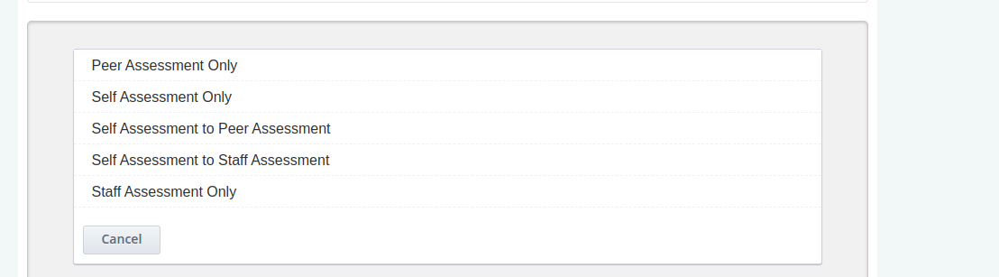
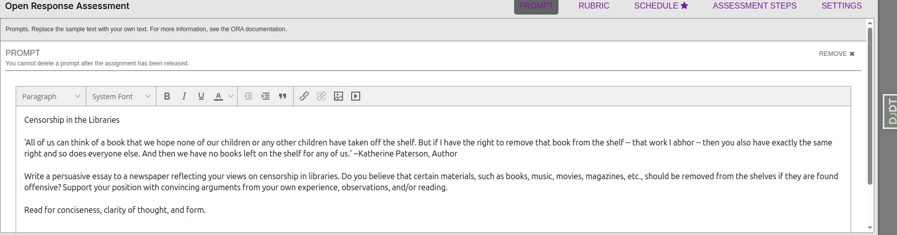
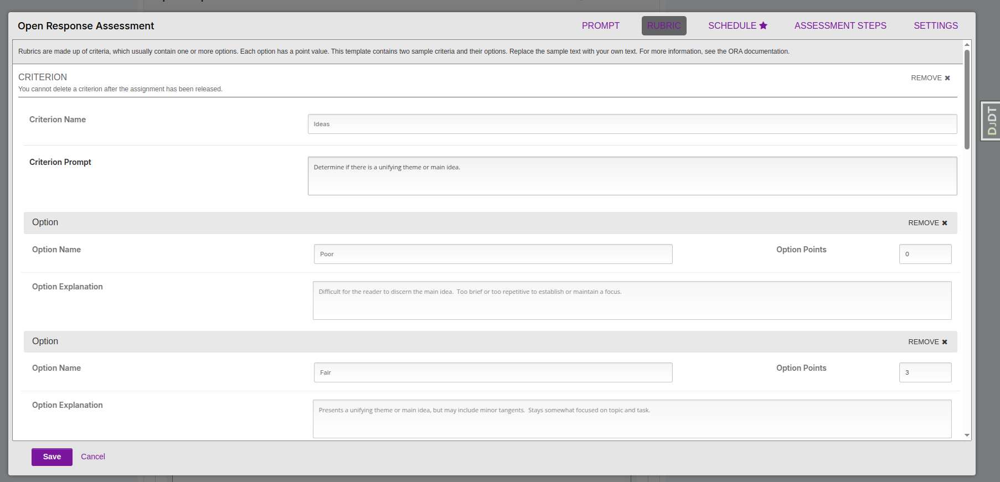
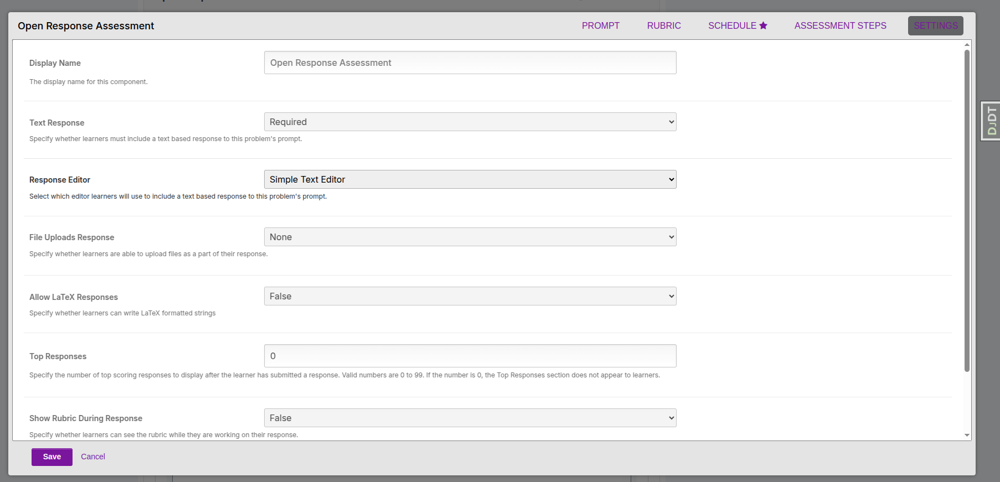
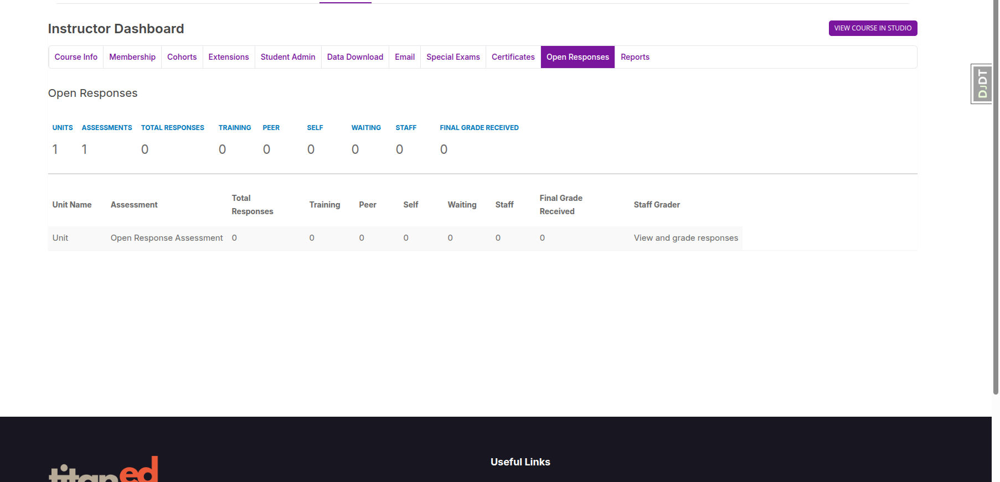
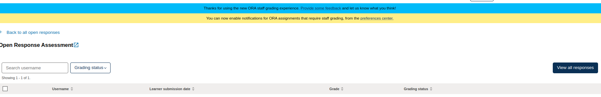
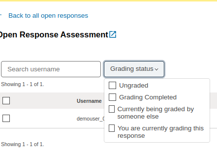
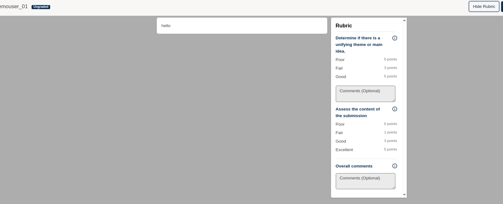
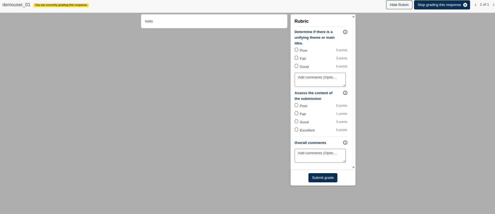

## Open Response Assessment (ORA) Overview and Setup Guide

The Open Response Assessment (ORA) allows learners to answer open-ended questions in essay form or upload files as part of their response. Responses are then graded by learners themselves, their peers, course instructors, or a combination of the three.

There are many ways to configure an ORA. This article provides a quick overview of the problem type so you can get up and running.

---

## Creating an Open Response Assessment

1. From Studio, navigate to the course unit where you want to add the ORA.
2. At the bottom of the unit, click **Add New Component** > **Problem** > **Open Response Assessment**.

> **Note:** You will see both the terms *Peer Assessment* and *Open Response Assessment* used interchangeably. At Appsembler, we use *Open Response Assessment* to avoid confusion.

3. You will see a demo version of the ORA. Click the **Edit** button to begin making changes.

---

## Configuring the Rubric

The rubric defines how learners' responses are graded.

- A rubric consists of **Criteria** — characteristics a learner's response should include.
- Each **Criterion** has a set of **Options**, describing how well the response meets that criterion (e.g., Poor, Fair, Good).
- Each option has a point value assigned.

### Setting up Criteria and Options

- Each criterion requires a **name** and a **description**.
- Under each criterion, add options with:
  - Option name
  - Explanation
  - Assigned points
- You can add more options as needed.
- Choose whether written feedback is **optional** or **required** for each criterion.

Once your rubric is complete, click **Settings** to finish setting up the ORA.

---

## Configuring the Settings of an ORA

In the **Settings** panel, you can configure:

- The **name** of the ORA and the **availability dates** for submissions.
- Whether learners are allowed to upload **files** or include **LaTeX** in their responses.  
  *(See documentation on allowing file uploads for details.)*

### Learner Steps Configuration

Choose which optional steps learners will take by checking/unchecking:

- **Learner Training**  
  Learners see a sample response and how it should be graded.

- **Peer Assessment**  
  Learners assess one another's responses using the rubric.

- **Self Assessment**  
  Learners assess their own responses using the rubric.

- **Staff Assessment**  
  Course staff assess learner responses using the rubric.

> For example, you might enable only **Staff Assessment** if staff grading is preferred.

---

## Responding to an ORA (Learner View)

Once an ORA is live, learners will see the prompt and submission interface.

- After writing their response, learners click **Submit** to proceed.
- If assessment steps like peer or self-assessment are enabled, learners will follow the prompts.
- When waiting for feedback, the system will show a **waiting status**.

---

## Grading an ORA (Staff View)

Staff can navigate to the ORA component to review and grade learner responses:

- Staff read submitted responses.
- Staff provide feedback per the rubric.
- Staff can choose to:
  - Submit the assessment and finish grading this response.
  - Submit and continue grading other responses.

---

This guide is for LMS administrators and course authors who need to create and manage ORA assignments.

Choose the workflow that fits your course objectives.

# ORA Grading Workflow in LMS (Instructor View)

Once learners have submitted their responses, instructors can grade them directly from the LMS interface.

## Accessing Submitted Responses

1. Navigate to the **Open Response** tab inside the course LMS view (as an instructor).
2. A table will display a summary of each ORA assignment with the following columns:
3. Click **View and grade responses** in the corresponding row under the **Staff Grader** column.

---

## Understanding Grading Status

Each response has a grading status that indicates its current state:

- **Ungraded**: The submission has not yet been graded.
- **Grading Completed**: The grading is finalized and a score is assigned.
- **Currently being graded by someone else**: Another staff member is grading the response.
- **You are currently grading this response**: You have opened and started grading this response.

---

## Viewing All Responses

To browse and grade all learner submissions, click the **View all responses** button. This allows staff to see a full list and choose which submissions to review and grade.

---

## Grading a Submission Using the Rubric

1. Select a learner response.
2. In the top-right corner, click **Show Rubric** to expand the rubric interface.
3. The rubric will display all the criteria defined for that ORA.

### Example Rubric Criteria

**Criterion 1**  
*Determine if there is a unifying theme or main idea.*

- Poor — 0 points  
- Fair — 3 points  
- Good — 5 points  
- Add comments (Optional)

**Criterion 2**  
*Assess the content of the submission.*

- Poor — 0 points  
- Fair — 1 point  
- Good — 3 points  
- Excellent — 5 points  
- Add comments (Optional)

**Overall Comments**  
You can provide overall feedback at the bottom of the rubric.

---

## Finalizing the Grade

After selecting scores for each criterion and adding optional comments:

1. Click the **Submit Grade** button to finalize the assessment.
2. You may then proceed to the next submission for grading.

---

