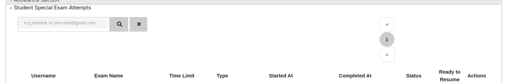

# Special Exam Allowance

This section allows instructors to manage special allowances for exams. These allowances help accommodate students who need additional support or exceptions during assessments.

## Features

- **Add a New Allowance**  
  Instructors can add allowances by entering usernames or email addresses separated by commas.

- **Select Exam Type**  
  Choose the type of exam for which the allowance applies (e.g., proctored exams).

- **Select Exams**  
  Specify one or more exams to which the allowance should be applied.

- **Allowance Type Options**  
  - **Additional Time (minutes):** Provide extra time for the exam.  
  - **Add Time (minutes):** Incrementally add time beyond the standard duration.  
  - **Student Special Exam Attempts:** Allow extra attempts for the exam.

  
  
  - **Review Policy Exception:** Grant exceptions to review policies.  
  - **Time Multiplier:** Multiply the exam time by a specific factor.

---
