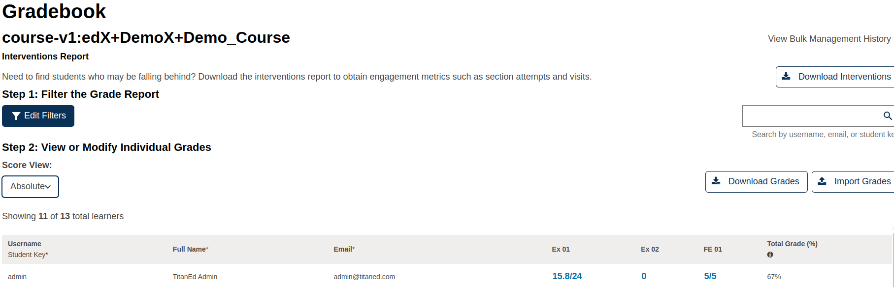
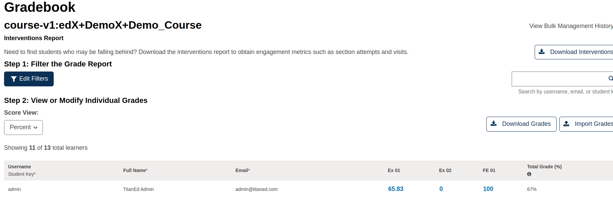
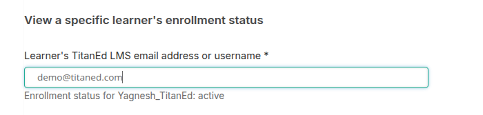
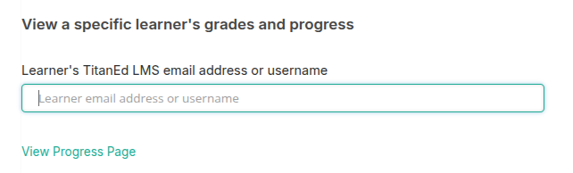
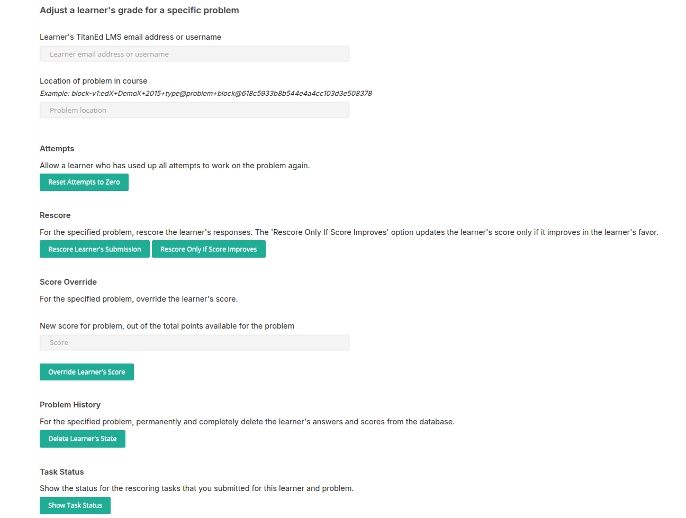
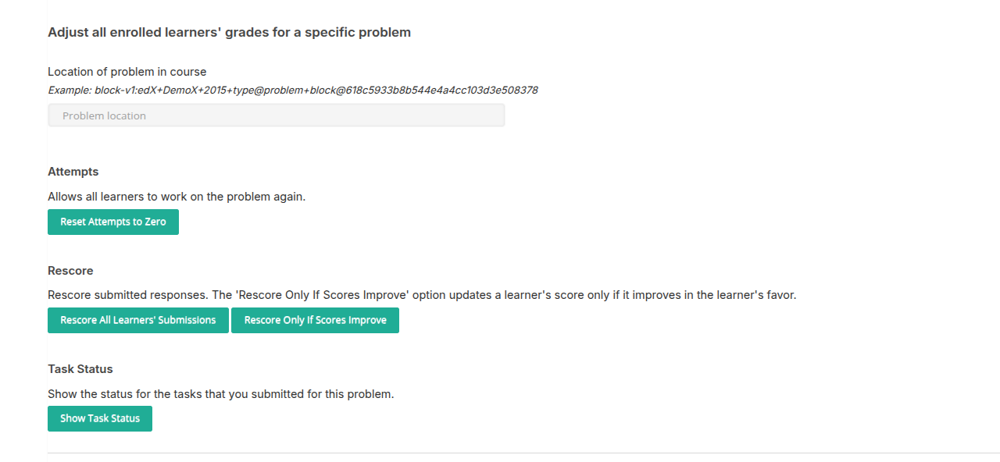

# Student Admin: Gradebook Overview

The Gradebook section under the Student Admin tab allows instructors and course staff to view individual learner performance and manage grading across the course.

## Gradebook View for Enrolled Learners

This table displays a list of learners currently enrolled in the course, along with their progress and scores in graded assignments.

### Columns Typically Displayed

- **Username**: The learner's username in the system.
- **Student Key**: A unique identifier assigned to each student (may be used for internal reporting).
- **Full Name**: The learner’s full name.
- **Email**: The email address registered with the learner’s account.
- **Assignment Columns (e.g., Ex 01, FE 01)**: Each column represents a graded component or subsection.
- **Total Grade (%)**: The learner’s cumulative grade as a percentage.

> Total grades are always shown as percentages, regardless of the assignment type.

### Filtering and Display Options

- **Assignment Types**: Allows filtering by specific assignment types (e.g., Homework, Exams, Projects).
- **Min/Max Grade Ranges**: Instructors can define custom grading boundaries to filter learners by performance range.
- **Student Groups**:
  - **Tracks**: Grouping by course enrollment track (e.g., Verified, Audit).
  - **Cohorts**: Grouping by learner cohort if cohorting is enabled.

### Viewing Modes

- **Score View Options**: Instructors may toggle between different grading views, such as:
  - **Absolute Scores**: Raw numeric scores for each assignment.

    

  - **Percentage Scores**: Scores converted to percentage format for standardized comparison.

    

### Use Cases

- Track learner progress across specific assignments.
- Identify students who may need intervention or support.
- Export grade data for external reporting or manual analysis.

## Best Practices

- Regularly check for zero scores or missing submissions.
- Use student group filters (cohorts/tracks) to analyze subgroup performance.
- Follow up directly with learners whose performance is below expectations.

> Grades shown in this tab reflect current calculations based on submitted work and configured grading policy.

## Gradebook Actions

### 1. **Download Interventions**
This option allows instructors to export a CSV file of learners who may need additional support or intervention. It typically includes data like:

- Learners with low performance
- Missing assignments
- Extended deadlines
- Assignment reattempts

This helps identify students who may benefit from personalized attention.

---

### 2. **Download Grades**
This button exports all current grades for enrolled learners into a CSV file. The downloaded file includes:

- Each student’s scores for all graded components
- Total percentage score
- Any assigned cohort or track information (if applicable)

> Useful for external reporting or offline analysis.

---

### 3. **Import Grades**
Instructors can import updated grade data from a properly formatted CSV file. This is helpful for:

- Uploading scores from offline evaluations (e.g., in-person exams)
- Correcting or adjusting grades in bulk

## View a Specific Learner's Enrollment Status

This tool allows course team members to check if a learner is currently enrolled in the course.

### Instructions:
1. Enter the learner's **email address or username** in the input field.
   - This is a required field.
2. Submit the form to view the enrollment status.

    

## View a Specific Learner's Grades and Progress

This tool allows course team members to access a detailed view of an individual learner's progress and grades.

### Instructions:
1. Enter the learner's **email address or username** in the input field.
   - This is a required field.
2. Click the **"View Progress Page"** button.

### What Happens Next:
- The system will redirect you to the learner's **Progress Page**.
- The Progress Page displays:
  - Grades for each assignment or assessment
  - Overall performance
  - Completion status of course sections

    

## Adjusting Learner Grades in LMS

This guide explains how to adjust grades for a specific problem in the Sumac version of the LMS, including resetting attempts, rescoring submissions, overriding scores, deleting problem history, and checking task status. Actions can apply to an individual learner or all enrolled learners.

## Prerequisites
- **Instructor/Admin Access**: Log in to the LMS with instructor or admin privileges.
- **Learner Information**: For individual adjustments, have the learner’s email address or username.
- **Problem Location ID**: Obtain the problem’s unique ID (e.g., `block-v1:edX+DemoX+2015+type@problem+block@618c5933b8b544e4a4cc103d3e508378`).

## Finding the Problem Location ID
1. In the LMS, go to **Course** > the unit containing the problem.
2. Display the problem and click **Staff Debug Info**.
3. Copy the **location** field value.

## Adjusting Grades for an Individual Learner

### 1. Reset Attempts
Allow a learner who has used all attempts to retry the problem.

1. Go to **Instructor** > **Student Admin**.
2. Under **Student-Specific Grade Adjustment**, enter:
   - Learner’s **email address or username**.
   - **Problem location ID**.
3. Select **Reset Student Attempts** and confirm.
4. Check status via **Show Task Status**.

**Best Practice**: Reset attempts only for errors or special cases. Notify the learner to resubmit.  
**Warning**: This clears previous submissions but retains the score until resubmission.

### 2. Rescore Submission
Rescore a learner’s responses to reflect changes in problem settings or answers.

1. Go to **Course**, locate the problem, and click **Staff Debug Info**.
2. Enter the learner’s **email address or username**.
3. Select **Rescore Student Submission** or **Rescore Only If Score Improves** (recommended).
4. Confirm. A success message appears.
5. Alternatively, use **Instructor** > **Student Admin**:
   - Enter learner’s **email address or username** and **problem location ID**.
   - Select **Rescore Student Submission** and confirm.
6. Check status via **Show Task Status**.

**Best Practice**: Use **Rescore Only If Score Improves** to avoid lowering scores.  
**Warning**: Rescoring works only for problems with defined answers (e.g., CAPA, drag-and-drop). Errors may occur if response fields were modified.

### 3. Override Score
Manually set a new score for a learner’s submission.

1. Go to **Instructor** > **Student Admin**.
2. Under **Adjust a learner’s grade**, enter:
   - Learner’s **email address or username**.
   - **Problem location ID**.
   - **New score** (out of total points, e.g., 8/10).
3. Select **Override Score** and confirm.
4. Verify via **Show Task Status**.

**Best Practice**: Double-check the total points to ensure accuracy.  
**Warning**: Overrides are final and replace the existing score.

### 4. Delete Problem History
Permanently delete a learner’s answers and scores for a problem.

1. Go to **Instructor** > **Student Admin**.
2. Enter learner’s **email address or username** and **problem location ID**.
3. Select **Delete Student State for Problem** and confirm.
4. Verify via **Show Task Status**.

**Warning**: This action is irreversible. Use cautiously, as it removes all submission data.

### 5. Check Task Status
Monitor the status of submitted tasks (e.g., resets, rescoring).

1. Go to **Instructor** > **Student Admin**.
2. Select **Show Task Status** for the learner and problem.
3. Review the status to confirm completion or diagnose issues.

## Adjusting Grades for All Enrolled Learners

### 1. Reset Attempts
Allow all learners to retry the problem.

1. Go to **Instructor** > **Student Admin**.
2. Under **All Learners Grade Adjustment**, enter the **problem location ID**.
3. Select **Reset Attempts for All Learners** and confirm.
4. Check status via **Show Task Status**.

**Best Practice**: Use for widespread issues (e.g., problem errors). Notify learners.  
**Warning**: Affects all learners, clearing prior submissions.

### 2. Rescore Submissions
Rescore all learners’ responses for a problem.

1. Go to **Instructor** > **Student Admin**.
2. Enter the **problem location ID**.
3. Select **Rescore All Submissions** or **Rescore Only If Scores Improve** (recommended).
4. Confirm and check status via **Show Task Status**.

**Best Practice**: Use **Rescore Only If Scores Improve** to protect learner scores.  
**Warning**: Only works for problems with defined answers. Avoid if problem structure changed.

### 3. Check Task Status
1. Go to **Instructor** > **Student Admin**.
2. Select **Show Task Status** for the problem.
3. Review the status for completion or errors.

## Best Practices
- **Backup Data**: Export course data before making bulk changes.
- **Test Actions**: Perform actions on a single learner first to verify outcomes.
- **Communicate**: Inform learners of resets or rescoring to avoid confusion.
- **Verify IDs**: Ensure the problem location ID is correct to avoid affecting the wrong problem.
- **Use Task Status**: Always check task status to confirm successful execution.

