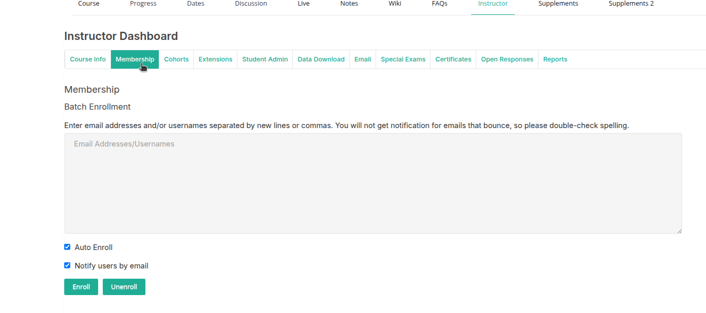
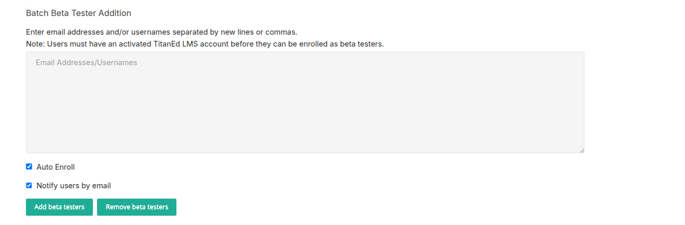
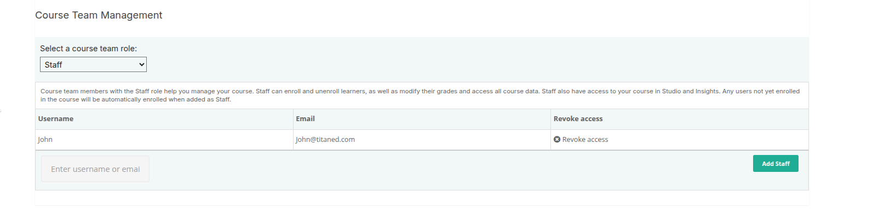

The Membership section allows instructors and staff to manage user enrollment and roles within a course.

### Batch Enrollment

Instructors can enroll multiple users at once using the batch enrollment form. User identifiers (email addresses or usernames) should be entered in the provided field, separated by either new lines or commas.

  

#### Enrollment Options

- **Auto Enroll**  
  If enabled, users who do not yet have an account on the platform will be automatically enrolled in the course once they register.  
  If disabled, users who do not have an account will not be enrolled until they manually register and join the course.  
  This setting has no effect if "Unenroll" is selected during batch processing.

- **Notify Users by Email**  
  If enabled, users will receive an email notification upon successful enrollment.  
  Note: Notification emails will not be delivered to addresses that are invalid or bounce. It is recommended to double-check all entries for correct spelling and format.

> Important: Enrollment changes take effect immediately. Ensure that enrollment lists are verified before submission to avoid accidental access or removal.

## Register and Enroll Students (Bulk Upload)

Instructors can register and enroll multiple learners into a course by uploading a CSV file.

### CSV File Requirements

The CSV file must contain the following columns, in this exact order:

1. `email`
2. `username`
3. `name`
4. `country`

Each row should represent a single learner. Do not include:

- Headers
- Footers
- Blank lines

### Optional Columns

You may also include the following **optional columns**, in this specific order:

5. `cohort`  
6. `course mode`

These optional fields can be left blank if not applicable.

### Upload Instructions

1. Prepare your CSV file based on the structure outlined above.
2. Navigate to the enrollment section of the Instructor Dashboard.
3. Upload the CSV file using the designated upload field.
4. Submit to process the enrollments.

> Tip: Double-check all fields for accuracy before uploading to avoid enrollment errors.

## Manage Beta Testers

The beta tester management section allows instructors to add or remove users who can preview course content before it is published to all learners.

  

### Adding Beta Testers

To add beta testers in bulk:

1. Enter a list of email addresses and/or usernames in the provided input field.
2. Separate each entry with a new line or comma.

> Note: Users must have an activated account on the platform before they can be added as beta testers.

#### Enrollment Options

- **Auto Enroll**  
  If enabled, users who have not yet enrolled in the course will be automatically enrolled as part of the beta tester group.  
  This setting has no effect if the "Remove beta testers" option is selected.

- **Notify Users by Email**  
  If enabled, users will receive an email notification after being added as beta testers.

### Removing Beta Testers

To remove users from the beta tester group:

1. Enter the relevant email addresses or usernames in the same format.
2. Select the "Remove beta testers" option.
3. Submit the form.

> Important: Changes take effect immediately after submission. Double-check user information before applying updates.

## Course Team Management

  

This section allows instructors and administrators to assign roles to course team members. Each role has specific permissions within the course. Users not currently enrolled in the course will be automatically enrolled when assigned a course team role.

### Available Roles

#### Admin
- Full administrative privileges.
- Can add or remove course team members (Admin, Staff, Beta Tester, Discussion roles).
- Has access to the course in both the authoring tool and analytics tools.

#### Staff
- Can enroll and unenroll learners.
- Can modify grades and view all course data.
- Has access to the course in both the authoring tool and analytics tools.
- Cannot manage team membership.

#### Limited Staff
- Same as Staff, but **does not have access** to the course in the authoring tool.
- Useful for users who manage learners or grading only.

#### Beta Tester
- Can preview course content before it's released to all learners.
- No additional permissions or access to course management tools.

#### Discussion Admin
- Full moderation privileges in course discussions.
- Can manage discussion roles (add/remove moderators or community TAs).
- Posts are labeled as "staff."

#### Discussion Moderator
- Can moderate all course discussions: edit/delete posts, clear flags, close/reopen threads, endorse responses.
- Cannot manage team membership.
- Posts are labeled as "staff."

#### Course Data Researcher
- Can access the "Data Download" tab.
- Useful for users analyzing learner performance or engagement data.

#### Community TA
- Community member who assists in moderating discussions.
- Can moderate discussions by learners in their assigned cohort or enrollment track.
- Posts are labeled as "Community TA."

#### Group Community TA
- Community member assigned to a specific group.
- Can moderate only the discussions within that group.
- Has similar permissions as a Community TA but limited to a specific learner group.

### How to Add Course Team Members

1. Select the desired role from the available list.
2. Enter the username or email address of the user.
3. Submit the form to assign the role.

> Note: Ensure users have an active account on the platform before assigning roles.

