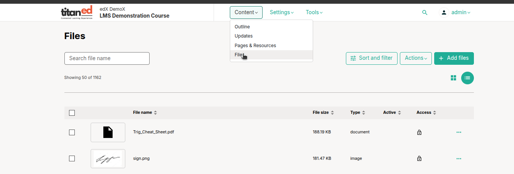

# Add and Manage Course Files

This guide helps educators upload and manage files in Studio to enhance course content.

## 1. Upload Course Files
Add files like images or PDFs to use in your course.

1. In Studio, go to **Content** > **Files**.
2. Click **Add Files** and select files from your computer (e.g., "Course_Image.jpg").
3. Wait for the upload to complete. Studio generates two URLs:
   - **Studio URL**: Use this to add the file in course components or pages.
   - **Web URL**: Use this for external links, like emails or websites.
4. Check the Files page to confirm the file appears.

**Why Use It?** Files enhance lessons with visuals or resources, and URLs make sharing easy.

> **Tip**: Use descriptive file names (e.g., "Lesson1_Summary.pdf") and keep files under 10 MB. Get copyright permissions for all files.

## 2. Organize and Manage Files
Keep your course files organized for easy access.

1. On the **Files** page, use the **Search** box to find files by name.
2. Sort files by name, size, or type, or filter by file type (e.g., images).
3. To manage a file, click the three-dot menu to:
   - Copy the Studio or Web URL.
   - Lock the file to restrict access.
   - Delete or download the file.
4. Check file details (e.g., upload date, usage in course) via the **Info** button.

**Why Use It?** Organizing files saves time and keeps your course tidy.

> **Tip**: Avoid file names with sensitive info (e.g., "Answerkey.pdf"), as they appear in URLs. Large files (e.g., audio) should be hosted externally.

---

**Done!** Your files are ready to enrich your course content.