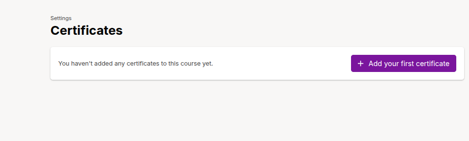
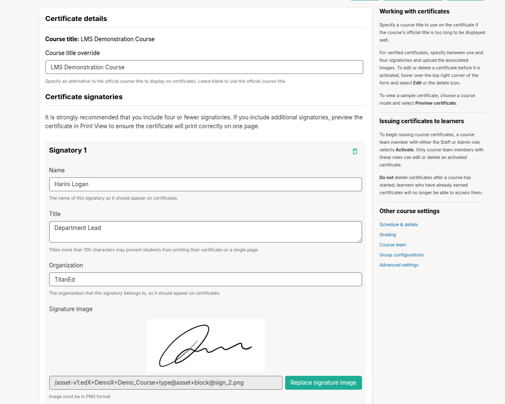
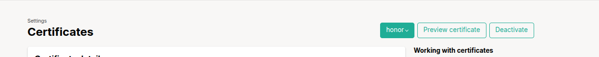

# Certificates in TitanEd Studio

TitanEd Studio allows course teams to provide certificates to learners as recognition of successful course completion. These certificates can be customized with course titles, signatories, and more.

## Adding a Certificate

To add a certificate in your course:

1. Log in to TitanEd Studio and open your course.
2. Navigate to the **Settings** tab in the course outline.
3. Click **Certificates** from the dropdown.
4. Click **Add your first certificate** to begin setup.

## Configuring Certificate Details

Once you click to add a certificate, you will be prompted to fill in the following details:

### Certificate Details

- **Course Title**: Displays the official course title.  
- **Course Title Override**: Optional. Enter an alternate course title to appear on certificates. Leave blank to use the default course title.

### Certificate Signatories

It is strongly recommended to include no more than four signatories to ensure the certificate prints correctly.

For each signatory, provide the following:

- **Name**: The full name as it should appear on the certificate.
- **Title**: The signatory’s title (must be under 100 characters).
- **Organization**: The organization the signatory represents.
- **Signature Image**: Upload **Only PNG** image of the signatory’s signature.

To add more signatories:

- Click **Add additional signatory** and repeat the steps for each additional signer.

After filling out the details, click **Save** to finalize the certificate setup.

> **Tip**: Use the Preview certificate option to how the certificate will appear to learners.

 

## TitanEd supports the following certificate types:

- **Certificate of Completion**: Issued when a learner completes the course with the required grade.
- **Certificate of Achievement**: Used in professional or advanced learning tracks where more rigorous criteria apply.
- **No Certificate**: Learners can audit the course without receiving certification.

## Customizing Certificates

You can customize certificate appearance and messaging:

- Add your organization’s **logo**.
- Specify **signatory names and titles**.
- Include a **custom course title or subtitle** if different from the default.
- Set the **minimum passing grade** required to earn the certificate.

## Deactivating Certificates

If your course does not require certification, you can easily deactivate certificates using the interface.

### Steps to Deactivate Certificates

1. Log in to TitanEd Studio and open your course.
2. Navigate to the **Settings** menu and select **Certificates**.
3. On the Certificates page, locate the **Deactivate** button in the top-right corner, next to the **Preview Certificate** button.
4. Click **Deactivate** to turn off certificate issuance for the course.
5. Confirm the action if prompted.

After deactivation:

- Learners will no longer receive certificates upon completing the course.
- Previously issued certificates will remain accessible unless revoked manually.

> **Important Note**: Turning off certificates after the course has launched may cause confusion or disappointment for learners. Make sure to communicate the change in advance through course announcements.

## Issuing Certificates

Certificates are automatically issued when a learner:

- Completes all required components.
- Achieves the minimum grade.
- Is enrolled in a certificate-eligible track.

Certificates appear in the learner’s dashboard and can be downloaded as a PDF.

> **Important Note**: Changing certificate settings mid-course may affect learner eligibility. Always review course settings and communicate changes to enrolled learners.

> **Tip**: Preview certificate settings in a test run before your course goes live to ensure layout and eligibility rules are correct.