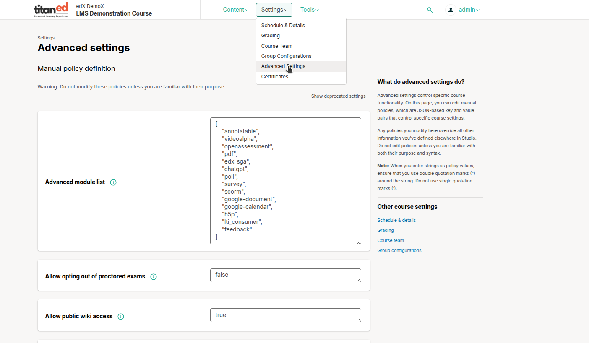

# Advanced Settings in TitanEd Studio

TitanEd Studio's "Advanced Settings" tab empowers instructors to customize their courses beyond basic configurations, offering fine-tuned control over functionality, appearance, and learner experience.

## Accessing the Advanced Settings
To access the Advanced Settings in TitanEd Studio:

1. Log in to Studio and navigate to your course.
2. From the course outline, click on the **Settings** menu.
3. Select **Advanced Settings** from the dropdown menu.

## Key Features of Advanced Settings
The Advanced Settings tab provides a range of powerful options, including:

- **Enabling Advanced Modules**: Activate specialized tools to enhance the learning experience. Available modules include:
  - `poll`: Add interactive polls to engage learners.
  - `survey`: Create surveys to gather learner feedback.
  - `mathcraft`: Incorporate interactive math exercises.
  - `pdf`: Embed PDF documents directly within the course.
- **Allow Public Wiki Access**: Configure course-related permissions, such as enabling public access to the course wiki. You can also manage settings for course-related elements like banner display, privacy options, and other customizable features directly in Studio.
- **Invitation Only**: Restrict course access to invitation-only, ensuring only invited users can enroll in the course.
- **Maximum Exam Attempts**: Set the number of attempts a learner can make on exams, allowing you to control assessment policies.

- **Configuring Course Visibility**: Set your course to be **public**, **private**, or visible only to enrolled learners. You can also hide the course from the catalog entirely.
- **Integrating Third-Party Tools**: Use **Learning Tools Interoperability (LTI)** to embed external resources, such as collaborative assignments via Google Docs or interactive content via H5P.
- **Setting Timed Exams and Assessments**: Fine-tune timed exams and configure assessment settings to meet the course’s and learners’ needs.

> **Important Note**: The Advanced Settings tab is a powerful tool, and changes made here can significantly impact your course. Ensure you understand the implications of each setting before making modifications.

> **Tip**: To explore the Advanced Settings tab, log in to TitanEd Studio and review the available options. For complex configurations, consult the TitanEd documentation or support resources for guidance.

---
