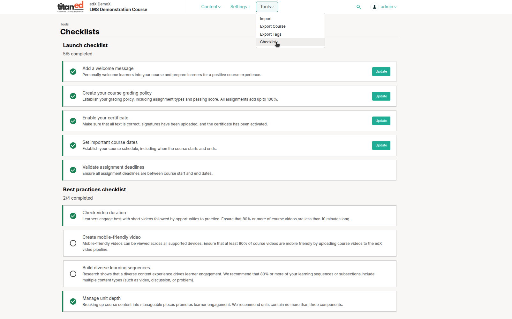

# Course Launch Checklist

Launching a course requires preparing the course content, course team, and learners to ensure a smooth start and positive experience.

---

## Course Launch Checklist in Studio

You can access the launch checklist from the Course Outline page or the Tools menu. Complete the following before launching:

- **Add a Welcome Message**  
  Personally welcome learners and prepare them for a positive experience.  
  See related documentation on adding course updates and handouts.

- **Create Your Course Grading Policy**  
  Establish grading policies including assignment types and passing scores. All assignments should total 100%.  
  See guidance on managing learner grades.

- **Enable Your Certificate**  
  Ensure all certificate text is correct, signatures are uploaded, and the certificate is activated.  
  See course certificate management instructions.

- **Set Important Course Dates**  
  Define the course schedule, including start and end dates.  
  Note: This applies to instructor-paced courses.

- **Validate Assignment Deadlines**  
  Confirm all assignment deadlines fall within the course start and end dates.  
  Note: This applies to instructor-paced courses.

---

## Communication with Course Team and Learners

- Use the instructor dashboard to send bulk email messages to the course team or learners before and during the course.  
- Refer to bulk email message guidelines and sample templates for effective communication.

---

## Course Launch Checklist Timeline

As your course start date approaches, consider the following timeline of activities:

### Before Course Starts

- **Verify Course Settings**  
  Confirm course start date/time and review grading policy. Set grace periods for assignment deadlines as needed.  
  Ensure optional features like learner cohorts are enabled and configured.

- **Verify Certificates**  
  Confirm certificates are properly configured and ready for issuance.

- **Review First Week Content**  
  Ensure all units are published. Check videos, transcripts, download links, and assignments for completeness and accuracy.  
  Incorporate feedback from course team and beta testers.

### Welcoming Learners

- **Two Months Before Start Date**  
  Send a welcome email to enrolled learners.

- **One Month Before Start Date**  
  Send another welcome email.

- **One Week Before Start Date**  
  Send a final pre-launch welcome email.

- **Course Start Date**  
  Send a launch day welcome email.

- **Additional Engagement**  
  Add an “Introduce Yourself” discussion post, possibly segmented by regions to manage thread size.

### Course Handouts and Materials

- Ensure syllabus and references are available on the course handouts page.

---

## Preparing the Course Team

- Define communication methods for all contributors (staff, admins, moderators).  
- Verify role assignments are correct and team members have activated their accounts and enrolled in the course.  
- Provide guidance on recording work, reporting issues, and collaboration.  
- Establish discussion moderation policies and distribute guidelines to moderators.

---

> **Note:** The last two checklist items (setting course dates and validating deadlines) apply only to instructor-paced courses.

---

By following this checklist and timeline, you can help ensure your course launch is organized, professional, and welcoming for your learners and team.
