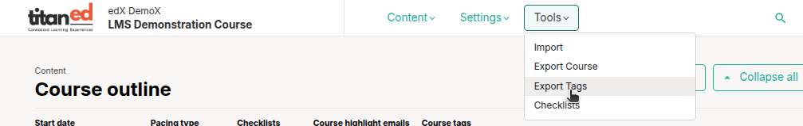
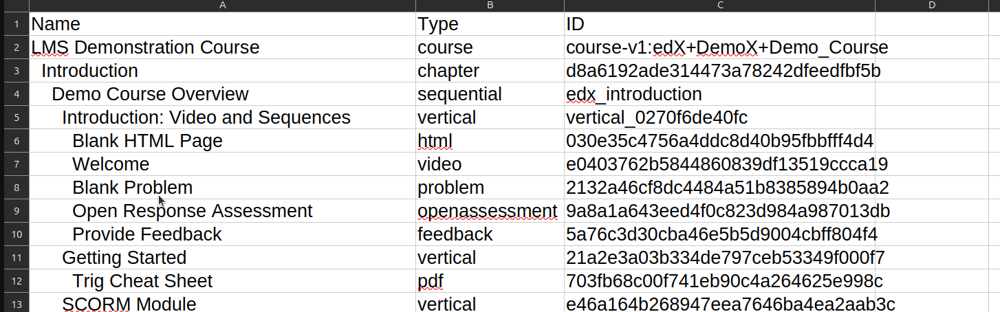

# Course Export Tag Overview

The **Export Tags** feature allows you to generate a report of which tags have been added to specific parts of your course content. This is useful for tracking tagged components and organizing course elements for analytics, curriculum planning, or external integrations.

## 1. Purpose of Tags in Exported Course Files

- **Organizing Content**: Tags help categorize and organize learning materials, making them easier to find and reuse.
- **Improved Searchability**: Exported tags allow for better filtering and searching within the receiving LMS or system.
- **Enhanced Accessibility**: Tags can provide structural context for assistive technologies, improving accessibility for learners.
- **Simplified Content Migration**: Tags help ensure that when a course is moved to a new system, the content retains its organizational structure and metadata.

## 2. Exporting Course Content with Tags

1. Log in to **TitanEd Studio**.
2. Navigate to the **Tools** menu.
3. Select **Export Tags** from the dropdown.
4. Wait while the system generates the CSV file.
5. The CSV file will be downloaded automatically to your local machine.

### File Format

Exported tags are provided as a CSV file, which allows for easy offline review and manipulation.

Each entry follows the format:

- **Name**: [Content Item Name]  
- **Type**: [Component Type]  
- **ID**: [Component ID]

