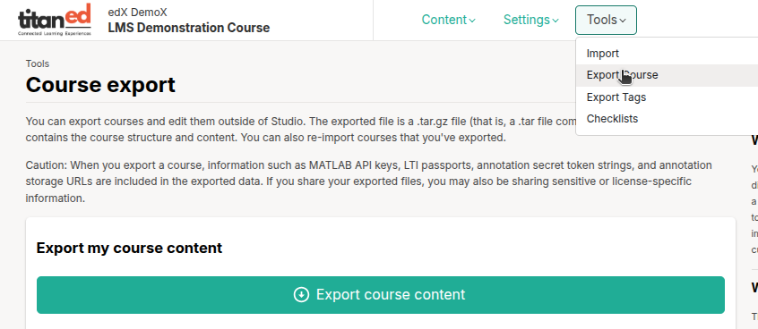

## Course Export

The Course Export tool allows you to download a copy of your course content and structure in a portable format. This is useful for editing outside Studio, creating backups, or reusing the course in another instance.

### How to Export a Course

1. Navigate to the **Tools** section in TitanEd Studio.
2. Select **Course Export**.
3. Click the **Export course content** button.
4. Wait for the `.tar.gz` file to be generated and downloaded.

The exported file is a `.tar.gz`, which includes the course's XML structure and content files.

### Contents of the Exported File

The export file includes:

- All course content: sections, subsections, units, problems, and pages
- Course structure and grading policy
- Course assets (e.g., images, videos, attachments)
- Advanced settings values, including:
  - MATLAB API keys
  - LTI passports
  - Annotation tokens and URLs
- Group configurations
- Course dates and visibility settings

The export file does **not** include:

- Learner-specific data (grades, submissions, forum posts)
- Discussion forum content
- Course team membership
- Certificates and issuance history

> **Caution**: Exported files may include sensitive data like API keys and tokens. Be careful when sharing or storing.

> **Tip**: Export your course before making major changes or before importing a different version. This provides a reliable backup in case you need to restore your content.

### Opening the Exported File

After downloading:

- Use an archive tool (e.g., 7-Zip, WinRAR, or macOS Archive Utility) to extract the `.tar.gz` file.
- Inside, you'll find a `course.xml` file and subdirectories with all course content.

### Why Export a Course?

Exporting allows you to:

- Make direct edits to the course XML files outside of Studio.
- Maintain a backup copy of your course for version control.
- Reuse content across different course runs or course shells.

