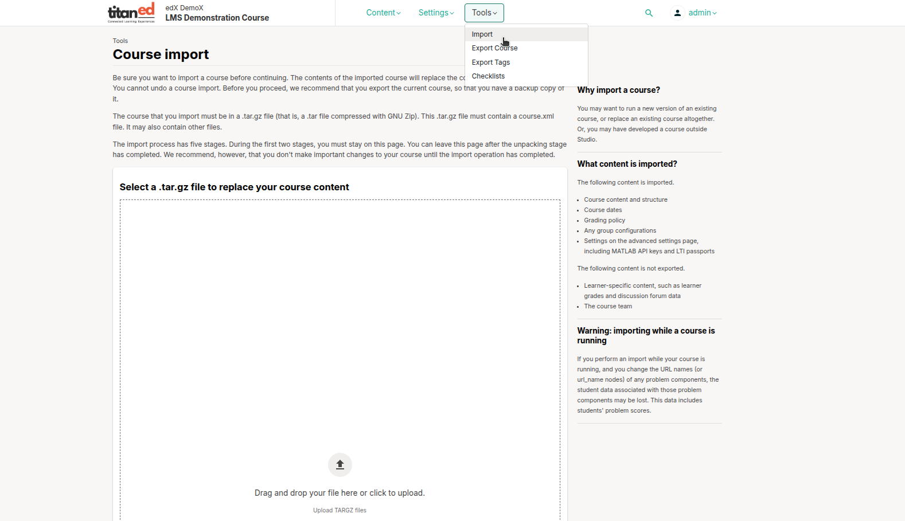

## Course Import

The Course Import tool allows you to replace the current course content with content from a previously exported course package. This action is permanent and cannot be undone, so proceed with caution.

### Important Considerations Before Importing

- Importing a course **replaces all existing content** in the current course.
- This action **cannot be undone**.
- It is strongly recommended to **export your current course** before proceeding, so you have a backup.

### File Requirements

To import a course, the file must meet the following criteria:

- The file format must be `.tar.gz` (a `.tar` archive compressed using GNU Zip).
- The archive must contain a `course.xml` file at the root level.
- Additional course files may also be included in the archive.

### Import Process Overview

The course import process has **five stages**. During the first two stages, it is important that you **remain on the page** to avoid interruptions.

- You may navigate away **only after the unpacking stage** has completed.
- Even then, it is recommended to **avoid making any changes to the course** until the import process is fully completed.

### How to Import a Course

1. Go to the **Tools** section in TitanEd Studio.
2. Select **Course Import**.
3. Click **Select a .tar.gz file** to upload your course archive.
4. Confirm the import when prompted.
5. Wait for the process to finish before making any course edits.

> **Important Note**: Course imports are irreversible. Always keep a backup copy of your course before performing an import.

> **Tip**: Use course import when moving content between environments or restoring a previous version of your course.
