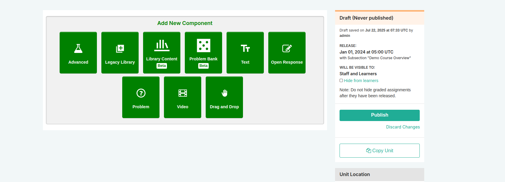

### What Is a Unit?
A unit is a part of a subsection that learners view as a single page.

A unit contains one or more components, such as text with HTML markup, problems, a discussion, or a video.

### Viewing Units in the Outline
The course outline page does not show components. You add or access components by selecting the units that contain the components.

### Viewing the Unit Page
In Studio, when you select a unit name in the outline, the Unit page opens.

### Viewing Units as a Learner
To a learner using the edX learning management system (LMS), each unit in the subsection is represented by an icon in the unit navigation bar at the top of the Course page.

### The Unit Workflow
The typical workflow includes these steps:
- Create a unit
- Add components to the unit
- Modify components in the unit

You publish the unit after you add all of its components. If you make additional modifications, you must publish the unit again for the changes to be visible to learners.

### Unit Publishing Status and Visibility to Learners
The following information summarizes whether or not learners can see a unit:

- **Draft (Never Published)**: Learners never see a unit with this status.
- **Visible to Staff Only**: Learners never see a unit with this status.
- **Published Not Yet Released**: Learners cannot see this unit until the release date (in an instructor-paced course). On the release date, the status changes to Published and Live.
- **Published and Live**: Learners see the current version of the unit.
- **Draft (Unpublished changes)**: Learners see the last published version of the unit if the release dates for the containing section and subsection have passed.

### Unit Publishing Statuses
As a course author, you work with units that have the following statuses:
- Draft (Never Published)
- Published and Live
- Published (Not Yet Released)
- Draft (Unpublished Changes)
- Visible to Staff Only

### Create a Unit
To create a unit:
1. Expand the subsection in which you want to create a new unit.
2. Select New Unit at the bottom of the expanded subsection.
3. Add components to the new unit.

### Edit a Unit
You can edit a unit in the following ways:
- Edit the unit name
- Add components to the unit
- Reorganize components in the unit

### Set Access Restrictions for a Unit
To specify a unit’s access settings:
1. In Studio, select Content, then select Outline.
2. Select the Configure icon in the unit’s toolbar.
3. In the unit’s Settings dialog box, select the group type by which you want to restrict access.
4. Select Save.

### Preview a Unit
To preview the unit, select Preview above the status panel in the Studio unit page. The unit opens in preview mode in the LMS.

### Publish a Unit
Publishing a unit makes the current version of the unit in Studio available to learners. You can publish a unit from the unit page or the course outline.

### Discard Changes to a Unit
To discard changes and revert the Studio version of the unit to the last published version, select Discard Changes in the status panel.

### View a Published Unit
To view the last published version of a unit in the LMS, select View Live Version at the top of the page.

### Hide a Unit from Learners
You can hide a unit from learners in the course outline or the unit page.

#### Use the Unit Page to Hide a Unit
In the status panel, select Hide from learners.

#### Use the Outline to Hide a Unit
Select the Configure icon in the unit box. In the Unit Visibility section, select Hide from learners and select Save.

#### Make a Hidden Unit Visible to Learners
To make a hidden unit visible to learners, deselect Hide from learners and confirm the action.

### Delete a Unit
To delete a unit from the course outline in Studio:
1. Select the Delete icon in the box for the unit you want to delete.
2. Confirm by selecting Yes, delete this unit.

> **Warning**: You cannot restore course content after you delete it. Consider hiding the unit instead of deleting it if you want to keep the content for later use.
