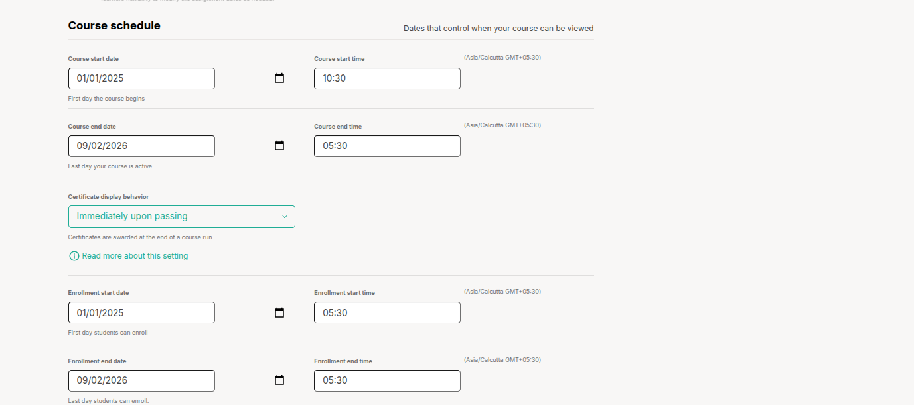

# How to Create a Course in Studio

Creating a course in Studio involves several important steps that help you set up everything from the course structure to content delivery. Here's a more detailed breakdown:

### 1. Sign In to Studio
Access your Studio account and log in to start the course creation process.

### 2. Choose "New Course"
Once logged in, find and click on the "New Course" button to begin creating a fresh course.

### 3. Enter Course Details
- **Course Name**: This is the official title of your course. Be sure to use title capitalization (e.g., "Introduction to Data Science").
- **Organization**: This refers to your organization’s unique identifier. You must enter this without spaces or special characters.
- **Course Number**: Assign a subject-specific number that represents the course (e.g., PH101 for Public Health 101 or Math201x for an online math course).
- **Course Run**: This is a term-specific identifier that will help in distinguishing different course sessions (e.g., “Fall2025” or “T2_2025”).

### 4. Review the Details
Double-check the values you’ve entered, especially the organization, course number, and run. These are used to generate the course URL, and they can't be edited after the course is created.

### 5. Finalize and Create the Course
Once all the details are entered, click on "Create" to officially establish the course in Studio.  
After this step, you’ll be directed to the Course Outline page, where you can begin structuring the course content, like lessons, assignments, and quizzes.

## 2. How to Set Your Course Schedule

You can control when your course starts, ends, and when learners can enroll.

To do this:

1. Open your course in Studio.
2. From the top menu, go to **Settings**, then choose **Schedule & Details**.

You’ll see an option to choose how learners move through the course:

- Select **Instructor-Paced** if you want to release content on a fixed schedule.
- Choose **Self-Paced** if learners can go through the course at their own speed.

Now fill in the following dates:

- **Course Start**: The day and time learners can begin the course.
- **Course End**: The last day learners can access the course.
- **Enrollment Start**: The first day learners can enroll. This should be before or on the same day the course starts.
- **Enrollment End**: The last day learners can enroll. This should be before or on the same day the course ends.

When you're done, scroll down and click **Save Changes**.

Your course schedule is now set.

## Add a Course Image
Add an image to make your course stand out.

1. Go to **Settings** > **Schedule & Details** > **Course Card Image**.
2. Upload a new image via **Upload Course Card Image** or select an existing one from **Files & Uploads**.
3. Click **Save Changes**.
4. Check the course dashboard to see how the image looks.

## Add a Course About Video
Add a short video to introduce your course.

1. Upload your video to YouTube and copy the video ID (e.g., "B-EFayAA5_0" from `https://www.youtube.com/watch?v=B-EFayAA5_0`).
2. Go to **Settings** > **Schedule & Details** > **Course Introduction Video**.
3. Paste the video ID in the field.
4. Click **Save Changes**.
5. View the course About page to test the video.

> **Tip**: Keep videos short (1–2 minutes) and engaging.

