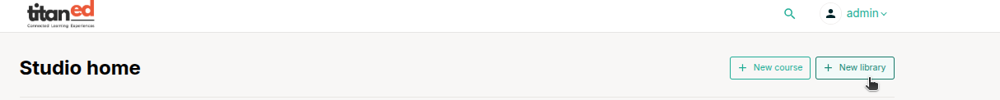
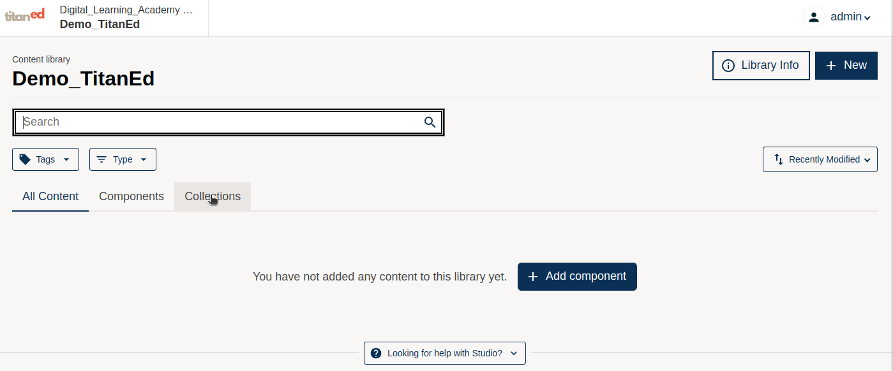
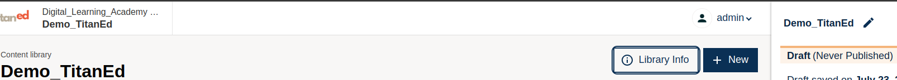

libraries are a powerful tool for storing and organizing reusable course components, such as problem sets or exercises. Once created, you can use them across multiple courses or in randomized blocks within a course.

---

## Why Use a Library?

- **Reusable Content**: Create a single version of a component (like a problem or HTML block) and reuse it in multiple courses without duplication.
- **Randomized Assessments**: Pull content randomly from a library to give learners different questions each time.
- **Scalability**: Manage large collections of questions in one place, especially useful for high-enrollment or repeated courses.
- **Efficiency**: Update content in one location and have it reflect across all courses using that content.
- **Collaboration**: Enable course teams to work together on a shared content pool.

---

## How to Create a New Library

To create a new content library, go to **Studio**:

### Click On  **New Library**

This option is available on your Studio dashboard.

## Library Creation Form Fields

You’ll be asked to fill in the following fields:

### 1. Library Name

- **Example**: `Computer Science Problems`
- This is the **public display name** of your library.
- Use a name that clearly describes the purpose or subject of the library.
- This helps your team easily identify it when linking to randomized content.

### 2. Organization

- **Example**: `UniversityX` or `OrganizationX`
- Represents the institution or team that owns the library.
- This becomes part of the library’s URL.
- This value **cannot be changed** after creation.
- Avoid spaces or special characters.

### 3. Library ID

- **Example**: `CSPROB`
- A **unique code** that identifies the library within your organization.
- It will appear in the URL.
- This value **cannot be changed** after creation.
- Avoid using spaces or special characters.

Once you complete the form and click **Create**, your library will be ready, and you can begin adding components to it.

# Add Components to a Content Library

Once you've created a content library, you can start adding components such as text, problems, and videos. These components are reusable and can be pulled into course units as needed, especially for randomized content blocks.

---

## How to Add Content

1. Open your content library in Studio.
2. Click **Add Content** to begin creating a new component.

You can add:

- **Text**: Explanatory content or instructions using HTML components.
- **Problem**: Interactive assessment items with various input types.
- **Video**: Embedded video content for instruction or context.

---

## Problem Types Available

When adding a **Problem** component, you can choose from a variety of input formats to suit your assessment needs.

### Basic Problem Types

- **Single Select**: Learners select one correct option.
- **Multi-Select**: Learners select multiple correct answers.
- **Dropdown**: Learners choose the correct answer from a dropdown menu.
- **Numerical Input**: Learners enter a numeric response.
- **Text Input**: Learners type in a short text-based answer.

### Advanced Problem Types

These allow for more flexible or custom interaction:

- **Blank Problem**: A template for manually writing custom problem code.
- **Custom Python-evaluated Input** *(Provisional)*: Accepts Python code as an input, evaluated server-side.
- **Custom JavaScript Display and Grading**: Enables advanced problem behaviors using JavaScript.
- **Math Expression Input**: Learners enter mathematical formulas.
- **Problem with Adaptive Hint**: Offers hinting that adapts based on learner input.

---

## Paste From Clipboard

In addition to creating new components, you can use the **Paste From Clipboard** feature:

1. This allows you to copy problem code (usually XML or OLX) from another source and paste it directly into the content editor.
2. Useful for quickly duplicating or importing problems from other courses or templates.

---

> **Tip**:
Use clear names for your components to make them easy to find when reusing.
Test advanced problems thoroughly to ensure they behave correctly in all course environments.
Use content libraries to maintain consistent question formatting and logic across multiple courses.

---

Now that you know how to add content, you're ready to build a robust, reusable content library for use across your learning experiences.

---

## Understanding the Library Tabs

When you open a content library, you'll see three main tabs at the top: **All Content**, **Components**, and **Collections**. Each one serves a specific purpose for managing and organizing your library content.

### All Content

This tab displays every component you’ve added to the library — regardless of type. It’s useful when you want to quickly scan, filter, or search all your existing materials in one place.

### Components

This tab allows you to **create new content** such as problems, HTML blocks (text), or videos. It’s your main workspace for building and editing individual items.

Available content types under this tab include:
- Text (HTML)
- Problem
- Video
- Discussion (if enabled)

### Collections

Collections help you **organize components into logical groups**. Think of them like folders or categories. You can use collections to:

- Group related problems together (e.g., “Unit 1 Practice”, “Final Exam Pool”)
- Organize content by topic, difficulty, or objective
- Make it easier to locate and reuse grouped content later

Collections are especially useful when pulling randomized content from the library into course units.

---

## Publishing Your Library

By default, new content in your library is saved in **draft mode**. This means it's not yet available for use in courses or randomized blocks.

To make your content live:

1. Open the component (problem, text, or video) you want to publish.
2. Click the **Publish** button at the top-right of the editor.
3. Repeat this for each component that you want available for use.

Only **published components** can be used in course units — draft items will not appear in content pickers or randomized blocks.

> **Tip**: Always review and test your components before publishing to ensure they work as expected.

