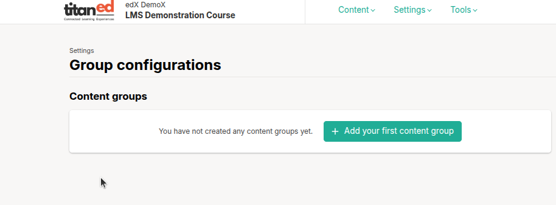
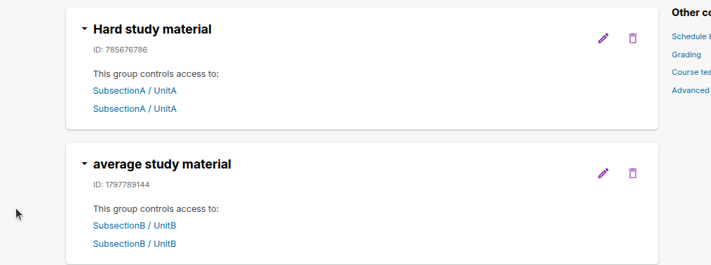
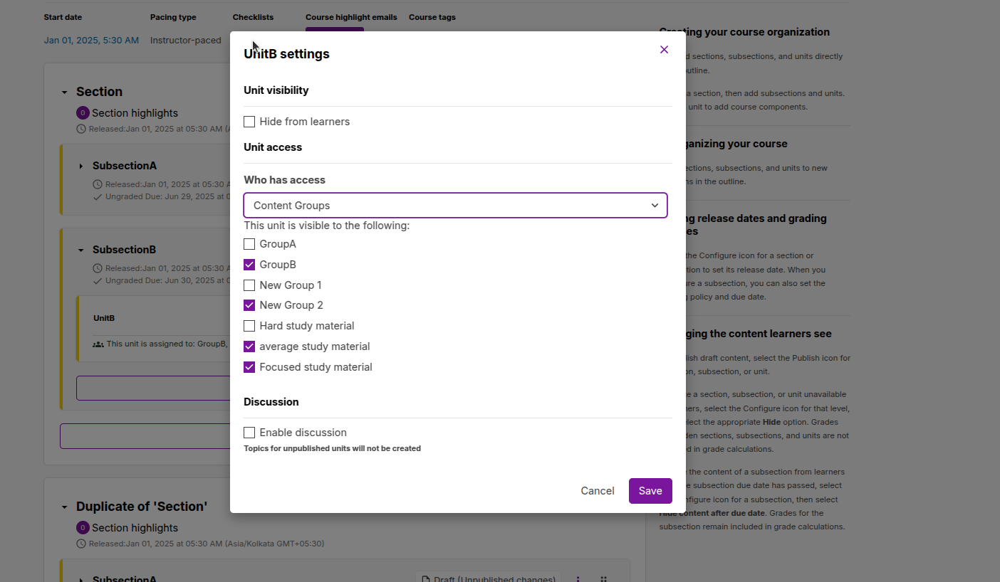

# Group Configuration for Content Experiments in TitanEd Studio

TitanEd Studio’s **Group Configuration** feature allows instructors to create personalized learning paths by customizing course content for different student cohorts. This is especially useful for conducting **content experiments** to evaluate the effectiveness of varying instructional methods.

---

## Accessing Group Configurations

To access group configuration settings in TitanEd Studio:

1. Log in to TitanEd Studio and open your course.
2. Navigate to the **Settings** menu from the course outline.
3. Click **Group Configurations** from the dropdown list.
4. On the Group Configurations page, select Add your first content group, or New content group if you have already created one.
5. Enter a meaningful name for the content group, then select Create. The page refreshes to show the name of your new content group.
6. Repeat this step to create as many content groups as you want.

---

## Delete Content Groups

1. In Studio, select Settings, then select Group Configurations.

2. On the Group Configurations page, locate the content group that you want to delete.

3. Move your cursor over the content group’s box, then select the Delete icon.

4. In the confirmation message, select Delete again to confirm the deletion.

> **Note**: You can delete a content group only if it is not in use in any course unit. To delete a content group that is currently in use, you must first remove it from any course unit visibility settings that use the content group.

### Steps to Assign Units by Content Group

1. Log in to TitanEd Studio and open your course.
2. Navigate to the Section, then the Subsection, and finally select the Unit you want to configure.
3. On the right side of the Unit, click the three-dot menu to open more options.
4. Select "Configure" from the dropdown menu.
5. In the configuration panel, you will see a list of content groups you have created.
6. Select one or more content groups to assign the unit to those groups.
7. Save your changes.

Once configured, only learners who are part of the selected content groups will be able to view the unit.

This feature allows instructors to deliver personalized content to specific groups of learners, supporting targeted instruction and controlled content experiments.

## Key Features of Content Groups

Content groups offer a flexible framework to personalize your course. Here’s what you can do:

### Create and Manage Content Groups

- Create virtual learner groups for targeted content delivery.
- Name groups clearly and descriptively for easy management.
- Use **Access Settings** in the course outline to control which components (videos, problems, assessments) are visible to each group.

### Cohort-Based Personalization

- Link one or more **cohorts** to a content group via the **Instructor Dashboard**.
- Example: Deliver a custom welcome video to only “Current Students” and “Alumni” cohorts by linking both to the same group and restricting video access accordingly.

### Enrollment Track Customization

- Customize content based on learners’ **enrollment tracks** (e.g., certificate vs. non-certificate).
- Example: Provide different midterm and final exams to certificate track learners, while keeping lecture content the same for everyone.

### Group Management Tools

- Add new content groups as needed for experiments or personalization.
- Delete unused groups (note: groups used in course units must first be removed from those units).
- View all course components that reference a content group to prevent accidental disruptions.

### Flexible Content Visibility

- Set visibility rules so only learners in specific groups (by cohort or enrollment track) can access selected content.
- Any content without access restrictions remains visible to all learners.

## Creating Units for Specific Content Groups in TitanEd Studio

In TitanEd Studio, you can assign specific course units to content groups by configuring them directly within the course structure.

> **Important**: Group settings impact the learner experience significantly. Avoid modifying or deleting content groups currently used in live course units.
