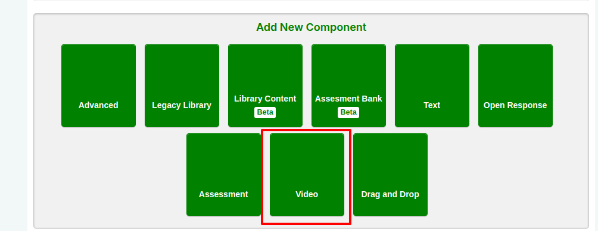
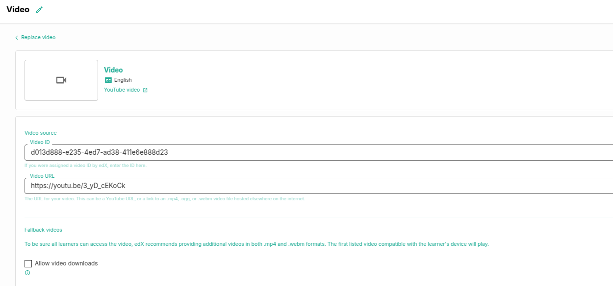
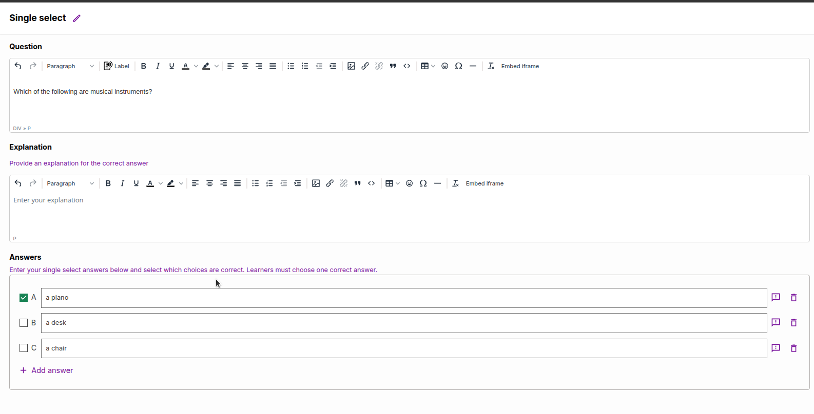
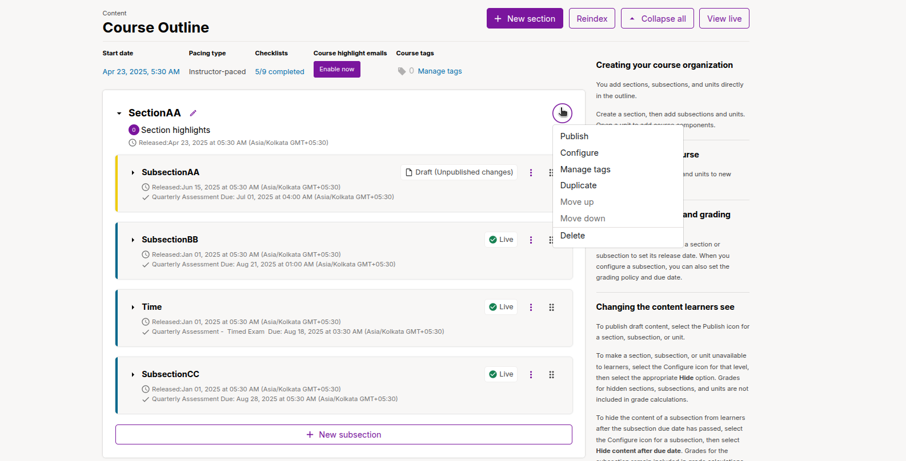
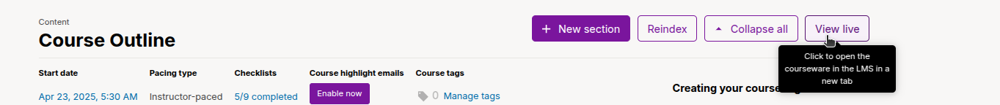

## 1. Add a Video to a Unit
Enhance your course with video content to engage learners visually and audibly.

1. In Studio, navigate to the unit where you want to add the video.
2. Under **Add New Component**, select **Video**.

   - A video component with default settings is added to the unit and opens in the visual editor.
3. Click the pencil icon in the **Component Display Name** field and enter a descriptive name for the video (e.g., "Lesson 1: Introduction").
   - This name appears as a heading in the Learning Management System (LMS) and is used in reports and analytics. If left blank, the default name is "video."
4. Paste the video URL into the **Video URL** field. This should be the URL generated when you uploaded the video to a hosting platform (e.g., YouTube, Vimeo).
   - **Note**: For YouTube videos, simply paste the YouTube URL into the **Video URL** field.
5. (Optional) For compatibility across devices, add alternative video URLs:
   - Below the **Fallback Videos** field, click **Add a Video URL** and enter additional URLs for different encodings or hosting services.
   - Ensure the 360p version of the video is listed first for optimal mobile playback.
6. (Optional) Configure advanced settings, such as playback speed or subtitles, by referring to the **Set Video Settings** documentation.
7. Click **Save** to add the video to the unit.

> **Tip**: Test the video on multiple devices to ensure compatibility and smooth playback. For mobile users, prioritize lower-resolution URLs (e.g., 360p) to reduce buffering.

---

## 2. Add Written Content to a Unit
Incorporate text-based content to provide explanations, instructions, or supplementary material.

1. In the unit where you want to add text, click **Text** under **Add New Component** at the bottom of the page.
2. Select the **Text** template to create a blank text component.
   - The component is added at the end of the unit and opens in the visual editor.
3. Enter and format your content using the editor’s formatting tools (e.g., bold, italics, lists, or headings).
   - **Tip**: Use clear headings, bullet points, and concise paragraphs to improve readability.
4. Click the pencil icon next to the component name and enter a descriptive **Display Name** (e.g., "Key Concepts: Module 1").
   - This name appears in the LMS and analytics reports.
5. Click **Save** to add the text component to the unit.

> **Tip**: For accessibility, ensure text is clear, uses proper formatting, and includes alt text for any embedded images.

---

## 3. Add a Multiple-Choice Question to a Unit
Engage learners with interactive multiple-choice (multi-select) questions to test understanding.

1. In the unit, under **Add New Component**, select **Problem**.
2. In the problem editor, choose the **Multi-select** option.
3. Configure the problem by filling in the following fields:
   - **Display Name**: Click the pencil icon to edit the name (e.g., "Quiz: Lesson 1 Concepts").
   - **Question**: Enter the question text clearly and concisely.
   - **Explanation**: Provide an explanation for the correct answer(s). Configure when this appears using the **Show Answer** panel on the right (e.g., after submission or on a specific date).
   - **Answer Fields**: 
     - Add answer options by filling in the text fields.
     - Check the box(es) next to the correct answer(s).
     - Click **Add Answer** to include additional options or the trash can icon to delete an option.
     - (Optional) Add feedback for each answer to guide learners.
   - **Settings**: Adjust settings on the right, such as the number of attempts or scoring options.
4. Click **Save** to add the problem to the unit.

> **Tip**: Provide specific feedback for each answer to enhance learning, and test the question in the LMS to ensure clarity.

---

## 4. Publish the Course
Make your course content available to learners by publishing it.

1. Return to the **Course Outline** in Studio.
2. Locate the unit, subsection, or section you created, which will appear in an unpublished state.
3. From the kebab menu (⋮) next to the section, select **Publish**.
   - This makes the content visible to learners in the LMS.

> **Note**: Only published content is accessible to learners. Unsaved or unpublished changes remain in draft mode.

---

## 5. Preview the Course as a Learner
Verify how your course appears to learners to ensure accuracy and quality.

1. In the **Course Outline**, click **View Live** next to the unit or section.
2. The course opens in the LMS in a new tab, displaying the content as learners will see it.
3. Navigate through the content to check for errors, formatting issues, or playback problems.
4. If changes are needed, return to Studio, edit the content, and republish by selecting **Publish** again.

> **Tip**: Test the course on different devices (e.g., desktop, tablet, mobile) to ensure a consistent experience.

---

## Additional Tips for Course Content Creation
- **Optimize Video Playback**: Ensure videos are hosted on reliable platforms like YouTube or Vimeo, and test playback on low-bandwidth connections.
- **Enhance Accessibility**: Add captions to videos and use descriptive text for images to support all learners.
- **Engage Learners**: Combine videos, text, and questions to create a varied and interactive learning experience.
- **Test Interactivity**: For multiple-choice questions, verify that feedback and scoring work as expected in the LMS.
- **Iterate and Improve**: Use learner feedback and analytics from Studio to refine content after the course launches.

---

**Congratulations!** You’ve successfully added content to your course and published it for learners. Your course is now ready to deliver an engaging learning experience! 🎉
