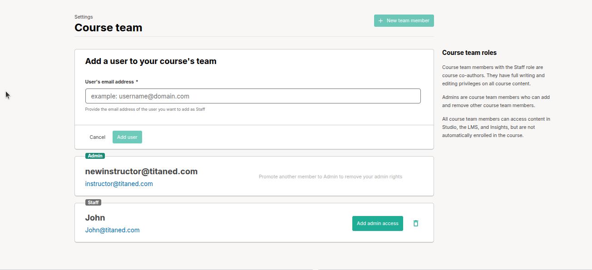

# Manage Course Team Members

This guide helps educators add and manage team members in Open edX Studio for effective course collaboration.

## 1. Add Course Team Members
Add team members to create and edit course content.

1. Confirm you have the **Admin** role in Studio.
2. Ensure the team member has an active, registered account (e.g., user@demotitaned.com).
3. In Studio, go to **Settings** > **Course Team**.
4. Click **Add a New Team Member**.
5. Enter the team member’s email and click **Add User**.
6. Check the **Course Team** list to confirm.

> **Tip**: Use professional email addresses for team members.

> **Note**: New members get Staff access by default, allowing them to edit/delete content but not manage team members or assign Admin roles.

## 2. Manage Roles and Removal
Promote, demote, or remove team members, and understand Admin vs. Staff roles.

1. In Studio, go to **Settings** > **Course Team**.
2. Find the team member (e.g., user@demotitaned.com) in the list.
3. To promote to Admin, click **Add Admin access**.
4. To demote an Admin to Staff, click **Remove Admin access**.
5. To remove a user entirely, click the trash icon.
6. Admin vs. Staff:
   - **Admin**: Full control, including team management and role assignments.
   - **Staff**: Edit course content only, no team or role management.

> **Tip**: Demote or remove users carefully to maintain team control.

> **Note**: Team members must have an active account for role changes. Removed users lose all access.

---