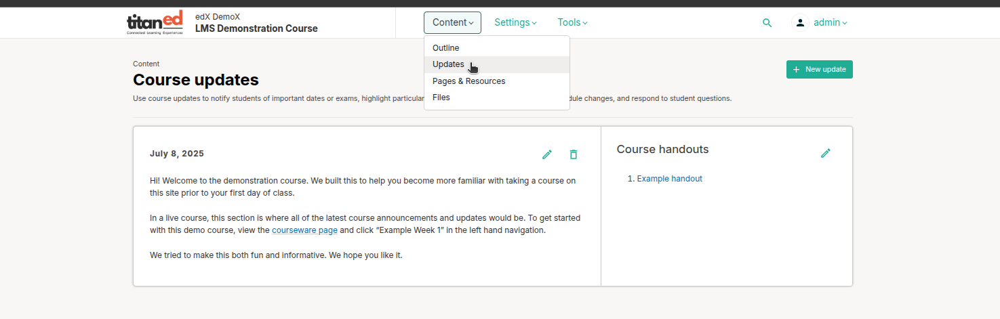
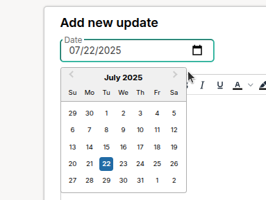

# Managing Course Updates and Handouts in Studio

This guide explains how to create and manage course updates and handouts in Studio to enhance learner engagement and provide essential resources. Follow these steps to communicate effectively and share materials with your learners.

## 1. Create Course Updates & Handouts
Course updates, such as a welcome message, appear at the top of the Course page in the Learning Management System (LMS), helping learners feel welcomed and oriented.

1. In Studio, open your course and navigate to **Content** > **Updates**.
2. Click **New Update** to create a new message.
3. Enter your message in the text editor (e.g., a welcome message introducing the course and key information).
   - **Tip**: Make the message engaging and concise, highlighting course goals and how to succeed.
4. Click **Save** to publish the update.
5. Verify the update by viewing the Course page in the LMS.

> **Note**: Learners can dismiss the welcome message after reading it, or it auto-dismisses after seven days. Dismissed messages remain accessible via the **Updates** link in the LMS sidebar.

## 2. Manage Course Announcements
Announcements keep learners informed about important updates, such as schedule changes or reminders.

1. In Studio, go to **Content** > **Updates**.
2. Click **New Update** and write a concise announcement (e.g., "Quiz deadline extended to Friday").
3. (Optional) Set a specific date for the announcement to appear using the scheduling options.
4. Click **Save** to publish.
5. View the Course page in the LMS to ensure the announcement displays correctly.

> **Tip**: Schedule announcements in advance for key dates to maintain engagement without manual updates.

---
