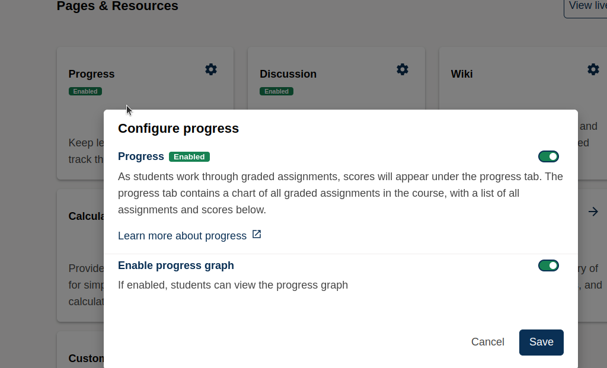
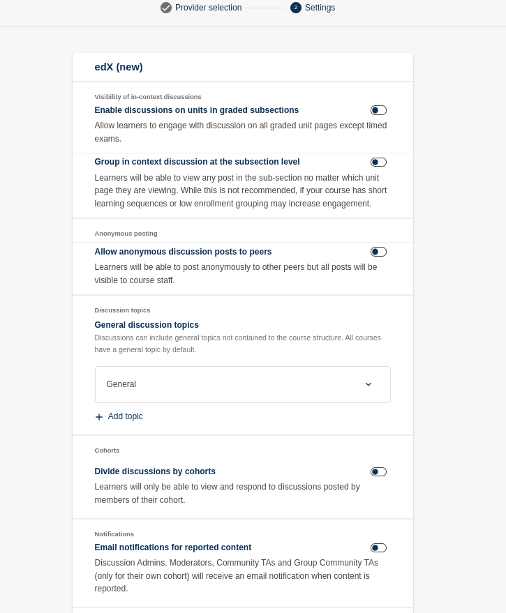
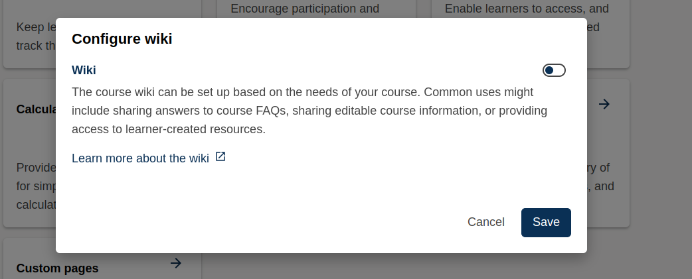
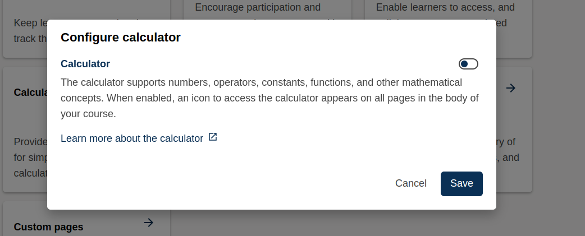
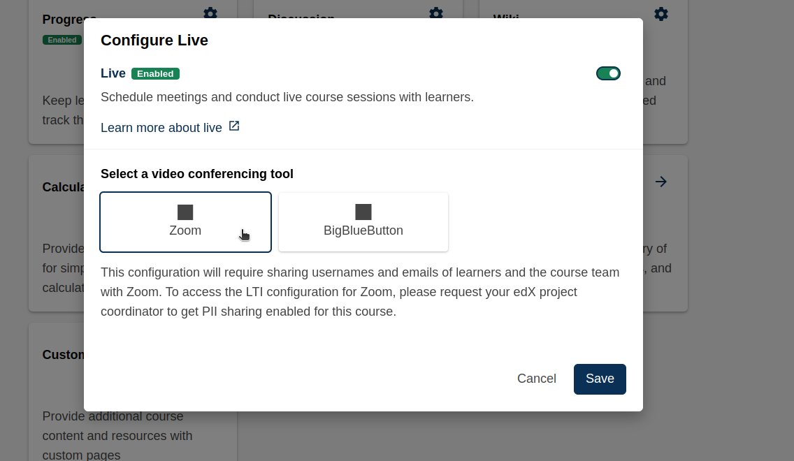
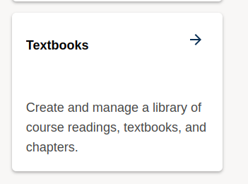
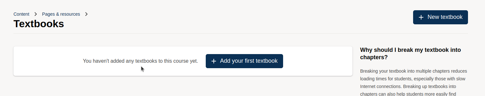
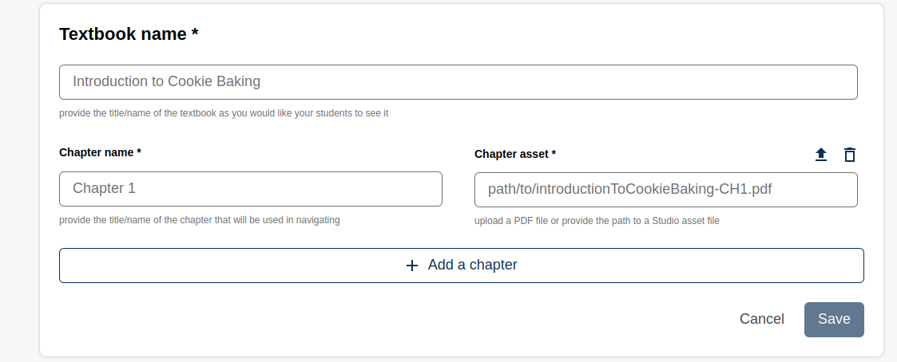
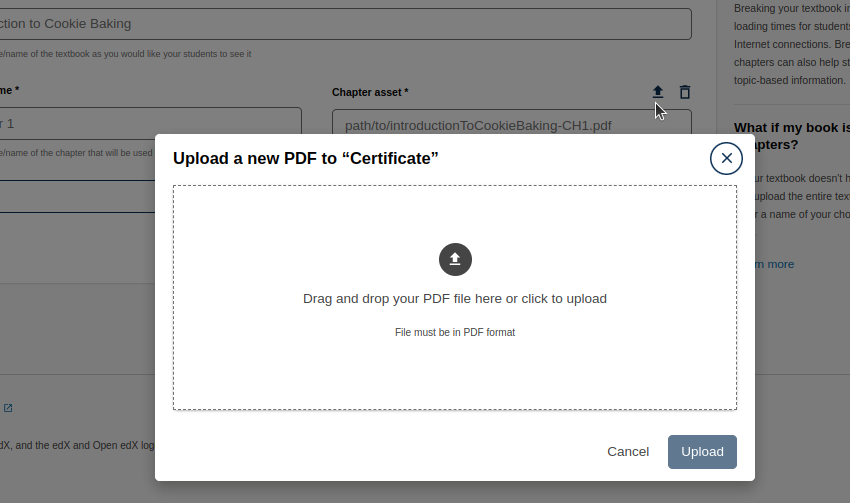
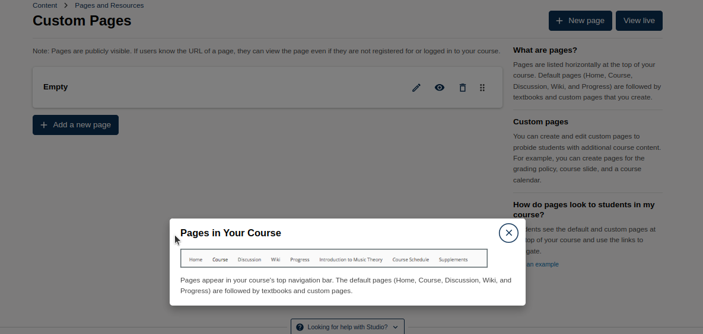

# Pages & Resources

## Progress

Keep learners engaged and on track throughout the course by enabling the **Progress** feature.

### How to Enable Progress Tracking

1. Click the **Settings** icon in the top navigation.
2. Select **Configure Progress**.
3. Toggle the **Progress** setting to **Enabled**.

Once enabled:

- Learners can view their scores for graded assignments via the **Progress** tab.
- This tab displays a visual chart of performance across all graded assignments, along with a detailed list of scores below.

---

## Discussion

Encourage participation and engagement with discussions throughout your course.

### Key Discussion Settings

- **Enable In-Context Discussions**  
  Allow discussions on unit pages within graded subsections (except for timed exams).

- **Group Discussions at Subsection Level**  
  Allow learners to view and participate in any discussion thread within a subsection, regardless of the unit page.  
  > _Note: This setting is best suited for courses with short sequences or low enrollment._

- **Anonymous Posting**  
  Allow learners to post anonymously to peers. Posts will remain visible to course staff.

- **General Discussion Topics**  
  General forums are available for topics outside the course structure. All courses include a default "General" topic.

- **Cohorted Discussions**  
  Restrict discussions so that learners only see and reply to posts from others in their assigned cohort.

- **Email Notifications for Reported Content**  
  Discussion admins, moderators, and TAs will receive email alerts when content is flagged.

> **Note**: In-context discussions and visibility settings can significantly impact learner experience and engagement. Adjust with care based on your course structure.

---

## Wiki

The course **Wiki** provides a collaborative space where instructors and learners can share knowledge, resources, or documentation throughout the course.

### How to Enable the Wiki

1. Click the **Settings** icon in the course toolbar.
2. Select **Configure Wiki**.
3. Toggle the **Wiki** option to **Enabled**.

### Common Use Cases

- Posting answers to frequently asked questions (FAQs)
- Sharing editable notes or documentation
- Linking to learner-created study guides and resources

> **Tip**: Use clear guidelines if allowing learners to edit the wiki. Moderation ensures quality and relevance.

---

## Calculator

The built-in calculator tool supports learners by providing easy access to mathematical operations directly within the course content.

### How to Enable the Calculator

1. Click the **Settings** icon in the course toolbar.
2. Select **Configure Calculator**.
3. Toggle the **Calculator** setting to **Enabled**.

Once enabled, learners will see a calculator icon on all course pages.

### Features

- Basic and advanced math functions
- Constants and operators
- Scientific notation support

---

## Live Sessions

Use the **Live** tool to schedule real-time sessions with learners using integrated video conferencing tools.

### How to Enable Live Sessions

1. Click the **Settings** icon in the course toolbar.
2. Select **Configure Live**.
3. Toggle the **Live** setting to **Enabled**.

### Supported Video Platforms

- **Zoom**
- **BigBlueButton**

You can choose a platform that best suits your course’s live interaction needs.

> **Important**:  
> To integrate Zoom, learner names and emails may need to be shared through the LTI connection. This requires enabling Personally Identifiable Information (PII) sharing. Contact your course administrator or platform coordinator to request this.

### Best Practices for Live Sessions

- Schedule sessions at times accessible to most learners.
- Record sessions for learners in different time zones.
- Use the platform's built-in chat and Q&A tools to drive engagement.

---

# Textbooks

Manage and share course readings using textbooks and chapter PDFs. This feature helps organize learning materials into a clear, structured format.

---

## How to Add a Textbook

1. Go to **Content** > **Pages & Resources** > **Textbooks**.

2. If no textbooks are added yet, click **Add your first textbook**.

### Fill in the Following Fields:

- **Textbook Name \***  
  Example: `Introduction to Cookie Baking`  
  _Displayed as the textbook title for learners._

- **Chapter Name \***  
  Example: `Chapter 1`  
  _Used for navigation and chapter structure._

- **Chapter Asset \***  
  Example: `path/to/introductionToCookieBaking-CH1.pdf`  
  _Provide the file path or upload a PDF file._

---

## Uploading a PDF

- On the right-hand side, you’ll see an Up Arrow.

- Drag and drop a PDF file or click to upload.

- To remove a file, click the **trash icon**.

> **Tip**: Use consistent naming for textbooks and chapters to keep things clear for learners.

---

## What Are Custom Pages?

Provide additional course content, resources, or information using custom pages. These pages appear alongside the default navigation links in your course.

Custom pages are extra tabs shown at the top of your course, along with the default ones like **Home**, **Course**, **Discussion**, **Wiki**, and **Progress**.

They can be used to share:

- Grading policies
- Course slides
- Calendars
- Extra instructions or resources

> **Note**: Custom pages are **publicly visible**. If someone knows the page URL, they can view it — even if they’re not logged in or enrolled.

---

## How Students See Custom Pages

Students will see all enabled custom pages listed in the top navigation bar of the course. They can click on any tab to open the content directly.

---

> **Tip**: Keep page titles clear and concise to help learners quickly understand their purpose.

> Final Notes: These tools are optional but can greatly enhance your course’s interactivity and learner support. Use them thoughtfully based on your teaching strategy and learner needs.

