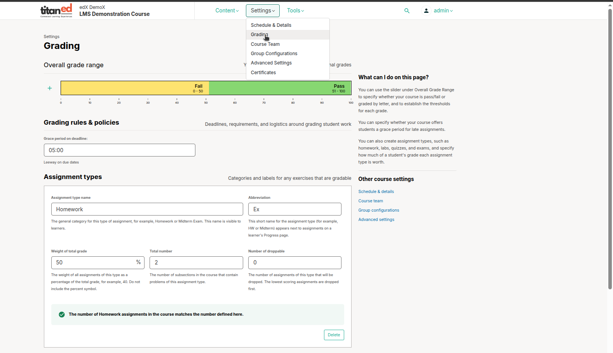
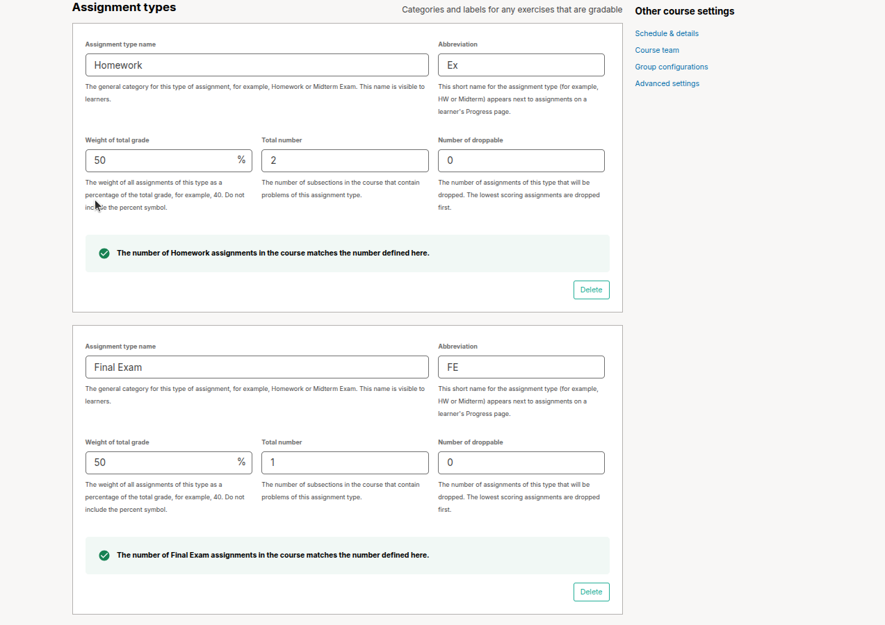
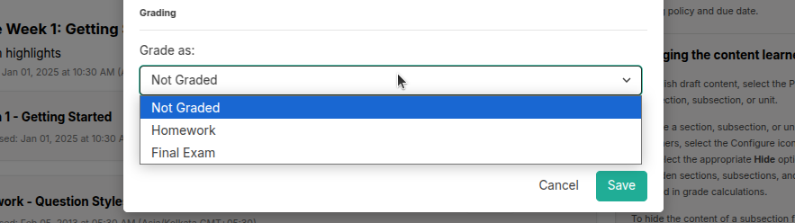

# Set Up Grading and Assignment Types

This guide helps you configure grading, assignment types, and graded subsections for your course.

## Configure Grade Ranges
Set how grades are calculated, such as pass/fail or letter grades (A–F).

1. From the **Settings** menu in the course editor, select **Grading**.

   

2. At the top of the **Grading** page, adjust the grade range:
   - **Add a grade**: Click the **+** icon to add a new grade level (e.g., adding a grade to a pass/fail setup creates F: 0–50, B: 50–75, A: 75–100).
   - **Adjust ranges**: Drag the line between grades to change score boundaries.
   - **Rename grades**: Click a grade name (e.g., “Pass”) and type a new name (e.g., “Excellent”). You cannot rename “F” or “Fail.”
   - **Remove grades**: Hover over a grade and click the **Remove** link. You cannot remove “F” or “A.”

3. Click **Save Changes** to apply.

> **Tip**: Set the pass/fail threshold one point below your desired passing score (e.g., set 70 for a 71 passing grade).

> **Note**: For courses offering certificates, learners earn a certificate by scoring above the “F” or “Fail” threshold, regardless of additional grade levels.

## Set Assignment Types

   

Define types of assignments, like Homework or Quiz, and their weights.

1. On the **Grading** page, click **New Assignment Type**.
2. Enter details, such as the name (e.g., “Quiz”) and weight (e.g., 25%).
3. Adjust existing assignment weights to total 100% (e.g., change Homework from 75% to 50% if adding a 25% Quiz).
4. Adjust existing assignment weights to total 100% (e.g., change Homework from 75% to 50% if adding a 25% Quiz).
5. **Total number**: find the The number of subsections in the course that contain problems of this assignment type.
6. **Number of droppable**: The number of assignments of this type that will be dropped. The lowest scoring assignments are dropped first.
7. Click **Save**.

> **Warning**: Total weights must equal 100%. Check weights before saving.

## Manage Graded Subsections
Assign grading settings at the subsection level.

1. In the course outline, select **Configure** from the subsection’s **Settings** menu.

   

2. In the **Settings** window:
   - Set the **Assignment Type** (e.g., Homework, Quiz) from the types you defined.
   - Set a **Due Date** for the subsection (optional).
   - Choose whether to show problem results immediately or hide them

3. Click **Save**.

> **Note**: All units in a subsection share the same assignment type and due date. Create separate subsections for different assignment types (e.g., one for Homework, another for Labs).

> **Warning**: Hidden subsections or units don’t count toward grades. Practice problems (in subsections without an assignment type) appear as “practice scores” on the learner’s Progress page and don’t affect grades.

## Set a Grace Period

   

Apply a universal grace period for late assignment submissions.

1. On the **Grading** page, find the **Grace Period** section.
2. Set the allowed extra time (e.g., 2 hours) for all assignments.
3. Click **Save**.

> **Note**: The grace period applies to all assignments in the course.