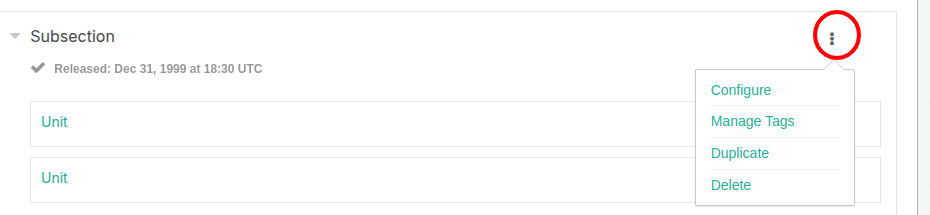
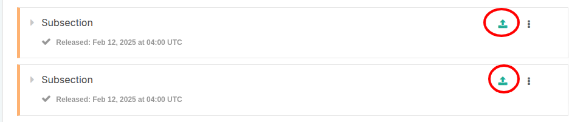

# Subsection Management

Sections, subsections, and units are structured in the course outline:

## Course Progress Information
- A **green check mark** indicates completion of the following:
  - All videos have been viewed.
  - All problems have been answered.
  - HTML content has been viewed for at least 5 seconds.
- The **Resume Course** option takes the learner to the unit they most recently completed.

---

## Subsections and Visibility to Learners
Learners cannot see content until the subsection's release date has passed and the following conditions are met:
- The **parent section's** release date has passed.
- **Units** within the subsection are published and not hidden.

### Subsection Visibility Options:
- **Default**: Available to learners unless explicitly hidden.
- **Hide Entire Subsection**: Make it completely invisible in course navigation.
- **Hide Content After Date**: Content becomes hidden after the subsection's due date (for instructor-paced courses) or the course's end date (for self-paced courses).

---

## Release Statuses of Subsections
You control the release status of subsections. Key statuses include:

- **Scheduled with Section**: The subsection is released at the same time as the parent section.
- **Unscheduled**: No content is visible to learners until you set and pass a release date.
- **Scheduled Later than the Section**: The subsection is set to release after the parent section’s release date.
- **Released**: The subsection becomes visible to learners once its release date has passed.

---

## Create a Subsection
To create a new subsection:

1. Expand the section where you want to create a subsection.
2. Click **New Subsection** and enter a descriptive name.
3. Add units as needed.

---

## Set a Subsection Release Date
To set the release date for a subsection:

1. Click the **Configure** icon in the subsection box.
2. Under **Release Date and Time**, enter the desired release date (in UTC).
3. Click **Save**.

---

## Set the Assignment Type and Due Date for a Subsection
To set grading and due dates for problems within the subsection:

1. Click the **Configure** icon in the subsection box.
2. Select the grading type and enter the due date.
3. Click **Save**.

---

## Set Problem Results Visibility
To control when problem results are shown to learners:

1. Click the **Configure** icon in the subsection box.
2. Select the **Visibility** tab.
3. Choose one of the following visibility options:
   - **Always show results**: Results are visible immediately (default).
   - **Never show results**: Results are hidden for everyone.
   - **Show results when subsection is past due**: Results are hidden until the due date.

---

## Publish All Units in a Subsection
To publish all new or updated units in a subsection:
- Click the **Publish** icon in the subsection box.

---

## Hiding a Subsection from Learners
You can hide a subsection in two ways:
1. **Entirely Hide a Subsection**: Prevent learners from accessing it, and it will not appear in course navigation.
2. **Hide Based on Date**: Hide content after the due date or course end date.

### Steps to Hide a Subsection:
1. Click the **Configure** icon in the subsection box.
2. Select **Visibility** and choose your option:
   - **Hide Entire Subsection**: Makes it completely invisible.
   - **Hide Content After Date**: Makes content unavailable after a certain date.
3. Click **Save**.

---

## Delete a Subsection
To delete a subsection:

1. Click the **Delete** icon in the subsection box.
2. Confirm by selecting **Yes, delete this subsection**.

> **Warning**: This action cannot be undone.

