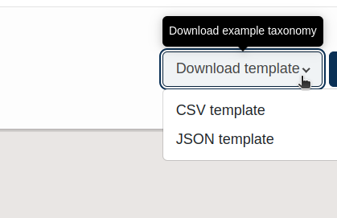
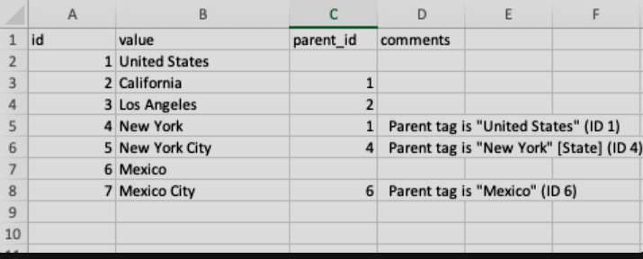
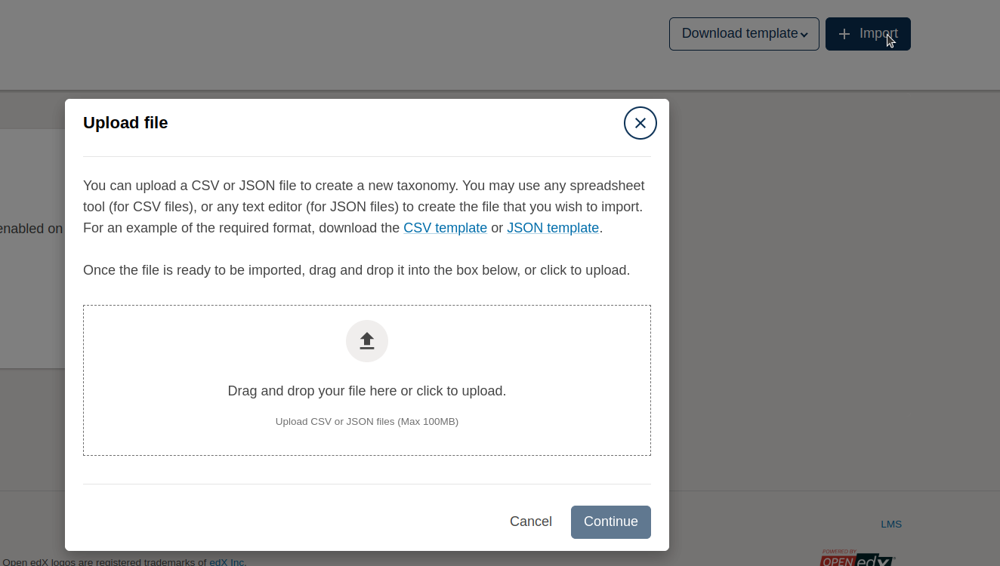
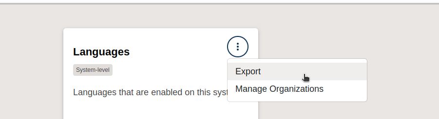
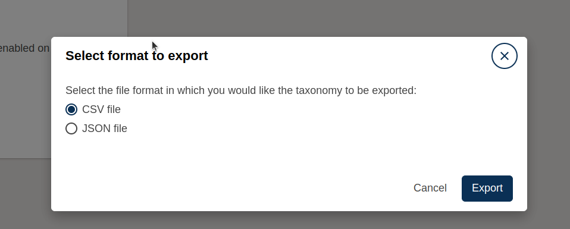
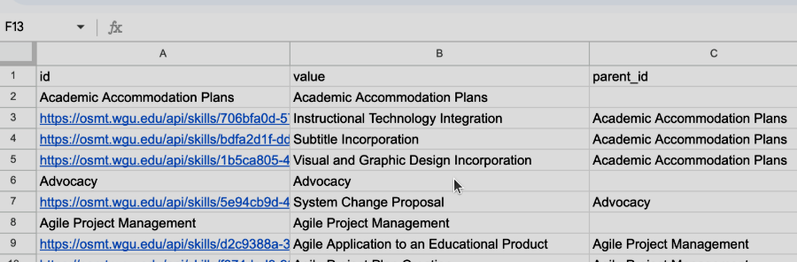
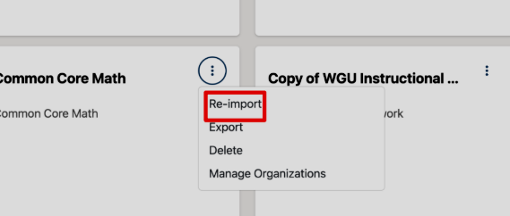
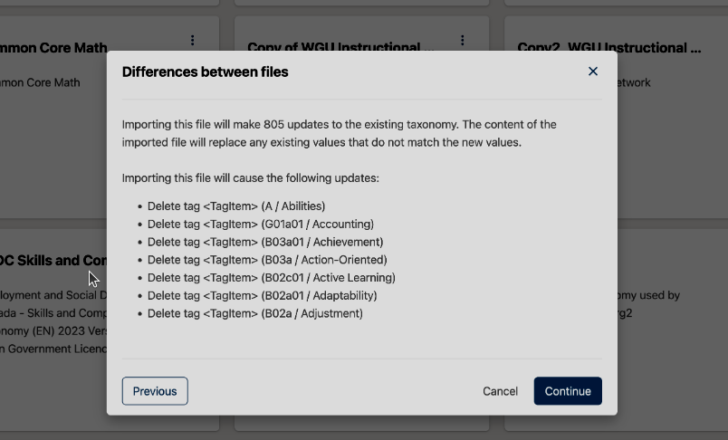

# Working with Taxonomies

Taxonomies are hierarchical systems of tags (e.g., Subject > Topic > Subtopic). used to categorize and organize course content, making it easier for learners to discover and navigate relevant materials. They provide a structured way to classify courses, units, or other learning components using a predefined set of terms and relationships.

---

# Build a Taxonomy Using a Template

Tags are organized into **hierarchical taxonomies** and created via a CSV or JSON upload.

you can create a taxonomy using either a **CSV** or **JSON** file.

### Steps to Build

1. Go to **Studio > Taxonomies**, click **Download Template**, and choose the **CSV template**.
2. Open the file in any spreadsheet tool (Excel, Google Sheets).
3. Add your tags:
   - Use `id` for each tag (must be unique).
   - Use `value` for the tag name.
   - Use `parent_id` to nest child tags under parent tags.
4. Example hierarchy:
   - United States (ID: 1)
     - California (ID: 2, parent_id: 1)
       - Los Angeles (ID: 3, parent_id: 2)
5. Save as **CSV UTF-8**.

---

### 2. Set Up Your Spreadsheet

| id | value          | parent_id | comments       |
|----|----------------|-----------|----------------|
| 1  | United States  |           | Root tag       |
| 2  | California     | 1         | State          |
| 3  | Los Angeles    | 2         | City           |

> Each `value` must be **unique**, even across levels.

### 3. Assign Parent-Child Relationships

- Use the `parent_id` column to nest tags under a parent.
- A parent tag’s `id` becomes the `parent_id` of its children.

### 4. Save & Export to CSV

- Save your spreadsheet in the default format for future editing.
- Then export it as:
  - **CSV UTF-8 (.csv)** (preferred) in Excel
  - **File > Download > CSV** in Google Sheets
  - **Export to CSV** in Numbers

---

## Tips

- The `id` column can be numeric or textual, but must be **unique**.
- The `comments` column is optional and ignored on import.
- Tag values must not repeat across the entire hierarchy.

 

> Once the file is ready, you can import it via **Studio > Taxonomies > Import**.

 

---

## Exporting a Taxonomy

1. From the **Taxonomies** page, locate the taxonomy card.
2. Click the **three-dot menu** and select **Export**.
3. Choose your format and download the file.

---

# Update or Re-import a Taxonomy

To modify an existing taxonomy, you must update it locally and then re-import it.

### 2. Edit the Taxonomy Locally

- Locate the **tag(s)** you want to update.

> Find the **tag value** that you wish to modify. Only **tags** in the “Value” column should be changed.

### 3. Save & Re-import

- Save the updated file as **CSV** or **JSON**.
- Back in Studio, click the **three-dot menu** > **Re-import**.
- Optionally, export a backup of the current taxonomy.
- Click **Next** and upload the updated file.
- Review the list of proposed changes.
- If correct, click **Continue**.

- You will be prompted with an option to export and save a copy of the taxonomy in its current state, before updating it. During the update process, the current taxonomy will be replaced with the updated version, and its advisable to keep a copy of the current version in case something goes wrong in the updating process.

- After exporting a copy of your taxonomy in its current state, click Next.

- Find your local file, upload, and click Import.

- You will be prompted to accept a list of changes. If everything looks ok, click Continue.

- You will be prompted with a notification when the re-import is complete.

- To view your newly imported taxonomy, find the taxonomy card in your taxonomy listing and click the title. You will see your taxonomy and all its associated tags in the taxonomy view page.

---

## Notes

- Always keep a **backup** of the current taxonomy before re-importing.

---

# Why Use Taxonomies?

Taxonomies is organize and tag course content, enhancing navigation, personalization, and content management for e-learning.

## Benefits
- **Easy Navigation**: Tags help learners find relevant courses (e.g., by skill or topic).
- **Personalized Learning**: Aligns content to learner needs, improving engagement.
- **Content Management**: Simplifies course organization and reuse across platforms.
- **Scalability**: Supports large-scale course catalogs with consistent tagging.

## Example Element
- **Taxonomy**: Skills
- **Element**: Programming > Python > Machine Learning
  - **Description**: Tags courses with "Machine Learning" under "Python" in a skills taxonomy, helping learners find targeted content.

> Tom’s platform had scattered AI courses, confusing learners. Adding a taxonomy with "Programming > Python > Machine Learning" tags streamlined discovery, boosting enrollments by 30%.
