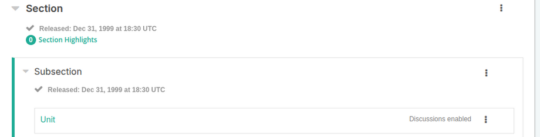
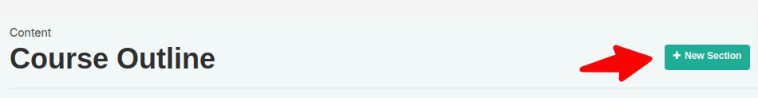
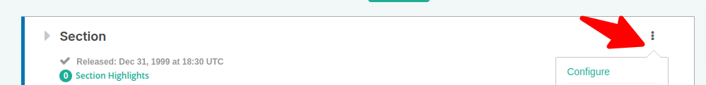
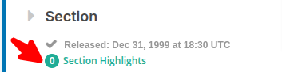
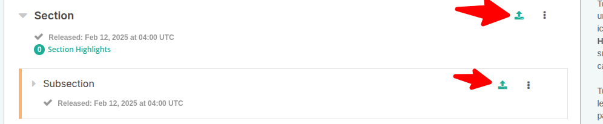
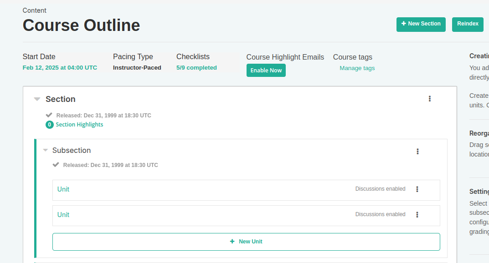

# What Is a Section?

A section is the topmost category in your course. It can represent a time period, chapter, or another organizing principle. A section contains one or more subsections. The levels are:

- Sections
- Subsections
- Units

## Course Progress Information

The course outline shows the learner’s progress. A green check mark indicates that all actions for the section, subsection, or unit have been completed, such as:
- Viewing all videos
- Submitting answers for all problems
- Viewing HTML content for at least 5 seconds

When learners select "Resume Course," the course opens to the unit they most recently completed.

## Sections and Visibility to Learners

Learners cannot see content in a section if its release date is unscheduled or has not passed. If the release date has passed, learners can see the content if:
- The release date for the subsection is passed
- The unit is published and not hidden

## Release Statuses of Sections

Course authors control the release status of sections. For the content to be visible to learners, the section must be released. Possible release statuses are:

- **Unscheduled**: Content is not visible until scheduled.
- **Scheduled**: The section becomes visible after the scheduled release date.
- **Released**: Content is visible if subsections and units are also released.
- **Released with Unpublished Changes**: Learners see the last published version of a unit until changes are published.
- **Staff Only Content**: Hidden from learners, available to the course team only.

## Create a Section

To create a section:
- On the Course Outline page, select "New Section."
- A new section appears at the end of the course outline.
- Enter a descriptive name for the section and add subsections as needed.

It is recommended to test the course content as you create new sections.

## Change a Section Name

To edit a section name:
- Hover over the section name to show the Edit icon.
- Select the icon, edit the name, and save it.

## Set a Section Release Date

To set a section release date:
- Select the "Configure" icon in the section box.
- Set the date and time (in UTC) for the section to be released.
- Save your changes.

## Set Section Highlights for Highlight Emails

If enabled by the system administrator, highlights of course content can be sent to learners via email. To set highlights:

- Go to the Course Outline page.
- Under the section name, select "Section Highlights."
- Enter 3-5 highlights for the section, each with a maximum of 250 characters.
- Save your changes.

### Send Highlight Emails

Once highlights are set, enable highlight emails:

- On the Course Outline page, find the "Course Highlight Emails" setting.
- Select "Enable Now" and confirm.

   - **Note:** Highlight emails cannot be disabled after enabling.

 
  

## Publish All Units in a Section

To publish all new and changed units in a section, click the "Publish" icon in the section box. The icon appears only if there’s new or modified content.

 

## Hide a Section from Learners

To hide a section from learners:
- Select the "Configure" icon in the section box.
- In the settings, choose "Hide from learners."
- Save the changes.

To make it visible again, repeat these steps and deselect "Hide from learners."

---

For more detailed information, you can explore other sections of the course documentation.

  

