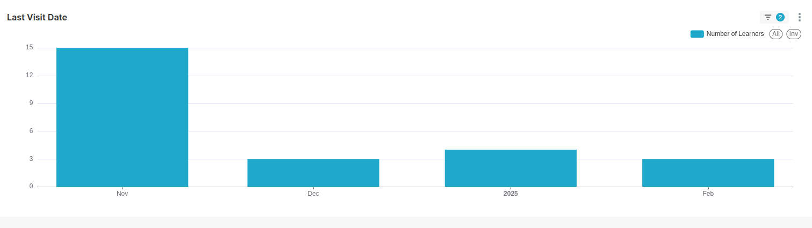
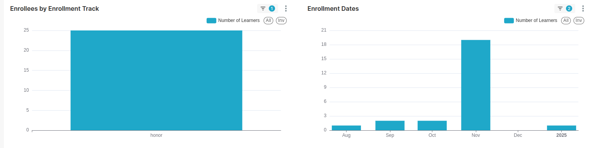
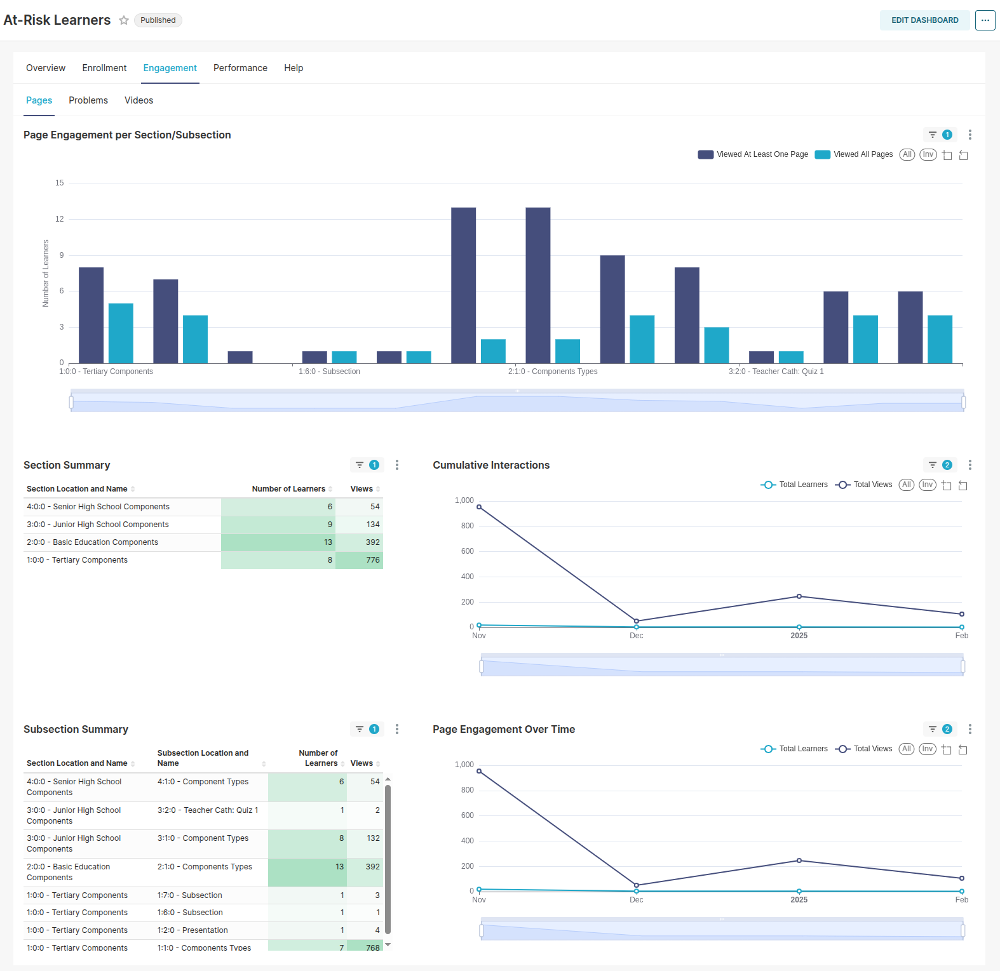
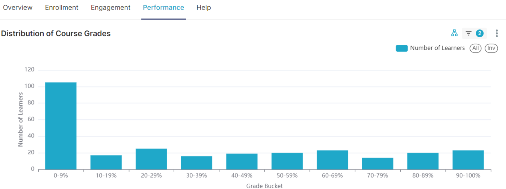

# TitanBI At-Risk Learner Dashboard Reports

The **TitanBI At-Risk Learner Dashboard** is designed to help instructors and administrators identify students who are at risk of disengaging or dropping out of the course. This dashboard highlights learners who have not been actively engaging with the course content, allowing early interventions and personalized support to help these learners succeed.

### Criteria for Learners to be At-Risk:

For a learner to be flagged as **At-Risk** and appear in the **At-Risk Learner Dashboard**, they must meet the following criteria:

1. **Active Enrollment**  
   The learner must be enrolled in the course. This means they have signed up and are officially registered to participate in the course.

2. **Course Interaction**  
   The learner must have engaged with the course content in some manner. This includes actions like accessing course materials, completing exercises, or participating in assessments. Simply visiting the course homepage without engaging with course content doesn't count toward this criterion.

3. **Failure to Complete the Course**  
   The learner has not yet passed the course. This means they haven't completed the course successfully, either by not reaching the required grade or by failing to finish essential assessments or assignments.

4. **Lack of Activity in the Last 7 Days**  
   The learner has not shown any interaction with the course for a period of seven consecutive days or more. This lack of activity indicates possible disengagement with the course content, contributing to their identification as at risk.

If a learner matches all of these conditions, they will be flagged as **At-Risk,** allowing instructors or administrators to take appropriate action, such as offering additional support or engagement strategies to help them stay on track.

If no learners match all of these criteria, the report will be empty.

This dashboard allows instructors to take targeted action to engage students who are at risk of abandoning or failing the course.

---

---

## 1. Overview Tab

### What It Shows:
The **Overview** tab presents a high-level view of learners who are flagged as at-risk. The key elements of this tab include:
- **Learner Names, Usernames, and Emails**: These columns display essential identification details about each learner. If these columns are blank, it means that personally identifiable information has been omitted by the site operator for privacy reasons.
- **Last Visit Date**: This indicates when each learner last interacted with the course. If a learner hasn't accessed the course for 7 or more days, they will be flagged as at-risk.

- **Risk Indicator**: The dashboard includes a visual risk factor indicator to help you quickly assess which learners are at higher risk based on their engagement.

### Why It’s Important:
The **Overview** tab serves as the first step in identifying students who are at risk. By seeing which learners have not interacted with the course recently, you can prioritize outreach to those students. Selecting a learner here will automatically filter data across the other tabs to show only the information specific to that learner, enabling you to focus on their individual situation.

---

## 2. Enrollment Tab

### What It Shows:
The **Enrollment** tab provides information on the learners’ enrollment types and their enrollment dates:
- **Enrollment Track**: Displays how learners enrolled in the course (e.g., honor, verified, audit). This helps you see if certain enrollment types are more likely to become at-risk.
- **Enrollment Dates**: Shows when each learner enrolled in the course. This can help you identify whether learners who enrolled later in the course are more likely to disengage.

### Why It’s Important:
This tab helps you understand how different enrollment tracks and timing affect engagement. For example, you might find that students who enroll later in the course or who have an audit track may be more likely to fall behind. This data helps instructors identify patterns and adapt strategies to engage specific groups.

---

### **Engagement Tab**

The **Engagement** tab shows how learners interact with course content like pages, problems, and videos. It tracks page views, problem attempts, and video completions. This data helps identify content areas where learners are struggling or disengaging, enabling targeted support.

---

### **Performance Tab**

The **Performance** tab displays learners' grades and success metrics. It includes course grade distribution, approval percentages, and grade trends. By analyzing this data, instructors can spot areas of difficulty and adjust course material to improve learner outcomes.

## **Summary of Benefits**

The **TitanBI At-Risk Learner Dashboard** allows instructors to identify and assist struggling learners early. With engagement and performance data, they can intervene and improve course outcomes, helping at-risk students stay on track and succeed.
