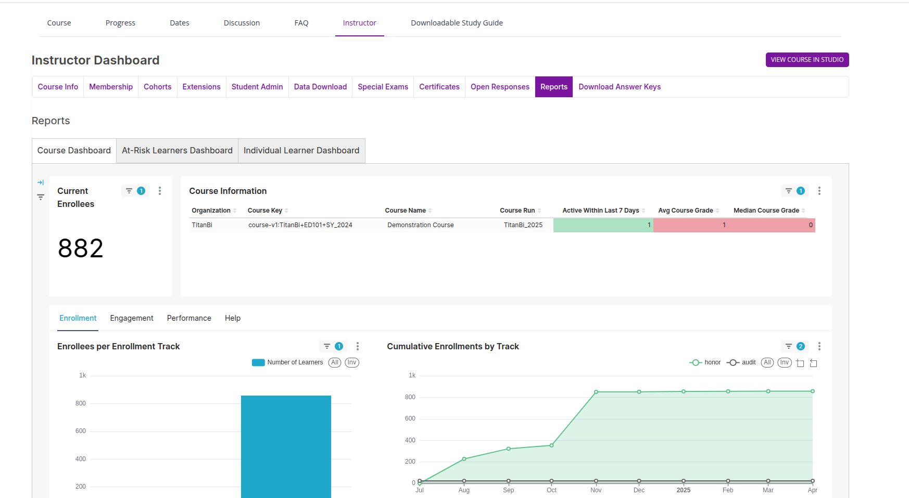

# How to View Course Reports in Titan BI (For Instructors or Staff)

If you are an **Instructor** or a **Course Staff Member**, you have access to powerful reports in **Titan BI** that help you monitor and understand how learners are interacting with your course.

---

## Step-by-Step Instructions to Access Course Reports:

1. **Log in** to your platform.
2. **Go to the Dashboard** and select the course you want to view reports for.
3. Make sure you have been granted access to this course as an **Instructor** or **Staff Member**.
4. Once you enter the course, look at the top menu and click on the **Instructor** tab.
5. Inside the Instructor tab, you will find a sub-tab called **Reports** – click on that.

---

## Inside the Reports Tab, You Will See Three Main Types of Reports:

- This report gives you a detailed overview of:
  - Student activity
  - Enrollment
  - Completion status
  - And more
- It is a powerful tool that helps you:
  - **Track student progress**
  - **Identify learning gaps**
  - **Understand course engagement**

---

## Why This Matters for Instructors and Staff:

- You can use these reports to monitor which learners are falling behind.
- It helps you make data-driven decisions to improve course quality.
- You can easily download CSV reports and share them with your team or organization.
- Only users with **Instructor or Staff roles** will be able to see these reports — students cannot access this section.

---

> **Note:**  
> If you need access to a course or can’t see the Instructor tab, please contact your platform administrator or course team lead.

