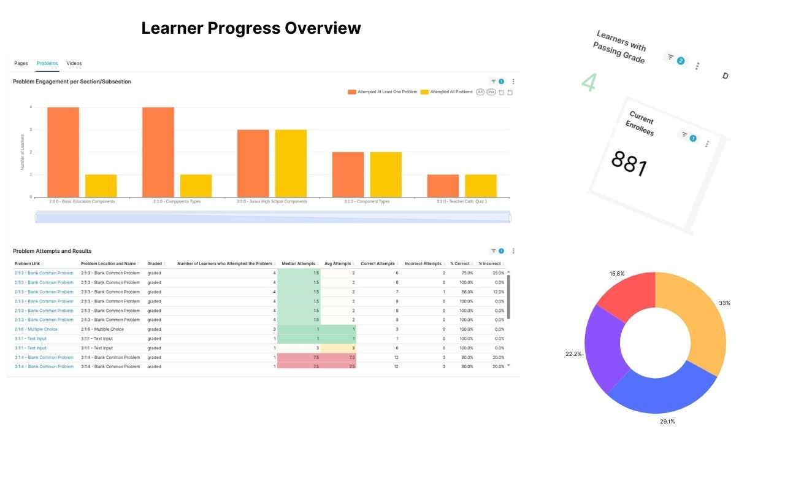

# TitanBI: Unlocking Analytics Insights into Learner Engagement and Performance

TitanBI is an advanced analytics tool designed to provide in-depth insights into learner engagement, course performance, and overall student progress. With TitanBI, educators and institutions can make data-driven decisions that enhance learning experiences, improve retention rates, and optimize course content.

---

## Core Features

### 1. **Course Dashboard (For Instructors)**
- **Enrollment Trends**: Track learner enrollments and demand over time.
- **Content Engagement**: Identify the most engaging course materials.
- **Completion & Success Rates**: Measure overall course success and completion rates.
- **Engagement Drop-offs**: Detect sections where students lose interest for timely course adjustments.

### 2. **Individual Learner Dashboard (For Instructors)**
- **Track Progress**: Monitor each learner's activity and course completion status.
- **Identify At-Risk Learners**: Spot disengaged students who may need additional support.
- **Personalize Feedback**: Offer tailored feedback and resources to address individual learner needs.

### 3. **At-Risk Dashboard (For Instructors)**
- **Track At-Risk Students**: Identify learners who haven't engaged or are falling behind.
- **Early Interventions**: Provide support to keep students on track and improve retention.

---

## Custom Insights & Benefits

### 1. **Monitor Active Users & Engagement Patterns**
- Track active learners and instructors to understand participation trends and engagement levels.
- **Benefits**: Balanced interaction between students and instructors, improving involvement.

### 2. **Improve Platform Access & Security**
- Monitor login trends to ensure smooth access and detect unusual login behaviors.
- **Benefits**: Streamline access, enhance security, and improve user experience.

### 3. **Track Course Retention & Dropout Trends**
- Identify when students disengage to prevent dropouts and improve retention.
- **Benefits**: Boost retention by addressing disengagement early.

### 4. **Assess Learner Participation in Discussions**
- Monitor activity in course discussions to improve collaboration and knowledge sharing.
- **Benefits**: Enhance course interactivity and foster an engaged learning community.

### 5. **Track Instructor Engagement & Response Times**
- Measure instructor participation in discussions and their response times.
- **Benefits**: Faster, more interactive responses lead to improved student satisfaction and engagement.

### 6. **Optimize Learning Engagement**
- Track how much time students spend on the platform and which areas capture their attention.
- **Benefits**: Refine course design to ensure long-term learner commitment.

### 7. **Recognize High Engagement Among Instructors & Students**
- Identify top-performing instructors and students to foster motivation and peer learning.
- **Benefits**: Encourage participation, boost morale, and create a more collaborative environment.

---

## Why TitanBI?

TitanBI’s flexible dashboards offer comprehensive insights into all areas of your learning platform:

- **Track Active User Engagement**: Monitor participation trends for both students and instructors.
- **Analyze Login Activity**: Identify access issues to improve user experience.
- **Measure Course Retention**: Track dropout trends and optimize student support.
- **Monitor Discussion Board Activity**: Foster collaboration and improve interactivity.
- **Analyze Engagement Time**: Improve course structure for better student retention.
- **Recognize Highly Engaged Participants**: Boost motivation and participation.

Customize your dashboards to track and make data-driven decisions across your learning platform.
