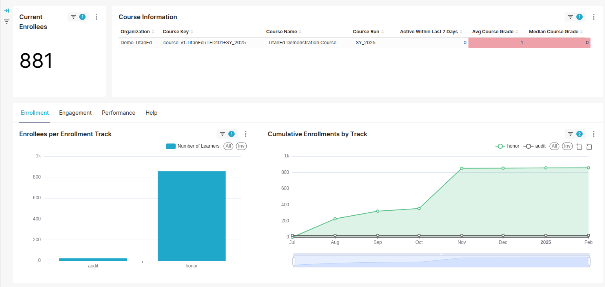
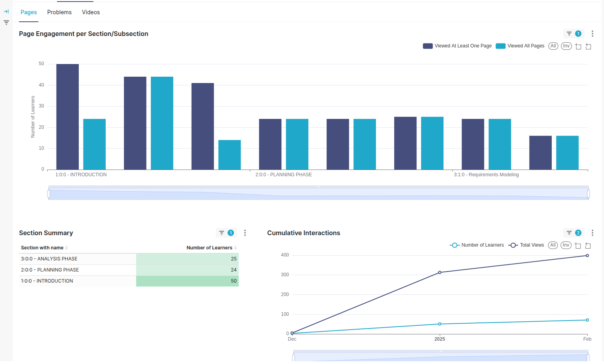
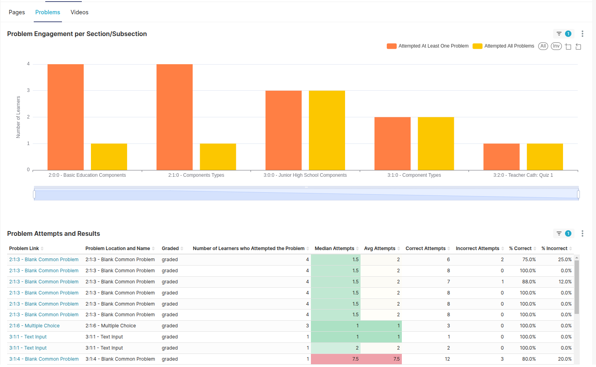
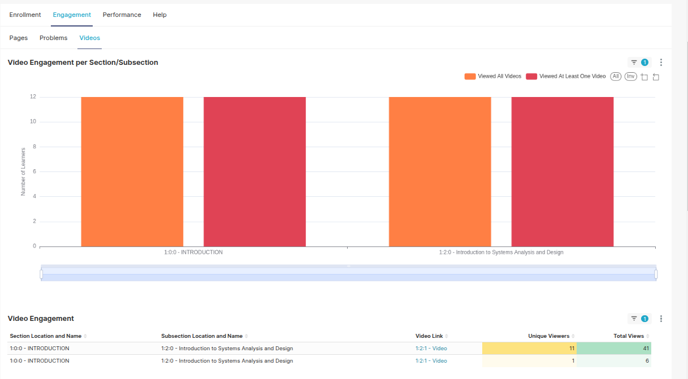
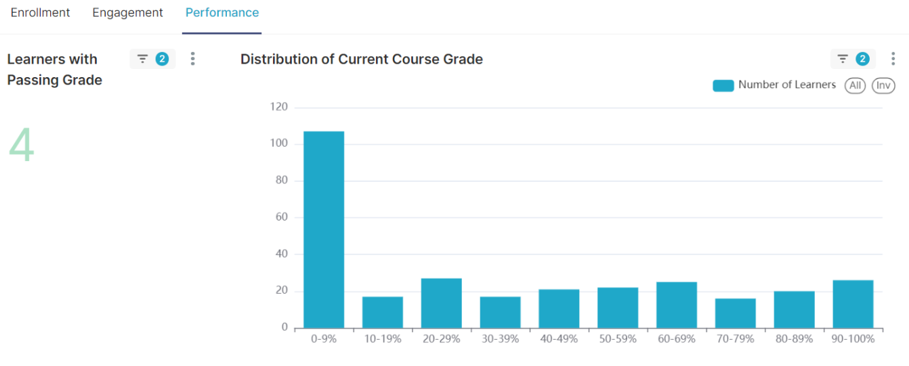

# TitanBI Course Dashboard Report

The **TitanBI Course Dashboard Report** offers an in-depth view of your course's performance. It helps track key metrics, including enrollment, engagement, and overall performance. The report is divided into three main sections for easy navigation and understanding.

## 1. Current Enrollments
This section provides an overview of the total number of students enrolled in the course. It's the first metric that helps you understand how many learners are currently taking the course. 

### Key Insights:
- **Total Enrollments**: The overall number of students enrolled.
- **Active Learners**: This might also be shown to indicate how many students are actively engaging with course materials at a given time.

### Why It's Important:
Understanding the number of enrollments helps you gauge the popularity of the course and assess its reach. It can also help in resource allocation (e.g., course support and content updates).

## 2. Course Information
This section offers more detailed insights into the course’s key metrics. It is designed to track performance and gives you a snapshot of how the course is being consumed by learners.

### Key Columns:
- **Organization**: This shows the organization or institution that is responsible for the course. It helps categorize the course within your system, especially if you offer multiple courses under different organizations.
  
- **Course Key**: A unique identifier (a code) used to distinguish the course, which is helpful in case there are multiple versions or similar courses.

- **Course Name**: The title of the course. This is usually a human-readable name that helps easily identify the course you are tracking.

- **Course Run**: This specifies the particular version of the course that’s being run. For example, a course may have multiple runs throughout the year, and this column tracks performance based on the specific iteration.

- **Active in Last 7 Days**: This metric shows the number of students who have been active within the past 7 days. It helps track engagement and activity in the course. A higher number indicates sustained learner interest and interaction.

- **Average Course Grade**: The average grade earned by all learners who completed the course. This is an overall measure of learner success in the course and reflects how well students performed.

- **Median Course Grade**: This is the middle value of course grades. Unlike the average, the median is less affected by outliers (extremely high or low grades). It provides a better representation of the typical learner’s performance in the course.

### Why It's Important:
This section allows you to track performance at a granular level. By analyzing the **Average Course Grade** and **Median Course Grade**, you can assess whether the course is too easy or difficult, and make adjustments if necessary. The **Active in Last 7 Days** metric can give you a sense of whether the course is engaging and whether learners are returning.

## 3. Enrollment, Engagement, Performance & Help

This section provides more in-depth metrics related to how students engage with the course content, how they perform, and overall course effectiveness.

### - **Enrollment Metrics**
This section provides a detailed report showing the enrollment process over time. It tracks various stages of learner enrollment (e.g., initial sign-up, course completion) and shows trends in enrollments, helping evaluate the effectiveness of marketing campaigns or outreach efforts.

### Key Insights:
- **Enrollments over Time**: Track how the number of students signing up for the course changes over time, which can help you identify trends or seasonal patterns.
- **Type of Enrollment**: This can include details like whether students enrolled manually, through a marketing campaign, or were added through other means.

### Why It's Important:
Understanding enrollment metrics helps in planning marketing campaigns, adjusting content, and evaluating external factors that could affect course uptake.

### - **Engagement Metrics**
Engagement metrics focus on how learners interact with different types of course content. It helps you understand which sections of the course are engaging, which might need improvement, and how learners are progressing.

#### **Pages**:
Shows engagement with the course pages. This can include:
- **Interactions per Section**: Track how often students are engaging with specific sections of the course.
- **Engagement Over Time**: Understand how engagement changes over the duration of the course.

#### **Problems**:
Tracks engagement with course problems or assessments, showing how learners interact with quizzes, assignments, and other assessments. The data will include:
- **Number of Attempts**: How many times learners try the problems.
- **Success Rate**: How often learners complete or pass the problems.

#### **Videos**:
Displays how learners engage with video content, including:
- **Views per Video**: Which videos are being watched the most.
- **Video Completion Rate**: How many learners watch the video to completion.
- **Time Watched**: Breakdown of how much time learners spend watching each video, including which parts they engage with the most.

### Why It's Important:
Engagement metrics help identify which parts of the course content are most popular and effective. This allows you to optimize the course material, whether by enhancing videos or improving the clarity of problems and pages.

### - **Performance Metrics**
Performance metrics give you an overview of how learners are performing in terms of grades and overall course approval.

#### Key Insights:
- **Pass Rate**: The percentage of learners who successfully complete the course.
- **Grade Distribution**: The spread of grades, showing how many students fall into various grade ranges (e.g., 90-100%, 70-89%, etc.).
- **Learner Success**: Identify areas where learners might be struggling by looking at failing grades or course exit points.

### Why It's Important:
Performance metrics allow you to assess how well learners are mastering the material. A high pass rate indicates that the course is effective, while a low pass rate may signal the need for course adjustments or additional support.

### - **Help Tab**
The Help tab directs you to the documentation or support resources that explain these metrics in detail. It’s an essential resource for understanding how to interpret the data and make informed decisions based on the report.

## Summary
The **TitanBI Course Dashboard Report** offers comprehensive insights into how the course is performing. By breaking down the report into sections focused on **Current Enrollments**, **Course Information**, and **Enrollment, Engagement, Performance & Help**, you can gain a deeper understanding of learner behavior, course effectiveness, and areas that need attention. 

These metrics help you make data-driven decisions to:
- Enhance content and engagement strategies.
- Improve learner outcomes.
- Optimize course structure and resources.