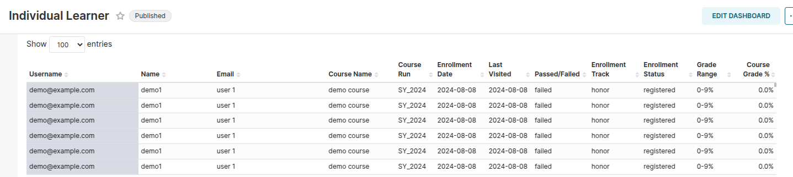
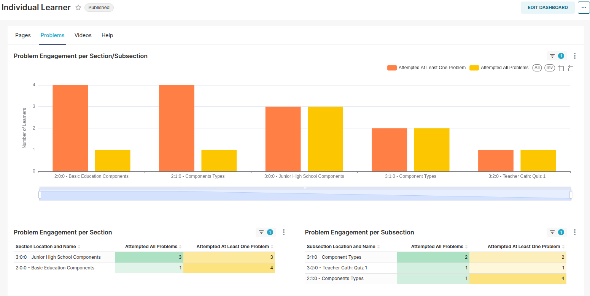
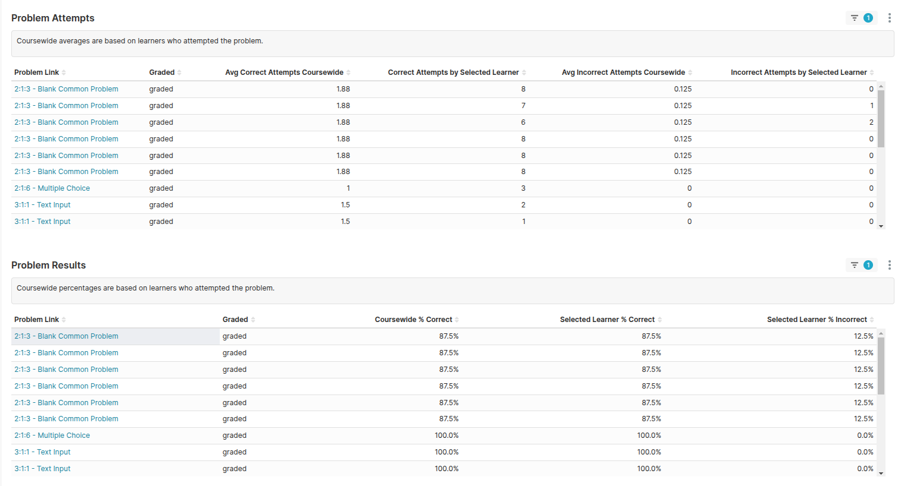

# TitanBI Individual Learner Dashboard Report

The **TitanBI Individual Learner Dashboard** provides an in-depth look into each learner's performance, activity, and engagement in the course. This dashboard is a powerful tool that helps instructors, administrators, and course teams track learner progress, analyze engagement, and identify areas where learners may need additional support.

It allows the course delivery team to have a detailed understanding of individual learner behaviors, performance, and progress, making it easier to tailor interventions when needed.

## Dashboard Structure

The **Individual Learner Dashboard** is divided into two main sections:

1. **Learner Summary**  

2. **Pages, Problems, Videos & Help**

These sections provide both a broad and detailed view of how learners are interacting with the course, as well as their progress and performance.

---

## 1. Learner Summary

### What is it?
The **Learner Summary** section provides a detailed table that tracks each learner’s progress in the course. It includes key information such as enrollment dates, course grades, and performance metrics, helping you get a clear view of how each learner is performing.

### Key Columns in the Learner Summary:
- **Username**: The unique identifier for the learner within the system. This helps differentiate learners, especially when names and emails might not be available.
- **Name**: The full name (or preferred name) of the learner. This is useful for personalizing communication and support.
- **Email**: The learner’s email address, typically used for notifications or communication (if available).
- **Course Name**: The title of the course that the learner is enrolled in. This helps track progress across different courses.
- **Course Run**: The specific version or instance of the course the learner is participating in. This is especially useful for courses with multiple runs.
- **Enrollment Date**: The date when the learner first enrolled in the course. This helps track how long the learner has been engaged with the content.
- **Last Visited**: The date the learner last accessed the course. This provides insight into learner engagement and can help identify inactive learners.
- **Passed/Failed**: Indicates whether the learner has completed the course successfully (passed) or not (failed). It provides a quick indicator of learner success.
- **Enrollment Track**: The type of enrollment the learner has (e.g., honor, verified, or audit). This helps you track the type of learner and their level of commitment.
- **Enrollment Status**: The current status of the learner's enrollment (e.g., active, inactive, registered). This helps identify whether a learner is still participating in the course.
- **Grade Range**: The possible grade range for the course, showing the minimum and maximum grade a learner can achieve.
- **Course Grade %**: The learner’s actual grade in percentage terms, which reflects their overall performance in the course.

### Why is it important?
The **Learner Summary** is essential for getting a quick overview of each learner's journey through the course. It allows instructors to:
- Track **engagement**: By monitoring last visited dates and active status, instructors can see which learners are actively engaged or falling behind.
- Assess **learner success**: By reviewing the passed/failed status and grades, instructors can identify learners who may need additional support.
- Manage course interventions: By filtering the data, you can quickly pinpoint students who are struggling and target them for help, improving learner success rates.

---

## 2. Pages, Problems, Videos & Help

This section delves deeper into how learners are interacting with specific course content, including **pages**, **problems**, and **videos**. These metrics help you understand the learner's engagement with different types of course materials, allowing you to optimize content and delivery.

### Pages:
This metric tracks how learners engage with course **pages**, including sections and subsections. It shows:
- **Engagement per Section**: Tracks the learner’s interactions with each section of the course.
- **Cumulative Interactions**: Shows how many times a learner has engaged with course pages over time.
- **Engagement Over Time**: Shows how engagement trends throughout the course duration, helping you identify peak interaction periods.

### Why it’s important:
Understanding page engagement helps identify whether specific sections of the course are engaging or if learners are skipping important material. It helps instructors:
- Pinpoint sections that may need content updates or improvement.
- Identify which sections require more interactive or multimedia elements to enhance learning.

### Problems:
This section focuses on learners' engagement with course **problems** and assessments, including quizzes and assignments. It provides:

- **Number of Attempts**: The number of attempts made by learners on each problem.
- **Success Rate**: The percentage of correct answers provided by the learner.

- **Problem Performance**: Insights into how learners are performing on different assessments.

### Why it’s important:
Analyzing problem engagement helps instructors:
- Identify problematic questions where many learners struggle.
- Determine if certain course concepts need further clarification.
- Understand learner performance across various assessments, which can help refine problem difficulty levels.

### Videos:
This section provides detailed insights into how learners interact with **course videos**. Key metrics include:
- **Partial vs. Full Video Views**: Tracks how much of the video the learner watches, showing whether they are watching all the way through or skipping parts.
- **Engagement per Section/Subsection**: Tracks which sections of the video are most engaging for learners.
- **Video Duration Engagement**: Shows how much time the learner spends watching each video, highlighting which segments retain attention.

### Why it’s important:
Video engagement metrics help instructors:
- Identify which parts of the video content are most engaging, and which parts may need to be improved.
- Measure how effective video content is in conveying the material, and whether learners are fully consuming the videos.
- Adjust video length or content based on learner interaction data.

---

## Summary of Benefits
The **TitanBI Individual Learner Dashboard** is an essential tool for monitoring and analyzing individual learner performance in real-time. It provides insights into:
- **Engagement**: How actively each learner is participating with course materials.
- **Performance**: Tracking grades, quiz attempts, and video views to see how well learners are doing.
- **Intervention**: Identifying learners who need additional help based on performance and engagement metrics.

With these detailed insights, instructors and administrators can:
- Personalize learning experiences.
- Identify at-risk learners early.
- Improve course content and delivery.
- Enhance overall course effectiveness.